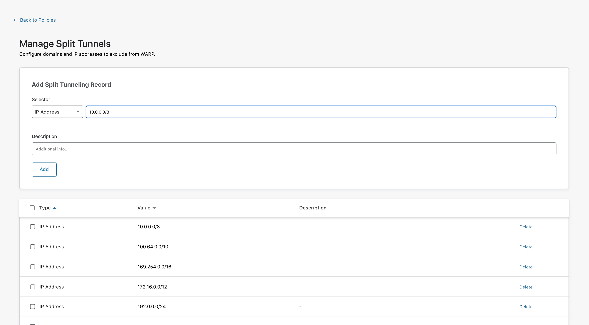
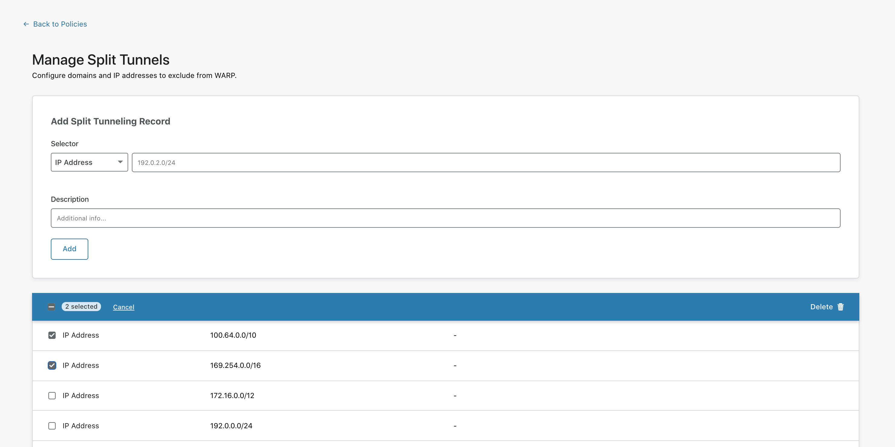

 
# Split Tunnels
 
<Aside>
 
In order for the WARP client to pick up any changes you make to Split Tunnels or Local Domain Fallback, you will need to restart it. To do that, you can either restart the computer or quit the application and relaunch it. This behavior will be improved in a future release.
 
</Aside>

Split Tunnels mode can be configured to exclude IP addresses commonly used for private routing, including those defined in [RFC 1918](https://tools.ietf.org/html/rfc1918). You can find a list of excluded IP addresses under **Gateway** > **Policies** > **Settings** > **Split Tunnels - WARP**.
 
You can add or remove IP addresses from the Split Tunnels list at any time.
 

 
1. On the Teams dashboard, navigate to **Policies** > **Settings**.
 

 
1. Click **Manage Split Tunnels**.
 

 
1. On this page, you'll find a list of the IP addresses Cloudflare for Teams excludes. You can customize this list to add or remove any items from it.
 
### Add an IP address
 
On the Manage Split Tunnels page, in the **Add Split Tunneling Record** card, enter the IP address or CIDR and an optional description in the relevant fields. Then, click **Add**.
 
 
 
The IP address will appear in the list below.
 
### Remove an IP address
 
On the Manage Split Tunnels page, locate the IP address in the list and then click **Delete**.
 
If you wish to remove multiple IP addresses at the same time, click the checkbox to the left of each IP address to select it, and click **Delete** in the top right corner of the box.
 
 
