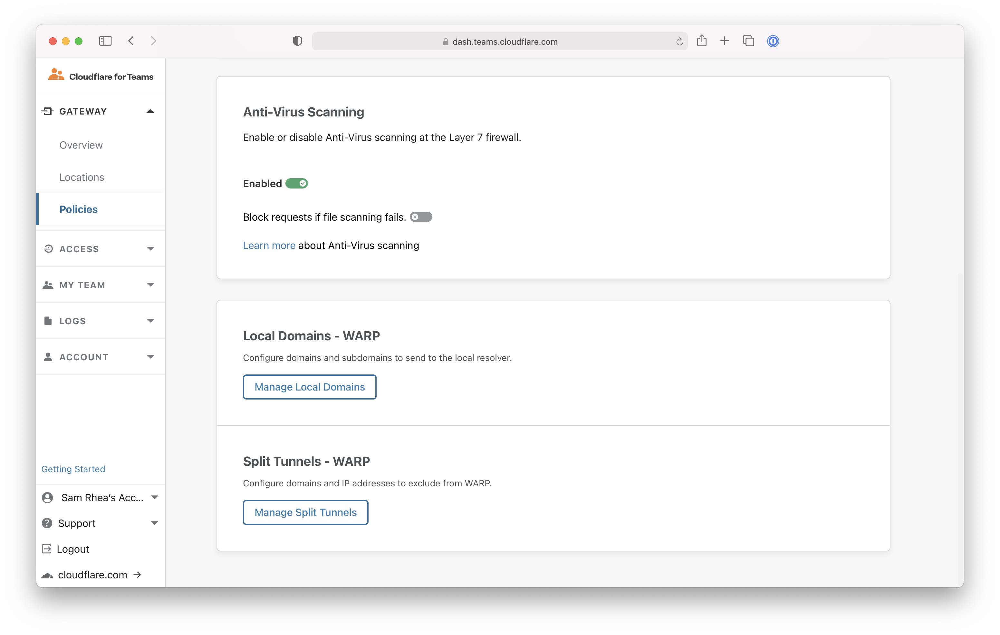
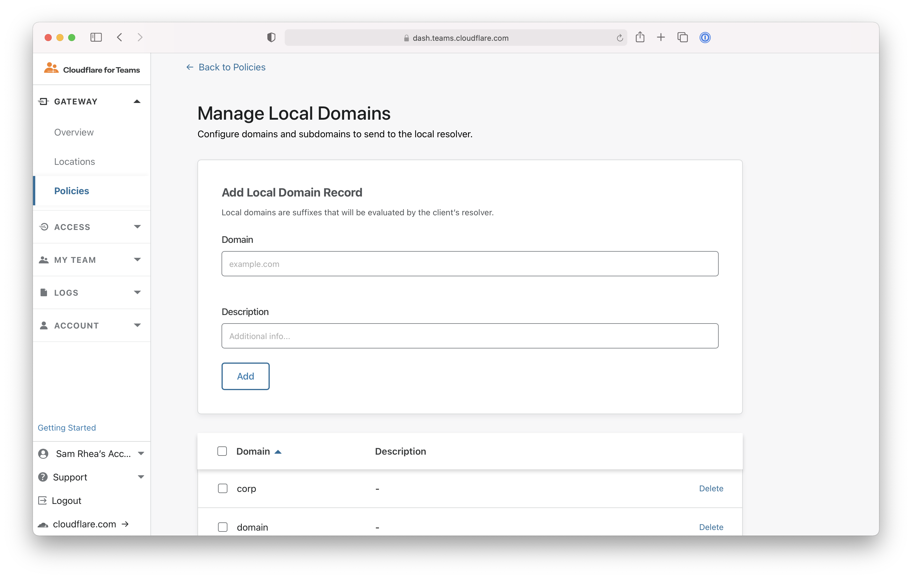
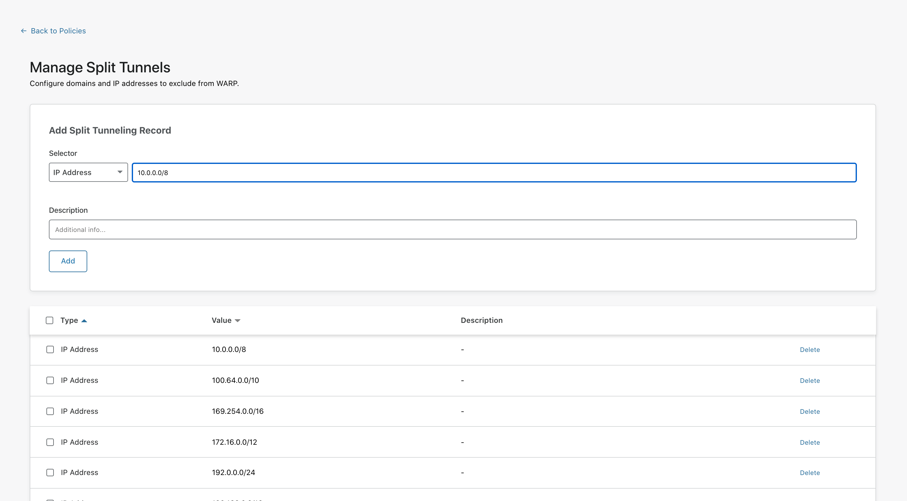
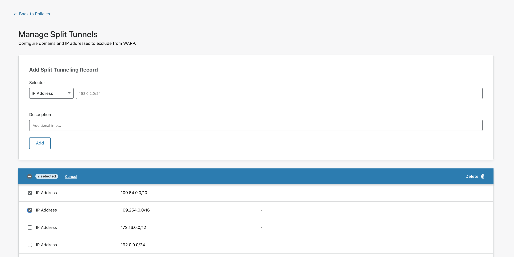

# Exclude domains and IP addresses

By default, Cloudflare for Teams excludes common top level domains used for local resolution from being sent to the Cloudflare proxy. Excluded domains are listed on the Teams dashboard under **Gateway** > **Policies** > **Settings** > **Local Domains - WARP**. All domains in that list rely on the local DNS resolver configured for the device. 

You can add or remove domains from the Local Domains list at any time.

Also, Cloudflare for Teams can be deployed in [Split Tunnels mode](#manage-excluded-ip-addresses) to exclude IP addresses commonly used for private routing, including those defined in [RFC 1918](https://tools.ietf.org/html/rfc1918). You can find a list of excluded IP addresses under **Gateway** > **Policies** > **Settings** > **Split Tunnels - WARP**. 

You can add or remove IP addresses from the Split Tunnels list at any time.

## Manage excluded domains

1. On the Teams dashboard, navigate to **Policies** > **Settings**.

 

1. Click **Manage Local Domains**.

 

1. On this page, you'll find a list of domains Cloudflare for Teams excludes. You can customize this list to add or remove any items from it.

 

### Add a domain

 On the Manage Local Domains page, in the **Add Local Domain Record** card, enter the domain and an optional description in the relevant fields.  Then, click **Add**.

 The domain will appear in the list below.

  

### Delete a domain

 To remove a domain from the list, locate the domain and then click **Delete**.

 If you wish to remove multiple domains at the same time, click the checkbox to the left of each domain to select it, and click **Delete** in the top right corner of the box.
 
  

## Manage excluded IP addresses

1. On the Teams dashboard, navigate to **Policies** > **Settings**.

 

1. Click **Manage Split Tunnels**.

 

1. On this page, you'll find a list of the IP addresses Cloudflare for Teams excludes. You can customize this list to add or remove any items from it.

### Add an IP address

On the Manage Split Tunnels page, in the **Add Split Tunneling Record** card, enter the IP address or CIDR and an optional description in the relevant fields. Then, click **Add**.

  

The IP address will appear in the list below.

### Remove an IP address

 On the Manage Split Tunnels page, locate the IP address in the list and then click **Delete**.

 If you wish to remove multiple IP addresses at the same time, click the checkbox to the left of each IP address to select it, and click **Delete** in the top right corner of the box.

  
