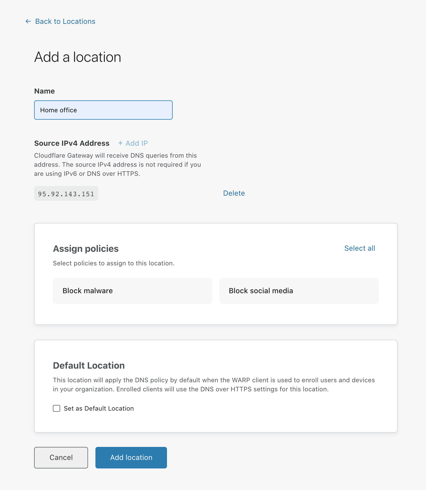
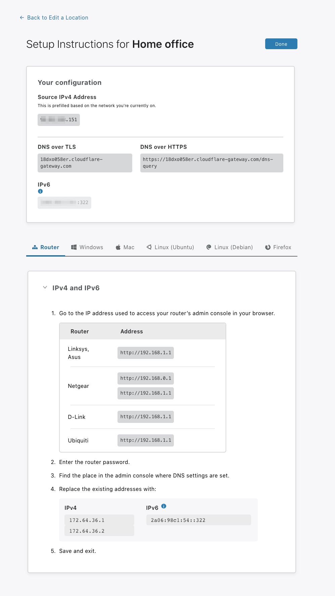
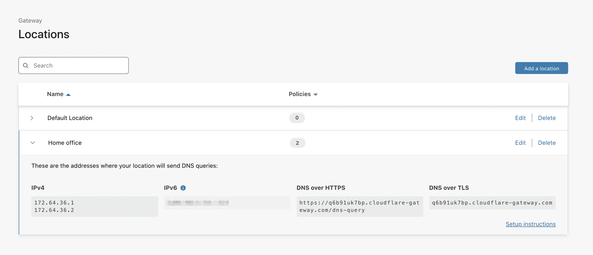

# Add locations

To add a location to Teams:

1. On the [Teams dashboard](https://dash.teams.cloudflare.com), navigate to **Gateway** > **Locations**.

1. Click **Add a location**.

1. Choose a name for your location.

1. If the location you are sending requests from is only using IPv6 or sending all DNS requests using DNS over HTTPS, click **Delete** on the right side of the IPv4 address field, as the field is not required.

   <Aside>

   If you're using an Enterprise plan, you'll be able to manually change the IPv4 address.

   </Aside>

   

1. Select any policies you want to apply to this location.

1. If you'd like to set this location as default, check the **Set as a Default Location** checkbox.

1. Click **Add location**.

1. This will show you your location's details, and instructions on how to change DNS resolvers on your router, browser, or OS. 

   

1. Click **Done**.

Your location is now listed under **Gateway > Locations**.

   