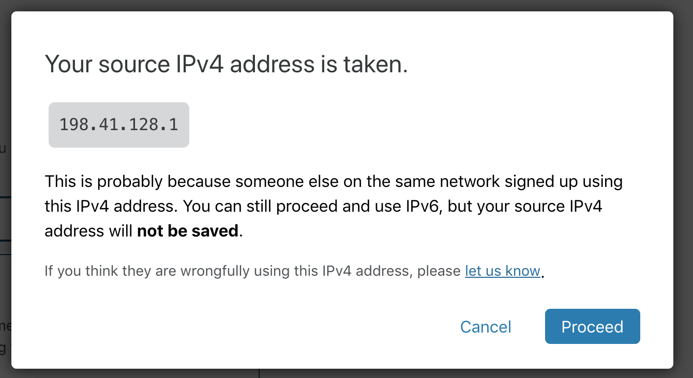
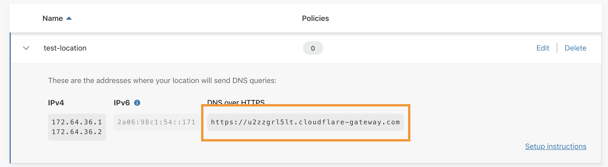
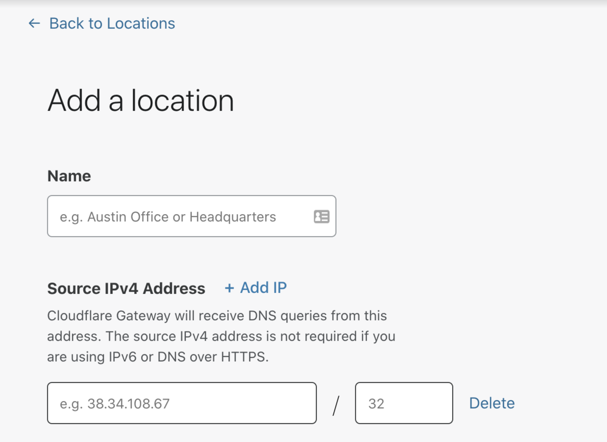

# Configure locations

<Aside>

Changing the IP address of a location is an Enterprise feature. See our [payment plans](https://www.cloudflare.com/teams-pricing/) for more information.

</Aside>

The only requirement for a location is its name. All other fields are optional if the location you are sending requests from is only using IPv6 or sending all DNS requests using DNS over HTTPS.

## IPv4
Gateway uses the public source IPv4 address of your network to identify your location, apply policies and log the DNS requests. When you go through onboarding or in our location tab, the dashboard automatically identifies the public source IP address.

If you are using an Enterprise plan, you can manually enter the IP address and netmask of your location. You can find out what public IP address you are using by connecting to the network of the location and then googling “What’s my IP address”.

On your router or if you are using a device or a daemon, forward DNS queries to the following IP addresses:

* **172.64.36.1**
* **172.64.36.2**

See how you can start sending DNS queries by visiting the [setup instructions](/connections/connect-networks/locations/setup-instructions/).

<Aside type='note' header='Your IPv4 address is taken'>

When trying to configure a location over IPv4, you may run into this error:

This may mean someone else in the same network signed up for Cloudflare Gateway before you did. If your network supports IPv6, you can still use Cloudflare Gateway's DNS filtering by sending DNS queries over IPv6. You can also use the DNS over HTTPS hostname to send queries using a DNS over HTTPS client.

If you think someone else is wrongfully using this IPv4 address, please [let us know](https://forms.gle/MUtjTheQh24MRY2aA).

</Aside>

## IPv6
When you create a location, your location will receive a unique IPv6 address. Cloudflare Gateway will identify your location based on this unique IPv6 address.

On your router/device/forwarder/daemon forward DNS queries to the corresponding IPv6 address for the location.

See how you can start sending DNS queries by visiting the [setup instructions](/connections/connect-networks/locations/setup-instructions/).

## DNS over HTTPS
Each location has a unique hostname for DNS over HTTPS.

Cloudflare Gateway will identify your location based on the DNS over HTTPS hostname.

See how you can start sending DNS queries over HTTPS using [Firefox](/connections/connect-networks/locations/setup-instructions/firefox).

## Editable IP addresses

When users on the Enterprise plan have the option of manually entering one or more IP addresses of their choice. This enables them to protect networks even if they're not connecting from any of those networks' IP addresses when creating the location on the Teams dashboard. 

To learn more about Teams pricing plans and the features they include, visit our [plans page](https://www.cloudflare.com/en-gb/teams-pricing/).
