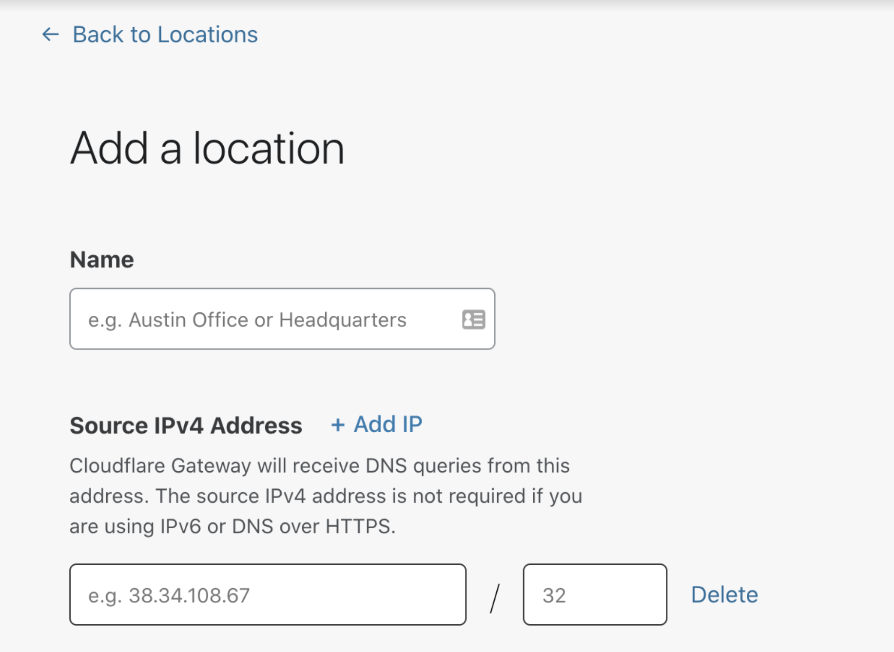

# Locations

Locations are usually physical entities like offices, homes, retail stores, movie theatres, or data centers. The fastest way to start sending DNS queries from a location and protect it from security threats is by changing the DNS resolvers at the router.

* If you have an IPv6 network, you can change your DNS resolvers to the dedicated IPv6 address for your location.

* If you don’t have an IPv6 network, you can set up a location by changing the DNS resolvers to:

  * **172.64.36.1**
  * **172.64.36.2**

If you want to send your DNS queries over an encrypted connection, you can use the hostname that we provide in the dashboard to send queries using DNS over HTTPS.

* [Add a location](/connections/connect-networks/locations/configuring-a-location)

## How Gateway matches queries to locations

Gateway uses different ways to match a DNS query to locations depending on the type of request and network. This is how Gateway determines the location of a DNS query:

1. **Step 1**: Gateway checks whether the query was sent using DNS over HTTPS. If yes, Gateway looks up the location by its unique hostname. 

2. **Step 2**: if the query wasn't sent with DNS over HTTPS, Gateway checks whether it was sent over IPv4. If yes, it looks up the location by the source IPv4 address.

3. **Step 3**: If the query wasn't sent over IPv4, it means it was sent over IPv6. Gateway will look up the location associated with the DNS query based on the destination IPv6 address. 

## Location attributes

The only requirement for a location is its name. All other fields are optional if the location you are sending requests from is only using IPv6 or sending all DNS requests using DNS over HTTPS.

### Source IPv4 address

<Aside>

Changing the source IPv4 address of a location is an Enterprise feature. See our [payment plans](https://www.cloudflare.com/teams-pricing/) for more information.

</Aside>

Gateway uses the public source IPv4 address of your network to identify your location, apply policies and log DNS requests. When creating a location, the Teams dashboard automatically identifies the public source IP address.

Users on the Enterprise plan have the option of manually entering one or more IP addresses of their choice. This enables them to protect networks even if they're not connecting from any of those networks' IP addresses when creating the location on the Teams dashboard. 

<Aside type='note' header='Your IPv4 address is taken'>

When trying to configure a location over IPv4, you may run into this error:

This may mean someone else in the same network signed up for Cloudflare Gateway before you did. If your network supports IPv6, you can still use Cloudflare Gateway's DNS filtering by sending DNS queries over IPv6. You can also use the DNS over HTTPS hostname to send queries using a DNS over HTTPS client.

If you think someone else is wrongfully using this IPv4 address, please [let us know](https://forms.gle/MUtjTheQh24MRY2aA).

</Aside>

### IPv6 address

When you create a location, your location will receive a unique IPv6 address. Cloudflare Gateway will identify your location based on this unique IPv6 address.

On your router/device/forwarder/daemon forward DNS queries to the corresponding IPv6 address for the location.

See how you can start sending DNS queries by visiting the [setup instructions](/connections/connect-networks/locations/setup-instructions/).

### DNS over TLS

Each location has a unique hostname for DNS over TLS.

Cloudflare Gateway will identify your location based on the DNS over TLS hostname.

 

### DNS over HTTPS
Each location has a unique hostname for DNS over HTTPS.

Cloudflare Gateway will identify your location based on the DNS over HTTPS hostname.

See how you can start sending DNS queries over HTTPS using [Firefox](/connections/connect-networks/locations/setup-instructions/firefox).

#### DoH subdomain

Each location in Teams has a unique DoH subdomain (previously known as a unique id). If your organization uses DNS policies, you will need to enter your location's DoH subdomain as part of the WARP client settings. 

In the example below, the DoH subdomain is: `9y65g5srsm`.

| DNS over HTTPS hostname | DoH subdomain |
| --- | --- |
| `https://9y65g5srsm.cloudflare-gateway.com/dns-query` | `9y65g5srsm` |