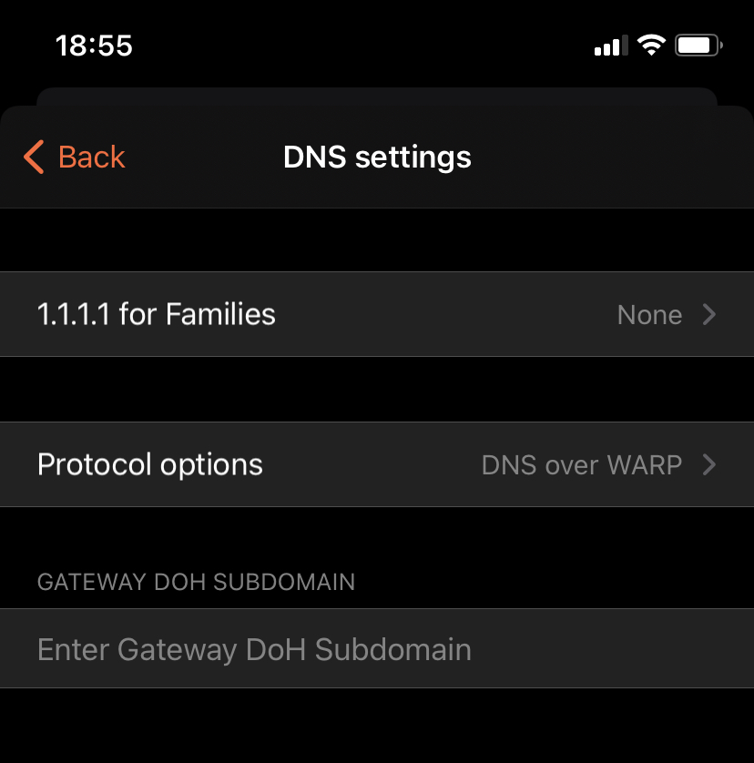

# iOS (Manual)

<Aside>

Note that if you were using 1.1.1.1 for Families in the mobile app, you will at first need to disable 1.1.1.1 for Families. You can disable it by going to `Advanced -> Connection options -> DNS Settings -> 1.1.1.1 for Families -> 'None'` in your 1.1.1.1 app.
</Aside>

1. Install the 1.1.1.1 mobile app by visiting the [app store](https://itunes.apple.com/us/app/1-1-1-1-faster-internet/id1423538627) on your iOS device.

 If you already have the app on your phone, make sure you have the latest version of the app and then skip to the next step.

1. Open the app and click on the menu button on the top right corner.

1. Click on **Advanced**.
1. Click on **Connection options**.
1. Click on **DNS settings**.
 
 This will take you to the screen where you can configure Gateway for your 1.1.1.1 mobile app.

 

1. Enter the [DoH subdomain](/connections/connect-networks/locations/configuring-a-location#find-a-locations-doh-subdomain) of the location you created for your mobile phone.

If 1.1.1.1 DNS, WARP or WARP+ was already enabled, the 1.1.1.1 app should be using Gateway now.