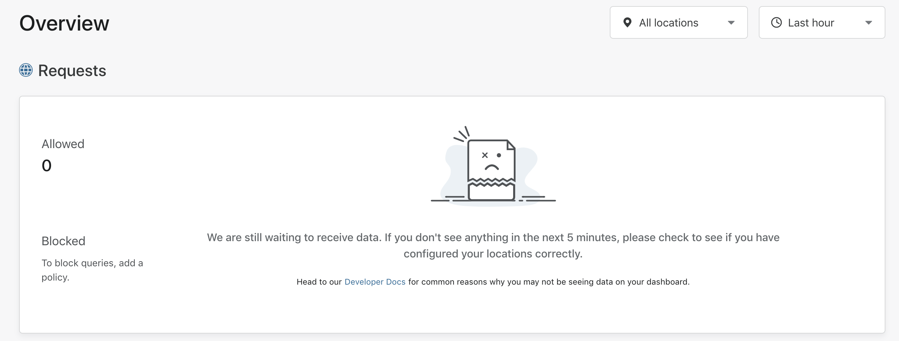
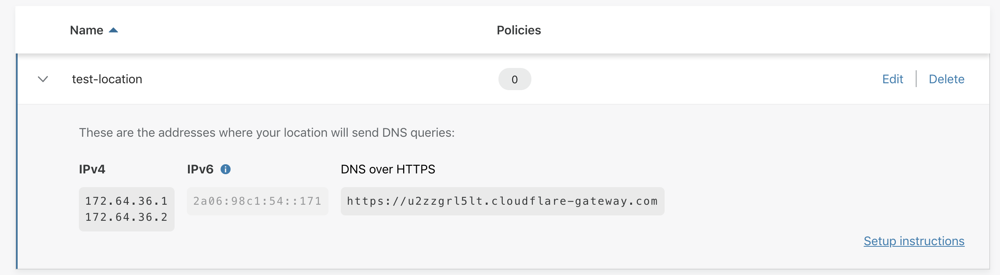

# Troubleshoot locations

## Why am I not seeing Analytics in my Overview page?

If you're seeing this message, there may be different reasons:

##### 1. You are not sending DNS queries to Gateway
Verify that the destination IP addresses you are sending DNS queries to are correct. You can check the destination IP addresses for your location by going to your locations page and then expanding the location:

##### 2. You are using other DNS resolvers
If you have other DNS resolvers in your DNS settings, your device could be using IP addresses for those resolvers that are not part of Gateway. Please make sure to remove all other IP addresses from your DNS settings and only include Gateway's DNS resolver IP addresses.

##### 3. The source IPv4 address for your location is incorrect
If you are using IPv4, check that the source IPv4 address that you entered for the location matches with the network's source IPv4 address.

##### 4. Analytics is not available yet
It takes some time to generate the analytics for Cloudflare Gateway. If don't see anything even after 5 minutes, please file a support ticket.
