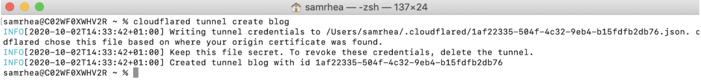
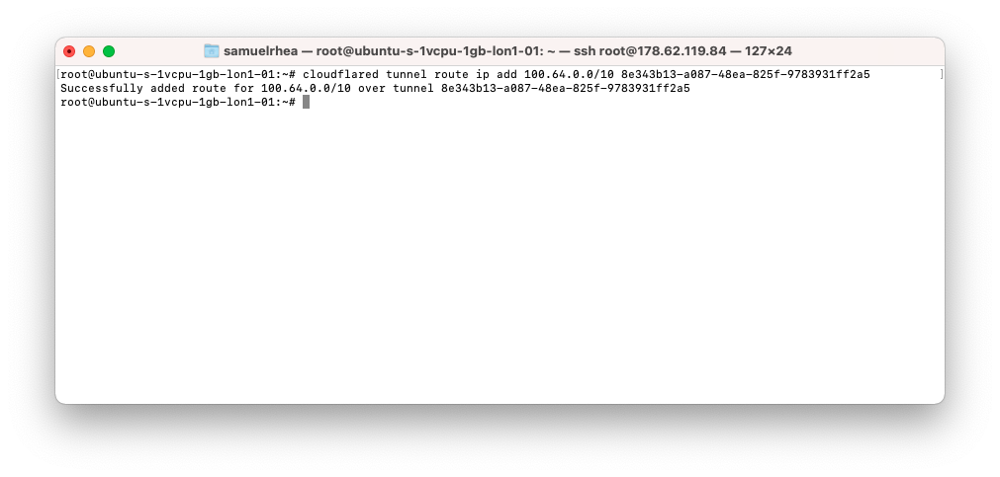
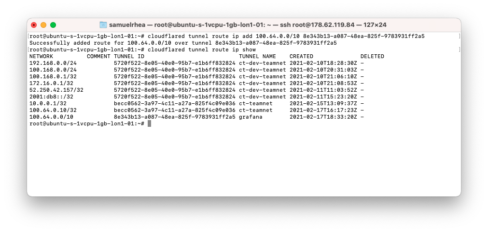

# Create a Tunnel

| Before you start |
|---|
| 1. [Install and authenticate `cloudflared`](/connections/connect-apps/install-and-setup/installation) |

## Create a Tunnel

To create a Tunnel, run the following command:

```bash
cloudflared tunnel create <NAME>
```

Replace `<NAME>` with the name you want to give to the Tunnel. The name assigned can be any string and does not need to relate to a hostname or your account name.

This command will create a Tunnel with the name provided and associate it with a UUID. The relationship between the UUID and the name is persistent. The command will not create a connection at this point.



Creating a Tunnel generates a credentials file for that specific Tunnel. This file is used to authenticate the Tunnel with your Cloudflare account when it connects.

You can also view and manage the Tunnels generated. Click [here](/connections/connect-apps/create-tunnel) for more information on other commands available.

## Associate the Tunnel with a CIDR

To map the Tunnel to a range of IPs, run the following command:

```bash
cloudflared tunnel route ip add <CIDR> <NAME>
```

Replace `<CIDR>` with the range of IPs that this Tunnel represents, for example `10.1.2.40/29`. The IP addresses used can include RFC 1918 ranges. The `<NAME>` value should be the name of a Tunnel already created.

This command will tell Cloudflare to send traffic from users in your organization to this Tunnel when those users connect to the range of IPs specified. The IPs must match the internal IPs of services running in your environment that `cloudflared` can reach.



Confirm the routes enrolled with the following command:

```bash
cloudflared tunnel route ip show
```



You can test the routing configuration with the following command as well:

```bash
cloudflared tunnel route ip get 100.64.0.1
```

## Configure the Tunnel

Next, create a configuration file for the Tunnel. The following template contains the required fields:

```yaml
tunnel: 8e343b13-a087-48ea-825f-9783931ff2a5
credentials-file: /root/.cloudflared/8e343b13-a087-48ea-825f-9783931ff2a5.json
warp-routing:
  enabled: true
```

## Run the Tunnel

You can now [run the Tunnel](/connections/connect-apps/run-tunnel) to connect it to Cloudflare.
