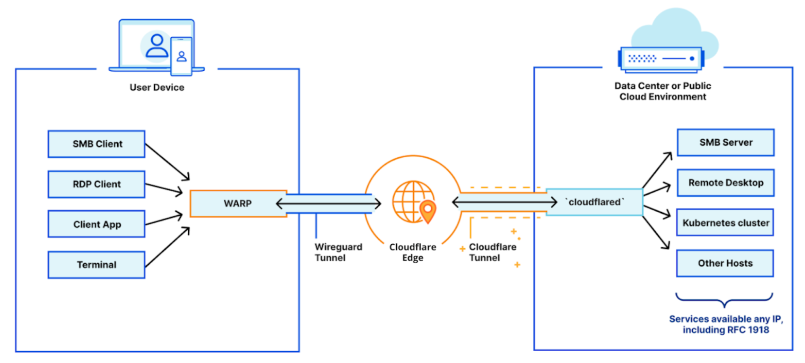

# Private hostnames and IPs

Building out a private network has two primary components: the infrastructure side and the client side.

The infrastructure side is powered by Cloudflare Tunnel, which connects your infrastructure to Cloudflare — whether that be a singular application, many applications, or an entire network segment. This is made possible by running `cloudflared` in your environment to establish multiple secure, outbound-only, load-balanced links to Cloudflare.

On the client side, your end users need to be able to easily connect to Cloudflare and, more importantly, your network. This connection is handled by Cloudflare WARP. This client can be rolled out to your entire organization in just a few minutes using your in-house MDM tooling and it establishes a secure connection from your users’ devices to the Cloudflare network.

For more information on how to connect private hostnames and IPs with Cloudflare Tunnel, see [this tutorial](/content/tutorials/warp-to-tunnel-internal-dns).
