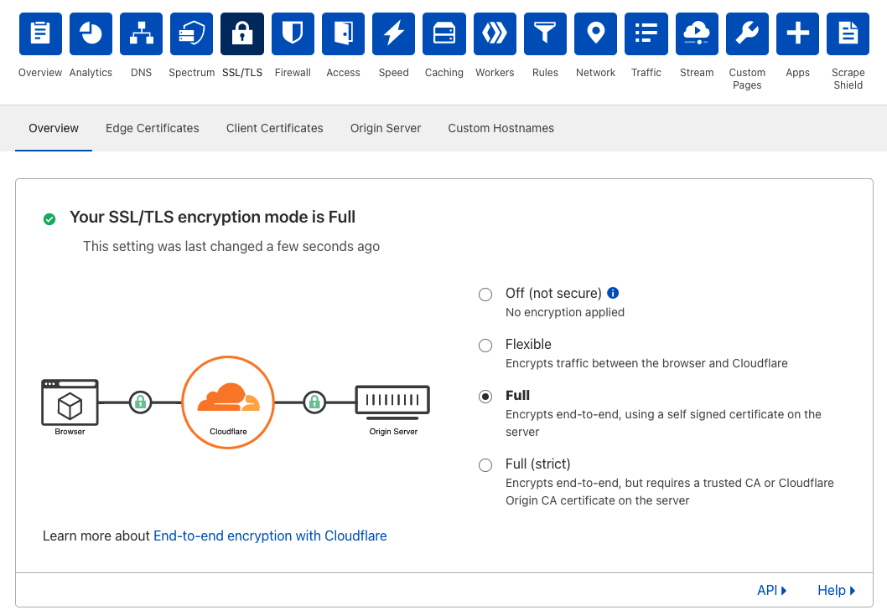

[❮ Back to FAQ](/faq)

# Tunnels

## ​Can I create a Tunnel for an apex domain?

Yes. With [Named Tunnels](https://blog.cloudflare.com/argo-tunnels-that-live-forever/) you can create a CNAME at the apex that points to the named tunnel.

## ​Does Cloudflare Tunnel support Websockets?

Yes. Cloudflare Tunnel has full support for Websockets.

## How can Tunnel be used with Partial DNS (CNAME Setup)?

Cloudflare offers two modes of setup: Full Setup, in which the domain uses Cloudflare DNS name servers, and Partial Setup (also known as CNAME setup) in which the domain uses non-Cloudflare DNS servers.

The best experience with Cloudflare Tunnel is using Full Setup because Cloudflare manages DNS for the domain and can automatically configure DNS records for newly started Tunnels.

You can still use Tunnel with Partial Setup. You will need to create a new DNS record with your current DNS provider for each new hostname connected through Cloudflare Tunnel. The DNS record should be of type CNAME or ALIAS if it is on the root of the domain. The name of the record should be the subdomain it corresponds to (e.g. example.com or tunnel.example.com) and the value of the record should be subdomain.domain.tld.cdn.cloudflare.net. (e.g. example.com.cdn.cloudflare.net or tunnel.example.com.cdn.cloudflare.net)

## How can origin servers be secured when using Tunnel?

Tunnel can expose web applications to the internet that sit behind a NAT or firewall. Thus, you can keep your web server otherwise completely locked down. To double check that your origin web server is not responding to requests outside Cloudflare while Tunnel is running you can run netcat in the command line:

```bash
netcat -zv [your-server’s-ip-address] 80
netcat -zv [your-server’s-ip-address] 443
```

If your server is still responding on those ports, you will see:

```bash
[ip-address] 80 (http) open
```

If your server is correctly locked down, you will see:

```bash
[ip-address] 443 (https): Connection refused
```

## What records are created for routing to a Named Tunnel's hostname?

Named Tunnels can be routed via DNS records, in which case we use CNAME records to point to the `<UUID>.cfargotunnel.com`; Or as Load Balancer origins, which also point to `<UUID>.cfargotunnel.com`.

## Does Cloudflare Tunnel send visitor IPs to my origin?

No. When using Cloudflare Tunnel, all requests to the origin are made internally between `cloudflared` and the origin.

To log external visitor IPs, you will need to [configure an alternative method](https://support.cloudflare.com/hc/en-us/articles/200170786-Restoring-original-visitor-IPs-Logging-visitor-IP-addresses-with-mod-cloudflare-).

## Why does the name "warp" appear in some legacy materials?

Cloudflare Tunnel was previously named Warp during the beta phase. As Warp was added to the Argo product family, we changed the name to match.

## How can I troubleshoot a Tunnel?

### Run Tunnel with debug logging

Use the following command to run your Tunnel in the debug mode:
```sh
$ cloudflared tunnel --loglevel debug run
```

The `--loglevel` flag indicates the logging level, which can be one of {`debug`, `info`, `warn`, `error`, `fatal`} (default: `info`). At the `debug` level, `cloudflared` will log and display the request URL, method, protocol, content length, as well as all request and response headers. However, please note that this can expose sensitive information in your logs. 

### Check SSL/TLS encryption mode
1. On the Cloudflare dashboard for your zone, navigate to **SSL/TLS** > **Overview**.
1. If your SSL/TLS encryption mode is **Off (not secure)**, make sure that it is set to **Flexible**, **Full** or **Full (strict)**.



When the encryption mode is set to **Off (not secure)**, you may encounter connection issues when running a Tunnel.

### Check location of credentials file
If you encounter the following error when running a Tunnel, double check your `config.yml` file and ensure that the `credentials-file` points to the correct location. You may need to change `/root/` to your home directory.

```sh
$ cloudflared tunnel run
2021-06-04T06:21:16Z INF Starting tunnel tunnelID=928655cc-7f95-43f2-8539-2aba6cf3592d
Tunnel credentials file '/root/.cloudflared/928655cc-7f95-43f2-8539-2aba6cf3592d.json' doesn't exist or is not a file
```

## I need help. How do I contact support?

If you are having an issue with one or more tunnels, before contacting the Cloudflare support team:

* Take note of any specific error messages and/or problematic behaviors.

* Take note of any options you specified, either on the command line or in your configuration file, when starting your tunnel.

* Set [`log-level`](https://developers.cloudflare.com/cloudflare-one/connections/connect-apps/configuration/arguments#loglevel) to `debug`, so the Cloudflare support team can get more info from the `cloudflared.log` file.

* Set [`transport-log`](https://developers.cloudflare.com/cloudflare-one/connections/connect-apps/configuration/arguments#transport-loglevel) level to `debug`.

* Include your Cloudflare Tunnel logs file (`cloudflared.log`). If you did not specify a log file when starting your tunnel, you can do so using the [`logfile` option](https://developers.cloudflare.com/cloudflare-one/connections/connect-apps/configuration/arguments#logfile) either on the command line or in your configuration file.

* Include your full `config.yml` file for the affected tunnel.

* Make sure that the `cloudflared daemon` is updated to the [latest version](https://github.com/cloudflare/cloudflared).

* Gather any relevant error/access logs from your server.
