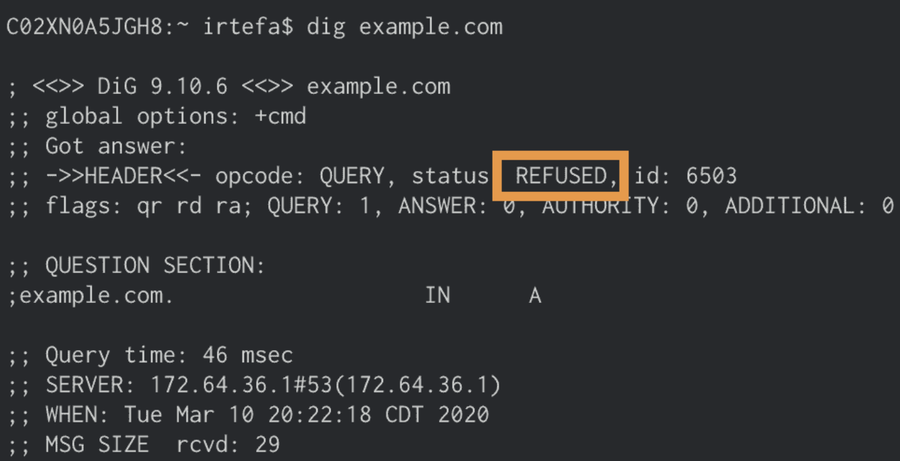
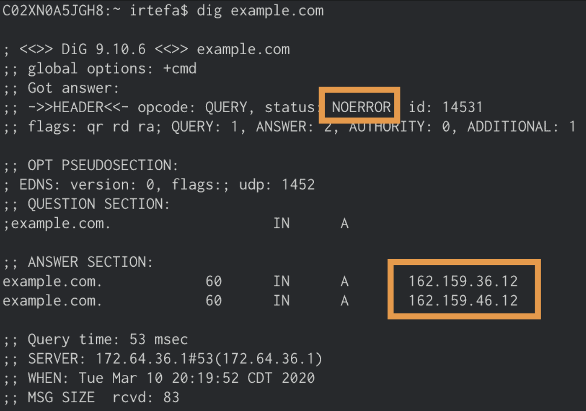
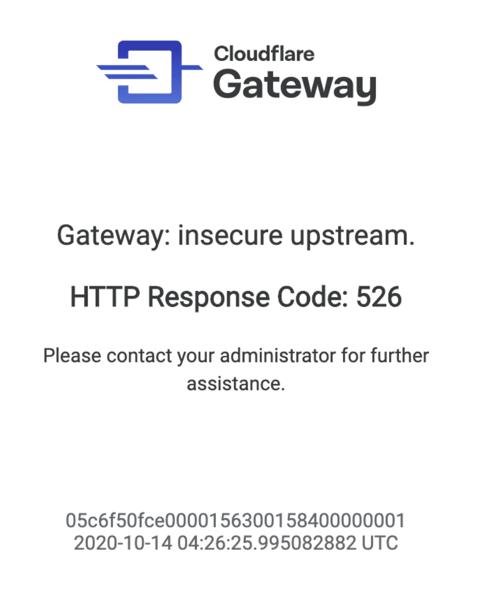
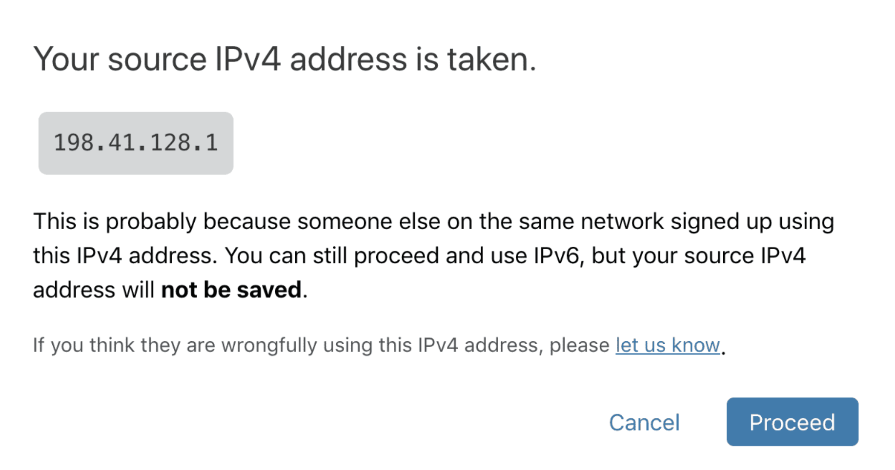
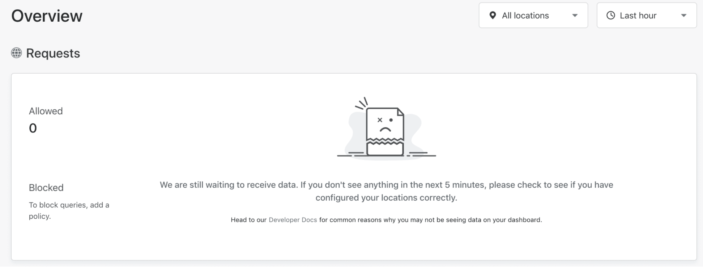

# Troubleshooting and FAQ

This section addresses the most common issues you may come across when setting up or using Cloudflare for Teams.

<ButtonGroup>
  <Button type="primary" href="/faq/access/">Access</Button>
  <Button type="primary" href="/faq/gateway/">Gateway</Button>
  <Button type="primary" href="/faq/warp/">WARP client</Button>
  <Button type="primary" href="/faq/tunnel/">Argo Tunnel</Button>
  <Button type="primary" href="/faq/browser-isolation/">Browser Isolation</Button>  
  <Button type="primary" href="/faq/self-diagnostics/">Self diagnostics</Button> 
</ButtonGroup>

## Gateway help

### What is the difference between Cloudflare Gateway and 1.1.1.1?
The primary difference between 1.1.1.1 and Cloudflare Gateway is that 1.1.1.1 does not block any DNS query. When a browser requests for example.com, 1.1.1.1 simply looks up the answer either in cache or by performing a full recursive DNS query.

Cloudflare Gateway's DNS resolver adds an additional step to introduce security into this flow. Instead of allowing all DNS queries, Gateway first checks the hostname being queried against the intelligence Cloudflare has about threats on the Internet. If that query matches a known threat, or is requesting a blocked domain configured by an administrator as part of a Gateway policy, Gateway stops it before the site could load for the user - and potentially execute code or phish that team member.

For example, if you are using Cloudflare Gateway, and send a DNS query to example.com, Gateway checks if the DNS query matches with any of the policies you set up earlier to block domains. The policy could be a domain that you are manually blocking or it could be part of a broader security category that you enabled. If the domain matches one of those cases, Gateway will return REFUSED. The browser will think this website does not exist. As a result, it will not take the customer to the blocked website.

### Does Cloudflare Gateway support IPv6 networks?
Yes. Each location has a unique IPv6 address. You can use that IPv6 address to send DNS queries to Cloudflare Gateway.

### How can I report a false positive?

If your domain is unexpectedly blocked, you can use [this form](https://radar.cloudflare.com/categorization-feedback/) to get the URL reviewed. 

## Policies

### You're using a regex in your HTTP policy, but it doesn't seem to be matching traffic as expected.

Gateway uses Rust to evaluate regular expressions. The Rust implementation is slightly different than regex libraries used elsewhere. For example, if you want to match multiple domains, you could use the pipe symbol (`|`) as an OR operator. In Gateway, you do not need to use an escape character (`\`) before the pipe symbol.
Let's say you want to block requests to two hosts if either appears in a request header. A regex for such a rule would look like this:
* Selector: `Host`
* Operator: `Matches regex`
* Value: `.*whispersystems.org | .*signal.org`
* Action: `Block`

To evaluate if your regex matches, you can use [this tool](https://rustexp.lpil.uk/).

### If I add a policy, how long does it take to propagate or take effect?
It takes about 60 seconds for the policy to be updated across all of our data centers around the world.

If you are still seeing responses from the DNS queries for a domain that you blocked. The answers may be cached by your browser from anywhere between 5 minutes to a few hours.

### In what order does Gateway apply the rules inside an HTTP policy?

Rules are enforced top to bottom. However, the L7 firewall will evaluate *Do Not Inspect* rules before any subsequent *Allow* or *Block* rules, to determine if decryption should occur. This means regardless of precedence in your list of rules, all *Do Not Inspect* rules will take precedence over *Allow* or *Block* rules.

### Can I use a wildcard operator to block domains?
You can only use a wildcard operator for DNS policies. However, you don’t need to use a wildcard operator to block domains. For example, if you want to block all the subdomains for `example.com` then you only have to block `example.com`. It will not only block dns requests to `example.com` but also all subdomains for `example.com`. You can read more about it on our [policies page](/policies).

### What happens when I have multiple policies assigned to the same location?
If you have multiple policies and both policies are applied to a single location, Gateway will arbitrarily choose one of the policies and apply them to the location.

### What happens when there is no policy assigned to a location?
Assuming the location is configured correctly, Gateway will log the DNS queries and show them in the analytics dashboard. As there are no policies assigned to the location, Gateway will not block any DNS queries.

### You added a domain to the block list but you can still resolve it. Here's what could've happened:

#### 1. Policy update is still in progress
After you update your policy, Cloudflare updates the new setting across all of our data centers around the world. It takes about 60 seconds to update the policy when you make a change.

#### 2. DNS records are cached

If it takes longer than 60 seconds and you are still seeing that you can successfully resolve a domain then the DNS record is probably getting cached in your browser or in your operating system. DNS records for domains can be cached from anywhere between five minutes to a few hours. Here is how you can flush the DNS cache in your browser and/or your operating system:

##### Mac OSX 10.9 and Later

1. Launch the Terminal application
2. Run the following command and hit enter:
`sudo dscacheutil -flushcache; sudo killall -HUP mDNSResponder`

##### Mac OSX 10.8 and Earlier

1. Launch Terminal (under Applications/Utilities)
2. Run the following command and hit enter:
`sudo killall -HUP mDNSResponder`

##### Windows

1. Right-click Command Prompt and select Run as Administrator.
2. Run the following command and hit enter:
`ipconfig /flushdns`

##### Linux

1. Open a terminal window.
2. Run the following command and hit enter:
`sudo service network-manager restart`

##### Safari

Use the instructions in the Mac section to flush the DNS cache for Safari.

##### Google Chrome

1. In a new tab, type the following into the address bar and hit enter: `chrome://net-internals/#dns`
2. Click the button labeled "clear host cache"

##### Firefox

1. Type `about:config` in Firefox’s address bar and acknowledge the warning that appears
2. Find an entry called `network.dnsCacheExpiration` and set its value to `0` (If there’s no such entry, create a new integer item with the name above and a value of 0)
3. Now go back and change the value to `3600`

#### 3. Your device using another DNS resolver
If you have other DNS resolvers in your DNS settings, your device could be using IP addresses for resolvers that are not part of Gateway. As a result, the domain you are trying to block is still accessible from your device. Please make sure to remove all other IP addresses from your DNS settings and only include Gateway's DNS resolver IP addresses.

#### 4. The policy is not assigned to a location
If your policy is not assigned to a location and you send a DNS query from that location, Gateway will not apply that policy. Assign a policy to a location to make sure the desired policy is applied when you send a DNS query from that location.

### I have a dynamic IP address assigned to me by my ISP. How can I still use Gateway?

There are two ways to connect to Cloudflare Gateway: with the Cloudflare WARP client and without the client.

You can filter DNS traffic without using the client by registering the source IP of your network and configuring Gateway as your upstream DNS resolver; however, if your IP address changes then Gateway will not know which policy to apply to your queries. This can be solved by using the [DoH subdomain](/glossary#doh-subdomain) associated with the location for which you've configured a policy. When queries reach Gateway over DoH, only the DoH subdomain is used to determine which organization and policy to apply to the query--the source IP of the query is not considered. There are a several of DoH clients available for a variety of operating systems, and we recommend using cloudflared to send queries to Gateway via DoH if not using the Cloudflare WARP client. Simply install cloudflared and configure the DoH subdomain for a chosen location as the upstream resolver in cloudflared.

[Install and configure cloudflared](https://developers.cloudflare.com/1.1.1.1/dns-over-https/cloudflared-proxy)

Connecting to Gateway with the Cloudflare WARP client creates a secure connection to the Cloudflare edge and also affords you the ability to send queries to Gateway over DoH. Using the Cloudflare WARP client allows you to apply security for your users wherever they are regardless of location or source IP address.

[Learn more about the Cloudflare WARP client](https://developers.cloudflare.com/warpclient/)

### How can I check if Gateway is blocking a domain?
After you blocked a domain using a policy, you can use either `dig` or `nslookup` to see if it's working.

Before you test if the domain is blocked, please make sure that you are connected to a network that is associated with the location where the policy is applied.

If you are using a policy to block `example.com`, you can do the following to see if Gateway is blocking `example.com`:

1. Open your terminal

2. Type `dig example.com` (`nslookup example.com`) if you are using Windows) and press enter

3. If the Block page is **disabled** for the policy, then you should see `REFUSED` in the answer section like below

If the Block page is **enabled** for the policy, then you should see `NOERROR` in the answer section and **162.159.36.12** and **162.159.46.12** as the answers when the domain is successfully blocked.


### How do I know if Gateway is working for me?

You can visit the [Teams help page](https://help.teams.cloudflare.com/). This page will give you an overview of your network details, as well as an overview of the categories that are being blocked and/or allowed.


### How can I test if SafeSearch is working?
Visit the [SafeSearch page](/policies/filtering/dns-policies/safesearch) to see how you can test if SafeSearch is working.

### I receive an untrusted certificate warnings for every page and I am unable to browse the internet.

Advanced security features including HTTPS traffic inspection require users to install and trust the Cloudflare root certificate on their machine or device. If you are installing certificates manually on all of your devices, these steps will need to be performed on each new device that is to be subject to HTTP Filtering.

To install the Cloudflare root certificate, follow the steps [found here](/connections/connecting-to-gateway/install-cloudflare-cert).

### Even though I installed the Cloudflare certificate on my system, mobile applications warn of an invalid certificate.

The mobile application may leverage certificate pinning. This is a security mechanism used to prevent man-in-the-middle (MITM) attacks on the internet by hardcoding information about the certificate that the application expects to receive. If the wrong certificate is received, even if it's trusted by the system, the application will refuse to connect.

Cloudflare Gateway dynamically generates a certificate for all encrypted connections in order to inspect the content of HTTP traffic. This certificate will not match the expected certificate by applications that use certificate pinning.

To allow these applications to function normally, administrators can configure bypass rules to exempt traffic to hosts associated with the application from being intercepted and inspected.

### I browsed to a website and received a Cloudflare Gateway error page, not a block page.



Cloudflare Gateway is designed to protect users by default. In the event this page is received, providing as much information as possible to the local IT administrator will be helpful as we troubleshoot with them such as:

* Operating System (Windows 10, macOS 10.x, iOS 14.x)
* Web browser (Chrome, Firefox, Safari, Edge)
* URL of the request
* Screenshot or copy/paste of the content from the error page

We present an HTTP error page in the following cases:

#### An untrusted certificate is presented from the origin to Gateway.

Gateway will consider a certificate is untrusted if any of these three conditions are true:

* The server certificate issuer is unknown or is not trusted by the service.
* The server certificate is revoked and fails a CRL check (OSCP checking coming soon)
* There is at least one expired certificate in the certificate chain for the server certificate

#### Common certificate errors

For example in the event of a certificate common name mismatch.

#### Insecure cipher suite

When the connection from Cloudflare Gateway to an upstream server is insecure (e.g, uses an insecure cipher such as rc4, rc4-md5, 3des, etc.)

We do support upstream connections that require a connection over TLS that is prior to TLS 1.3. We will support the ability for an administrator to configure whether to trust insecure connections in the very near future.

#### I created a bypass rule or disabled TLS interception completely and inspection seems to still be occurring.

Disabling TLS interception for a previously inspected hostname requires the HTTP connection to be restarted (i.e., closing the browser) for the bypass to take effect.

### Does Cloudflare have a global policy to allow, block, or bypass anything in addition to what I've configured?

Cloudflare provides organizations the tools to protect themselves from advanced threats in the simplest way possible. However, we won't configure any rules without the knowledge of our customers--we'd rather make it easy for you to do so. A customer's rules are always evaluated first (and exclusively) with one exception: We have a single global rule to ensure that the Cloudflare WARP client can connect to the Cloudflare edge even in the event that the Cloudflare root certificate was not installed:

```
Selector: hostname
Operator: is
Value: cloudflareclient.com
Action: bypass
```

This allows the WARP client to connect to Cloudflare and determine if the Cloudflare certificate is not present and trusted on the local device; and if not, then the client will alert the user.

### Your source IPv4 address is taken



If you are seeing this, you may be connected to a network where someone else in the same network signed up for Cloudflare Gateway before you did.

If your network supports IPv6, you can still use Cloudflare Gateway's DNS filtering by sending DNS queries over IPv6. You can also use the DNS over HTTPS hostname to send queries using a DNS over HTTPS client.

## Analytics

### Will I see the private IP addresses in the activity log?
No. The IP addresses are NAT-ed behind a public IP address. Activity log will only show the public Source IP address.

### You are not seeing analytics on the Overview page



You may not see analytics on the Overview page for the following reasons:

##### 1. You are not sending DNS queries to Gateway
Verify that the destination IP addresses you are sending DNS queries to are correct. You can check the destination IP addresses for your location by going to your locations page and then expanding the location:


##### 2. You are using other DNS resolvers
If you have other DNS resolvers in your DNS settings, your device could be using IP addresses for resolvers that are not part of Gateway. Please make sure to remove all other IP addresses from your DNS settings and only include Gateway's DNS resolver IP addresses.

##### 3. The source IPv4 address for your location is incorrect
If you are using IPv4, check the source IPv4 address that you entered for the location matches with the network's source IPv4 address.

##### 4. Analytics is not available yet
It takes some time to generate the analytics for Cloudflare Gateway. If you are not seeing anything even after 5 minutes, please file a support ticket.
