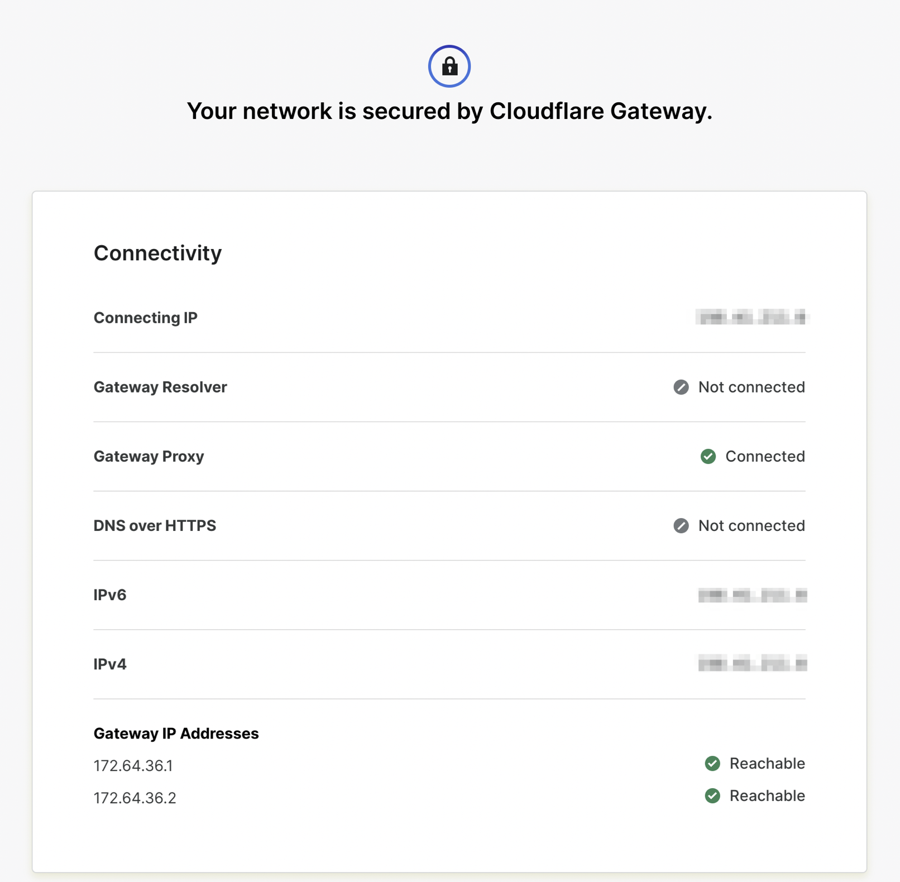
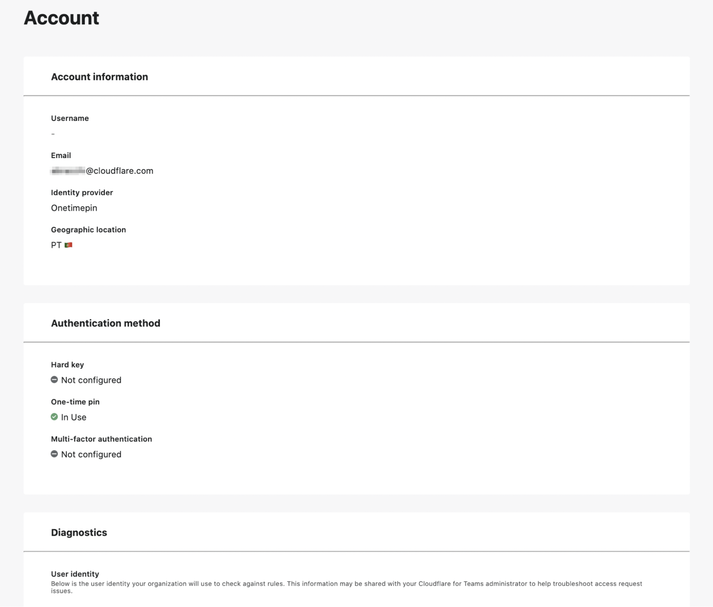

# Troubleshooting and FAQ

This section addresses the most common issues you may come across when setting up or using Cloudflare for Teams.

<ButtonGroup>
  <Button type="primary" href="/faq/access/">Access</Button>
  <Button type="primary" href="/faq/gateway/">Gateway</Button>
  <Button type="primary" href="/faq/warp/">WARP client</Button>
  <Button type="primary" href="/faq/tunnel/">Argo Tunnel</Button>
  <Button type="primary" href="/faq/self-diagnostics/">Self diagnostics</Button> 
</ButtonGroup>

# Self diagnostics

If your users are experiencing issues connecting to Cloudflare for Teams, they can visit the **Teams help page** or their **Account page** to quickly isolate the problem.

* The [Teams help page](#teams-help-page) returns information on the status of your connection to Gateway.
* The [Account page](#account-page) gives an overview of a user's personal information and authentication methods.

## Teams help page

The [Teams help page](https://help.teams.cloudflare.com/) at `https://help.teams.cloudflare.com/` is a quick way to check whether Gateway is successfully protecting your network. It also allows your users to further investigate network issues.

This page shows:

* An overview of **Connectivity** details
* **Debug information** 
* An overview of the content categories and security risks that are being blocked

## Account page

The Account page in the App Launcher allows your end users to self-diagnose any issues they may encounter when accessing applications behind Teams. In the Account page, they can check their account information and their authentication methods. 

To reach the Account page:

1. Navigate to the **App Launcher**.
2. Click on the User icon in the top right corner.
3. In the drop-down menu, click on **Account**.

The Account page includes:
* Details on the end user’s **account** and **authentication methods**
* A **Diagnostics** card with a code snippet users can share with a Teams administrator to help with troubleshooting.

