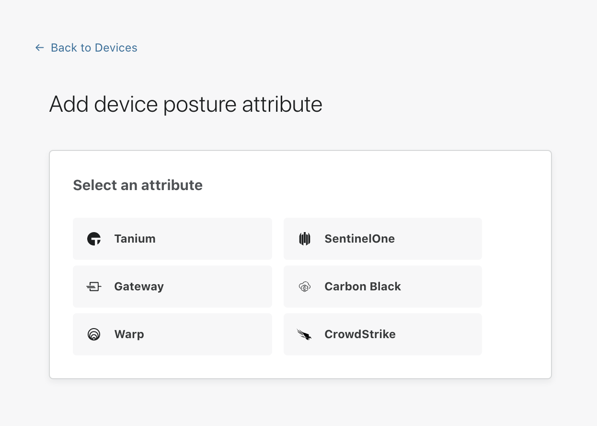

 
# Carbon Black

Cloudflare for Teams can check if [Carbon Black](https://www.carbonblack.com/) is running on a device to determine if a request should be allowed to reach a protected resource.

| Prerequisites |
| ------------- |
| The WARP client installed on a user machine and updated to the latest version (minimum version required - macOS: Version 1.4.34 and Windows: Version 1.4.33.0) |
| Carbon Black installed on a user machine |

## Configuring the Cloudflare integration

1. On the [Teams dashboard](https://dash.teams.cloudflare.com), navigate to **My Team > Devices > Device posture**.

1. Select **+Add**.

   

1. Select **Carbon Black**.

1. You will be prompted for the following information:
    * **Name:** A unique identifier for this Carbon Black device posture check
    * **Operating system:** You’ll need to configure one posture check per operating system (Mac and Windows currently supported)
    * **Application Path:** This will pre-populate with the default application path but can be edited if you have installed in a non-standard location
    * **Certificate thumbprint (optional):** The thumbprint of your Carbon Black instance’s certificate.
    * **SHA256 checksum (optional):** Used to validate the SHA256 signature of your Carbon Black instance.

1. Once you have configured your Carbon Black instance, you can then add Carbon Black device posture checks to any application protected by Access.
