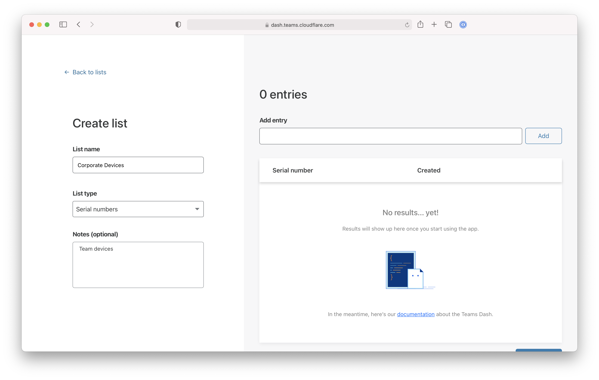
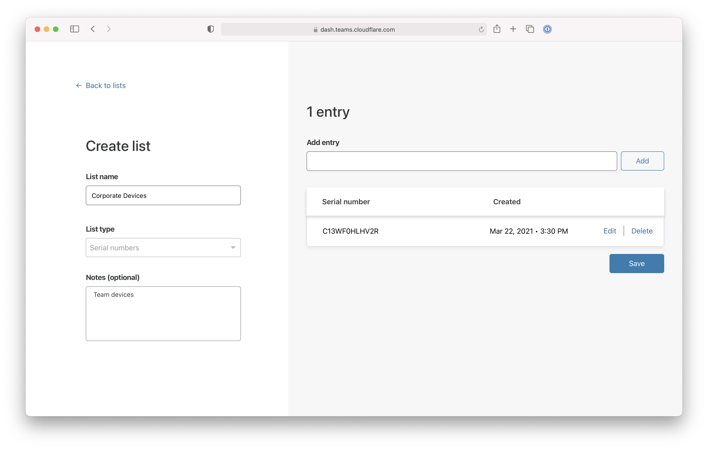
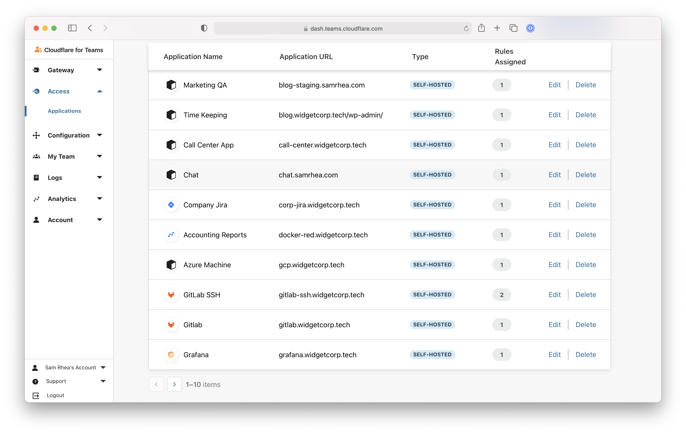
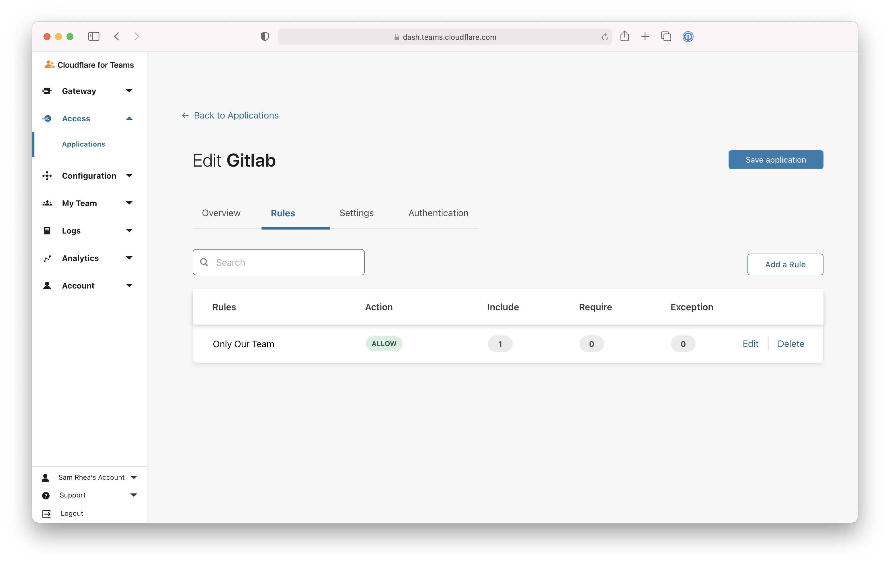
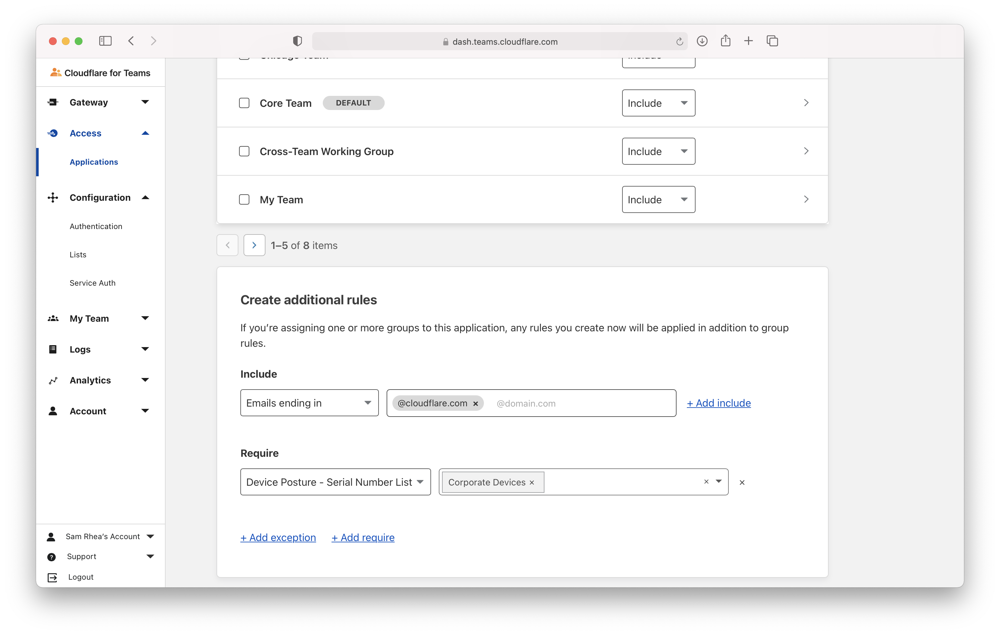

# Device serial numbers

Cloudflare for Teams allows you to build Zero Trust rules based on device serial numbers. You can create these rules so that access to applications is granted only to users connecting from company devices.

To create rules based on device serial numbers you'll need to create a list of numbers using the [Lists](/policies/lists) functionality in the Teams Dashboard.

<Aside header='Important'>

Cloudflare Access relies on the WARP client to gather the serial number of a device attempting to reach an application.

In order for your users to be able to authenticate, you must [deploy the WARP agent](/tutorials/gw-rollout-guide#configure-device-policies) in proxy mode to your company devices. Users also [must enroll](/tutorials/gw-rollout-guide#enroll-the-cloudflare-for-teams-agent-for-dns-filtering) into your organization's Cloudflare for Teams account.

</Aside>

1. On the [Teams dashboard](dash.teams.cloudflare.com), navigate to **Configuration > Lists**.

1. Click **Create manual list** or **Upload CSV**. For larger teams, we recommend uploading a CSV or using Cloudflare's API endpoint.

   

1. Give your list a descriptive name, as this name will appear when configuring your Access policies.

   

1. Set List Type to Serial Number.

1. Input the serial numbers of the devices your team manages, or upload your CSV file.

   

1. Click **Save**.

  Once saved, the serial number list will appear in your list view.

   

Now you can create or update an existing Access policy to require that any device requesting access belongs to your list of serial numbers.

To do that: 

1. Navigate to **Access > Applications**.

1. To add to an existing application, choose the specific resource from the **Applications** page in the Access section of the sidebar.

1. Click **Edit**.

   

1. Select the **Rules** tab and edit an existing rule. To add a new rule, click **Add a Rule**.

   

1. Add a `Require` rule and choose `Device Posture - Serial Number List` from the drop-down menu.

1. Choose the list of devices to require and click **Save rule**.

  

Once saved, any device attempting to reach the application will need to connect from a device that uses Cloudflare WARP and presents a serial number in the list created.

