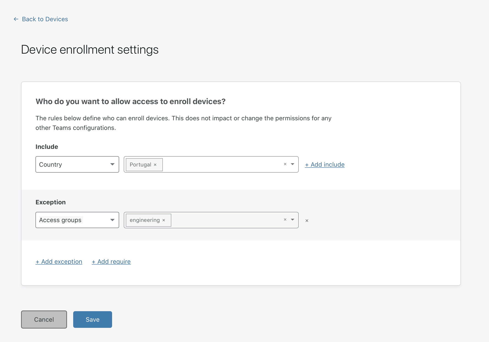

# Device enrollment

<Aside>

Revoking a user's permission to manage devices will not prevent that user from autnenticating to Access. If you wish to revoke access to that user, you can do so by [revoking their user session](/identity/users/session-management#revoke-user-sessions). 

</Aside>

Cloudflare for Teams allows you to establish which users in your organization can enroll new devices or revoke access to connected devices. To do that, you can create a **device enrollment rule** on the Teams dashboard.

1. On the [Teams dashboard](https://dash.teams.cloudflare.com), navigate to **Devices**.

1. Click **Device Settings** on the top-right corner.

1. In the rule builder, configure a rule to define who can enroll or revoke devices.

 

1. Click **Save**.