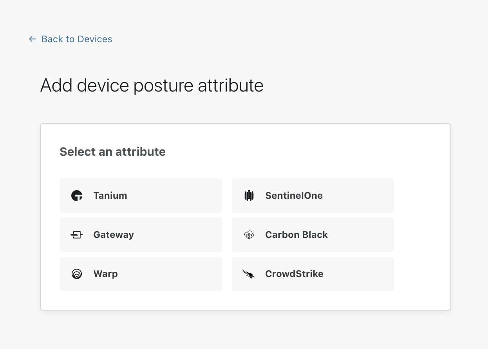

# SentinelOne

Cloudflare for Teams can check if [SentinelOne](https://www.sentinelone.com/) is running on a device to determine if a request should be allowed to reach a protected resource.

| Prerequisites |
| ------------- |
| The WARP client installed on a user machine and updated to the latest version (minimum version required - Windows: 1.4.25.0, macOS: 1.4.27) |
| SentinelOne installed on a user machine |

## Configuring the Cloudflare integration

1. On the [Teams dashboard](https://dash.teams.cloudflare.com), navigate to **My Team > Devices > Device posture**.

1. Select **+Add**.

   

1. Select **SentinelOne**.

1. You will be prompted for the following information:

    * **Name:** A unique identifier for this SentinelOne device posture check
    * **Operating system:** You’ll need to configure one posture check per operating system (macOS and Windows currently supported)
    * **Application Path:** Enter the full path to the SentinelOne process to be checked (for example, `c:\program files\SentinelOne\SentinelOne.exe`)
    * **Certificate thumbprint (optional):** The thumbprint of the publishing certificate used to sign the binary. This proves the binary came from SentinelOne and is the recommended way to validated the process
    * **SHA256 checksum (optional):** Used to validate the SHA256 signature of the binary. This verifies the binary exactly matches the one you expect to be there. Note: do not fill out this field unless you strictly control updates to SentinelOne, as this will change between versions

1. Once you have configured your SentinelOne instance, you can then add SentinelOne device posture checks to any application protected by Access.