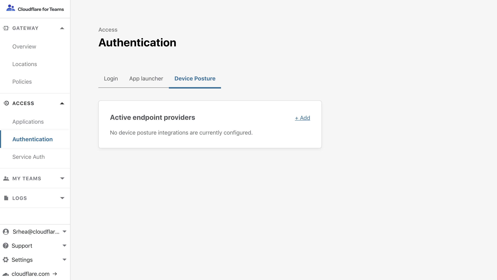
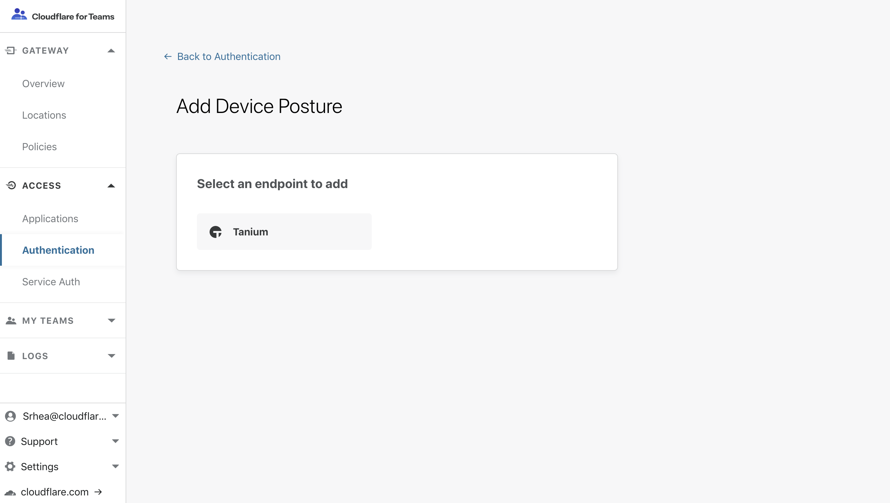
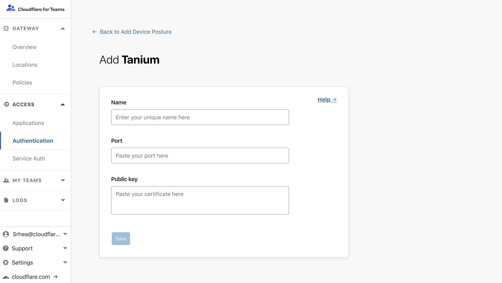

# Tanium

Cloudflare Access can use endpoint data from [Tanium™](https://www.tanium.com/) to determine if a request should be allowed to reach a protected resource.

## Tanium Configuration

Tanium's Endpoint Identity feature can share information about a device that is attempting to authenticate through Cloudflare Access, including patch status, management status, and vulnerabilities score.

First, configure your Tanium deployment using the [step-by-step documentation](https://docs.tanium.com/endpoint_identity/endpoint_identity/userguide.html) provided.

Once complete, return to the Cloudflare for Teams dashboard to integrate with your Cloudflare Access account.

## Cloudflare Access Configuration

Cloudflare Access relies on a secure exchange between a user's browser and the Tanium agent to read data from the Tanium client. When users attempt to connect to a resource protected by Access with a Tanium rule, Cloudflare Access will validate the user's identity, and the browser will connect to the Tanium agent before making a decision to grant access.

<Aside>

The integration does not currently support Safari.
</Aside>

## Integrating Tanium Identity

| Requirements |
| ------------ |
| You will need an active Tanium™ Core Platform deployment that runs version 7.2 or later. |

Integrate your Tanium deployment with Cloudflare Access using public keys generated in the Tanium step-by-step documentation linked above.

1. On the Teams dashboard, navigate to **Access > Authentication**.

2. Select the **Device Posture** tab.

    

3. Click *+Add* to start configuring the Tanium integration.

3. Select **Tanium** from the list of providers.

    

4. In the next screen, give a name to the Tanium integration.

 "Tanium" will work, or, if you prefer, you can choose a more specific name.

    

5. Input `17472` for the port value.

 This is the default port used by the Tanium endpoints to communicate inbound and outbound with Cloudflare Access. You may need to modify it to reflect your organization's deployment.

6. Input the public certificate generated in the Tanium step-by-step documentation above.

 Adding the certificate allows Cloudflare to validate that the response from the Tanium agent is valid.

## Building policy rules with Tanium endpoint signal

With Tanium integrated, you can build policies that enforce decisions using signal from the endpoint.

| Signal | Value | Description |
|--|--|--|
| Managed | Boolean | Validates that the device is managed in your organization's Tanium account. |

1. On the Teams dashboard, navigate to **Access > Applications**.

2. [Create a new application](/applications/) or edit an existing application.

3. [Build a policy](/policies/) that contains a rule with an Allow action that includes identity.

 For example, a rule that allows users to connect if they are members of your team's email domain.

4. Add an additional rule that contains a Require action that includes Device Posture and choose Tanium.

 The Tanium rule will require that the device connecting is managed in your Tanium deployment and has checked into the Tanium server in the last 7 days.

5. Save the rule.

The rule above will only allow users who are part of your team's email domain and running the Tanium agent to connect to the protected resource.