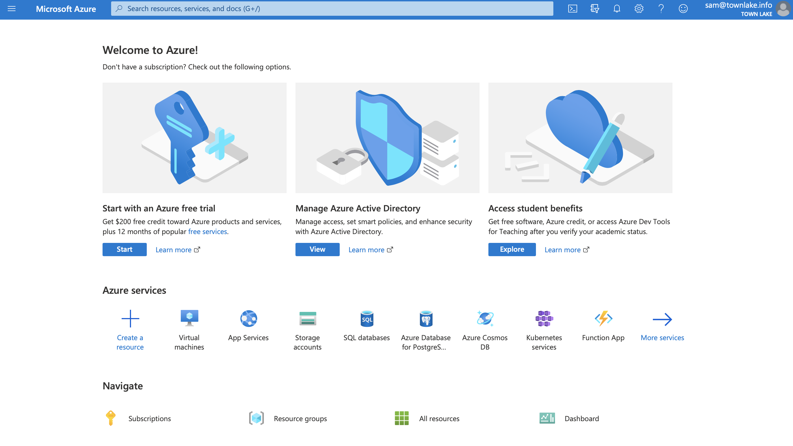
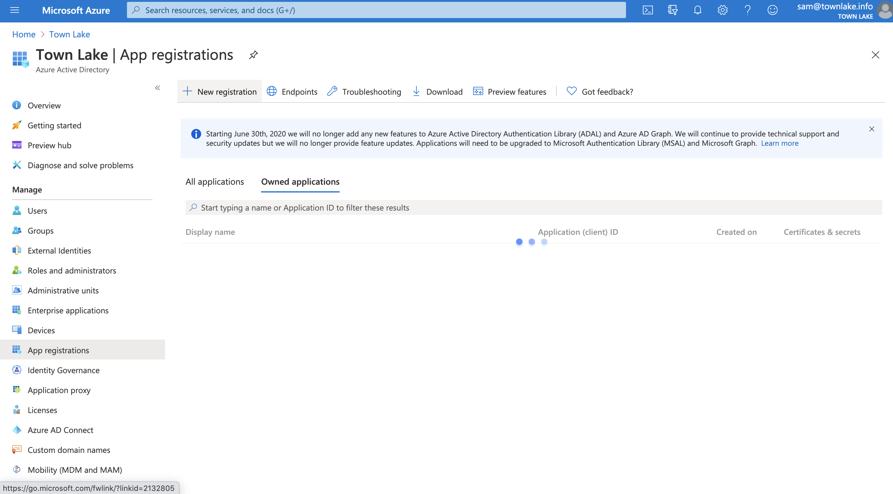
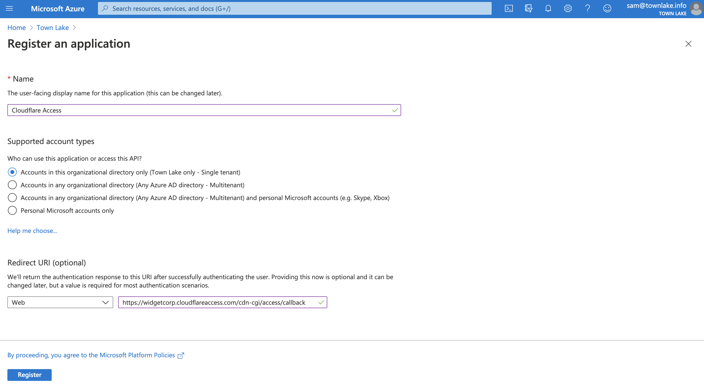
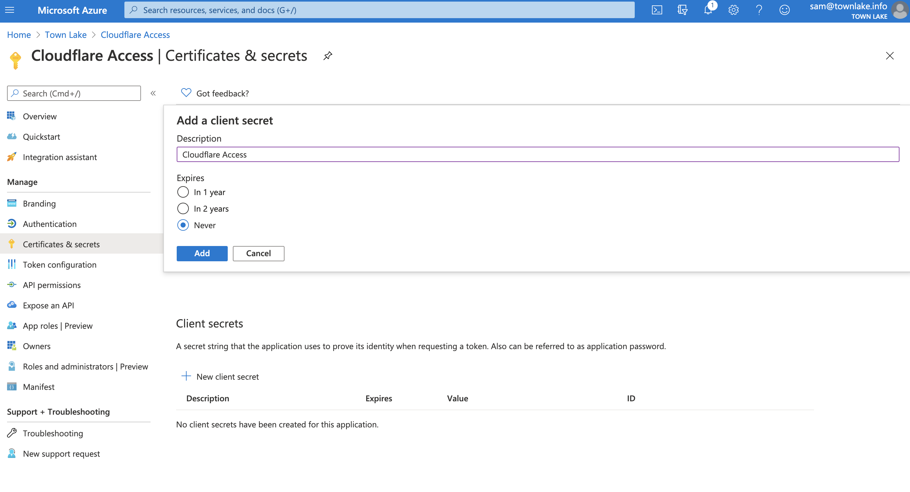
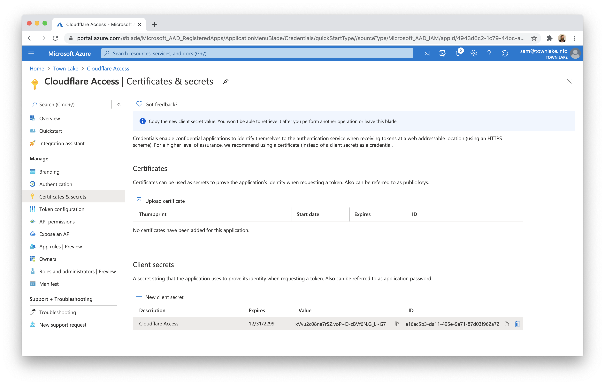
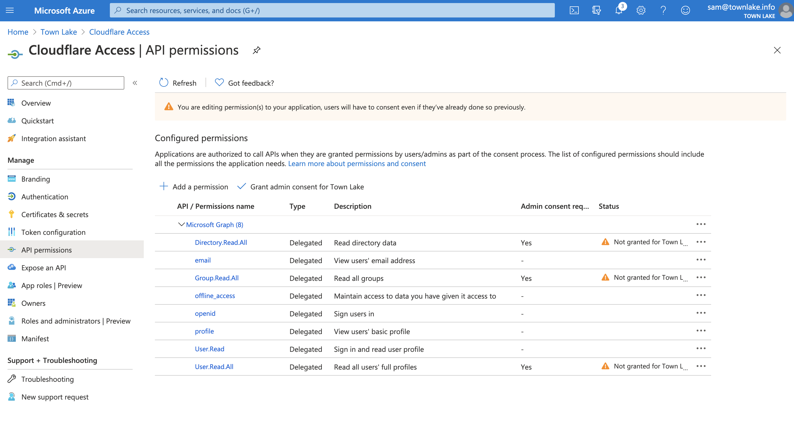
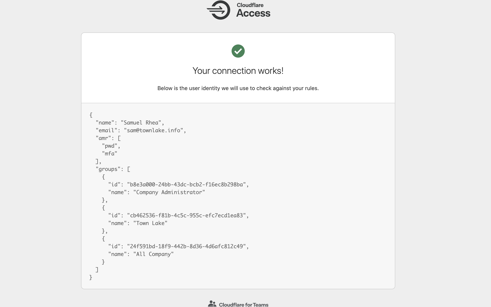
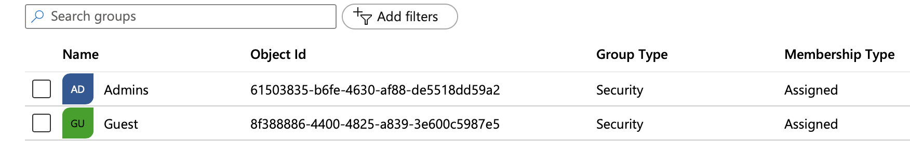
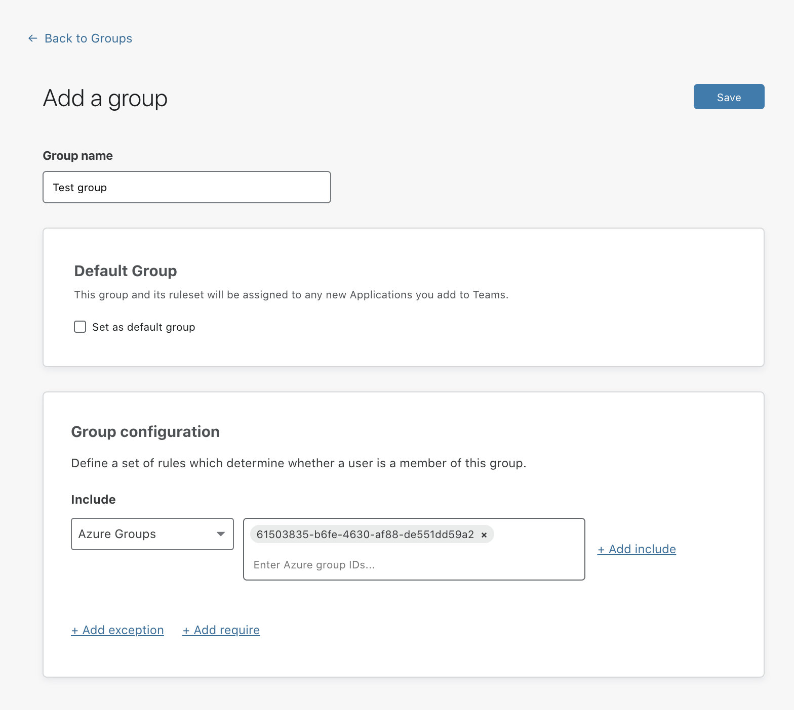

# Microsoft Azure AD®

You can integrate Microsoft Azure AD® (Active Directory) with Cloudflare for Teams and build rules based on user identity and group membership. Users will authenticate with their Azure AD credentials and connect to Teams.

1. Sign in to [the Azure dashboard](https://portal.azure.com/).

 

1. Click **Azure Active Directory** in the Azure Services section.

 

1. On the **Azure AD** dashboard, click **App registrations** in the **Manage** section of the _Azure Active Directory_ pane.

 

1. Click **+ New registration**.

 

1. Name your application and enter your [team domain](/glossary#team-domain) followed by this callback at the end of the path: `/cdn-cgi/access/callback`. For example:

    ```txt
    https://your-team-name.cloudflareaccess.com/cdn-cgi/access/callback
    ```
    Click **Register**.

 

1. On the following screen, copy the `Application (client) ID` and `Directory (tenant ID`. You will need to input these values into the Cloudflare dashboard.

 

1. In the left hand panel, click **Certificates & Secrets** to create an Application Secret.

 

1. Click **+ New client secret**. Name the client secret and choose an expiration. Click **Add**.

 

 Copy the `Value` field of the client secret. Treat this value like a password. This example leaves the value visible so the values in Azure can be seen in the Access configuration.

 

1. In the left hand panel, select **API permissions**. Click **Add a permission**.

 

1. Click **Microsoft Graph**.

 

1. Select Delegated permissions. You will need to toggle 7 specific permissions in the next page. Once toggled, click **Add permissions**.

    - email
    - openid
    - profile
    - offline_access
    - User.Read
    - Directory.Read.All
    - Group.Read.All

 

1. On the next page, click the button that begins **Grant Admin Consent for ...**.

 

1. On the Teams dashboard, navigate to **Configuration > Authentication**.

1. Under **Login methods**, click *+ Add*.

1. Choose **Azure AD** on the next page.

1. Input the `Application ID`, `Application secret`, and `Directory ID` values from Azure.

 If you are using Azure AD groups, toggle **Support Groups** slider **On** in the **Edit your Azure AD identity provider** window.

 

1. Click **Save**.

To test that your connection is working, navigate to **Authentication > Login methods** and click **Test** next to Azure AD.

 

## Using AzureAD Groups

AzureAD exposes directory groups in a format that consists of random strings, the `Object Id`, that is distinct from the `Name`. In the example below, the group named "Admins" has an ID of `61503835-b6fe-4630-af88-de551dd59a2`.



To configure Access to use Azure groups, make sure you toggle on the **Support groups** switch as you set up Azure AD on your Teams dash.

This will enable you to select **Azure AD groups** when creating or editing a group. When asked for the **Azure group ID**, you must input the `Object Id`. 



## Example API Configuration

```json
{
    "config": {
        "client_id": "<your client id>",
        "client_secret": "<your client secret",
        "directory_id": "<your azure directory uuid",
        "support_groups": true
    },
    "type": "azureAD",
    "name": "my example idp"
}
```
