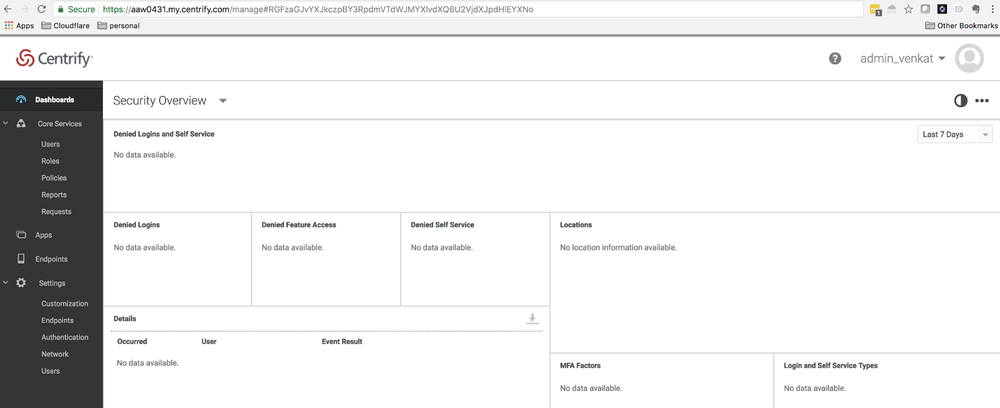
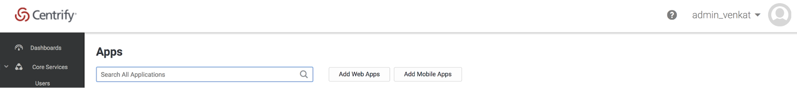
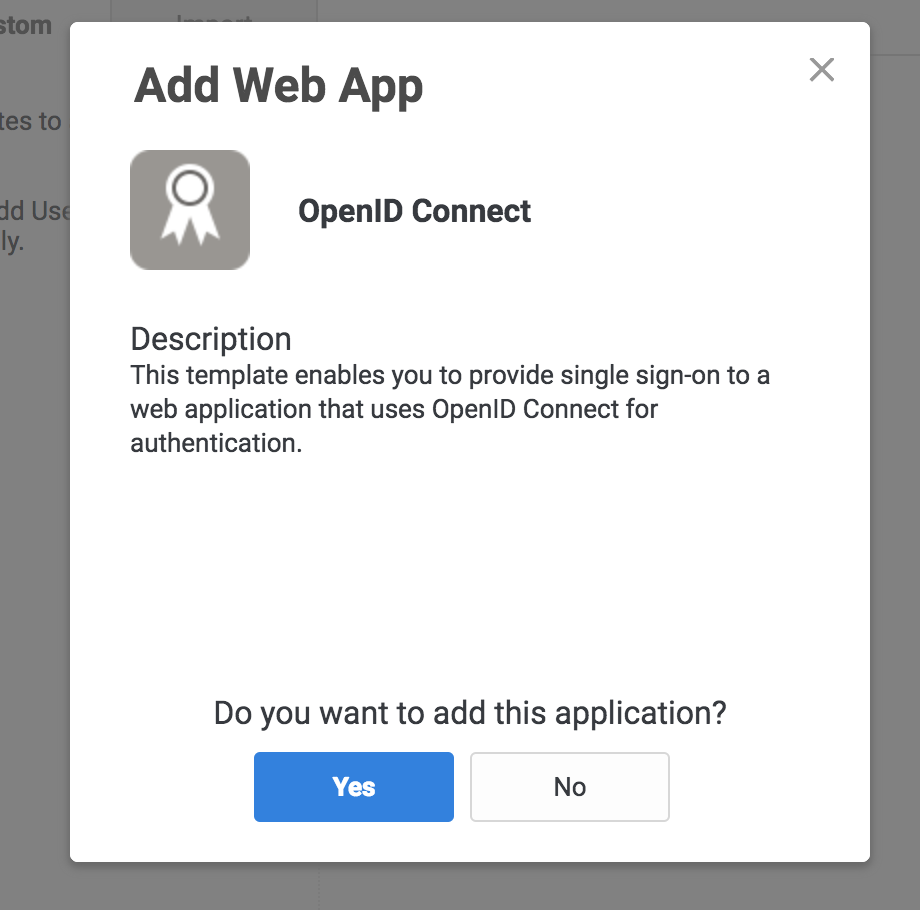
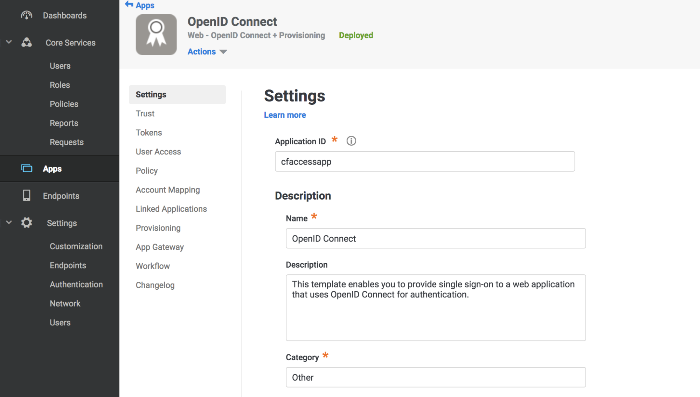
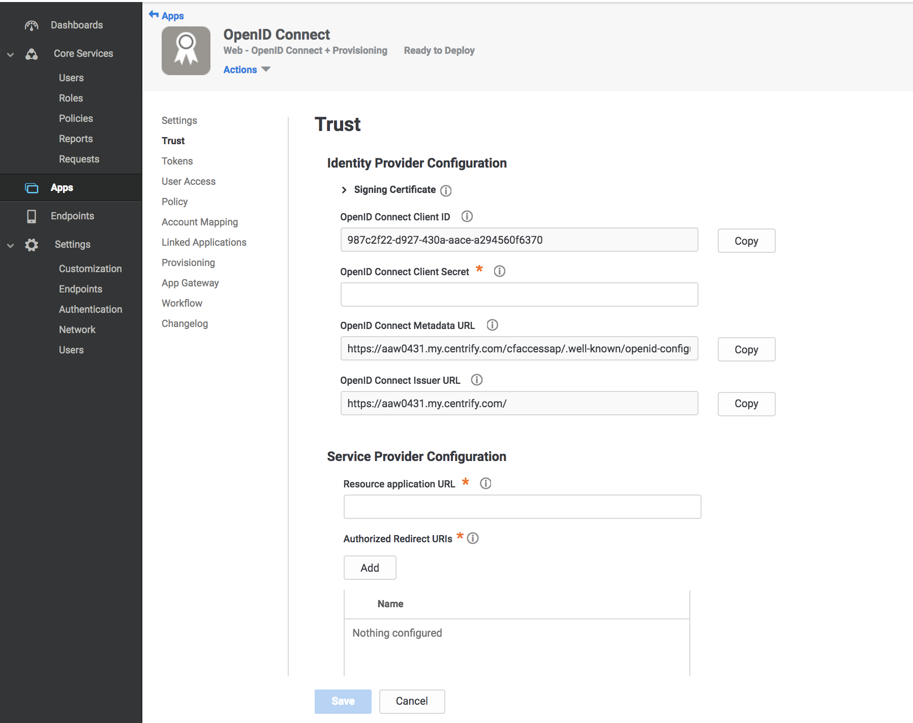
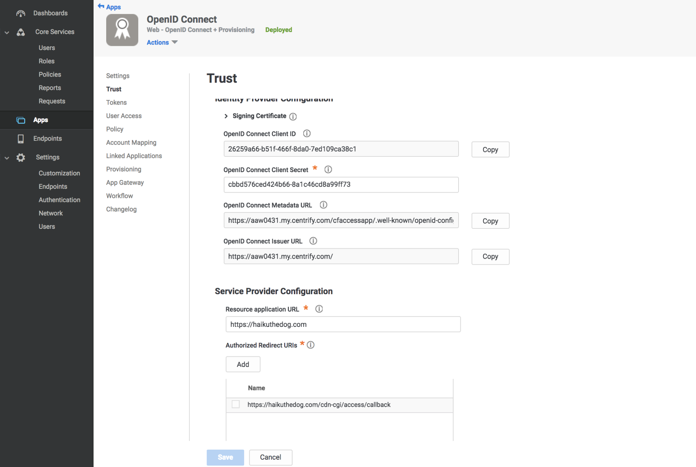
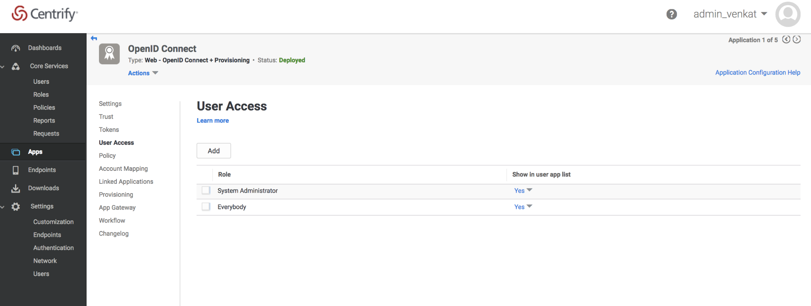

# Centrify

Centrify secures access to infrastructure, DevOps, cloud, and other modern enterprise so you can prevent the number one cause of breaches: privileged access abuse.

## Set up Centrify

These steps help you set up Centrify as your identity provider:

1. Log in to the Centrify administrator panel.
1. Click **Apps**.

    

1. Click **Add Web Apps**.

    

1. Select the **Custom** tab and click **Add OpenID Connect**.
1. On the **Add Web App** screen click **Yes** to create an OpenID Connect application.

    

1. Enter an **Application ID**.

    

1. Click **Save**.
1. Click **Trust** in the **Settings** menu.
1. Enter a strong application secret on the **Trust** section.
1. Under **Service Provider Configuration** enter your application’s authentication domain as the resource application URL.
1. Under **Authorized Redirect URIs** click **Add**.

    

1. Under **Authorized Redirect URIs** enter your [team domain](/glossary#team-domain) followed by this callback at the end of the path: `/cdn-cgi/access/callback`. For example:

    ```txt
    https://your-team-name.cloudflareaccess.com/cdn-cgi/access/callback
    ```

1. Click **Save**.

    

1. Take note of the Client ID, Client Secret, OpenID Connect Issuer URL, and Application ID from the Settings tab.

    <Aside>

    Do not use the forward slash from the <strong>Settings</strong> tab.
    </Aside>

1. Navigate to the **User Access** tab.
1. Select the roles to grant access to your application.

    

1. On the **Teams dashboard**, navigate to **Configuration > Authentication**.
1. Click *+ Add* under **Login Methods**, and select Centrify as your IdP.
1. Paste in the **Client ID**, **Client Secret**, **Centrify account URL** and **Application ID**.
1. Click **Save**.

To test that your connection is working, navigate to **Authentication > Login methods** and click **Test** next to the login method you want to test.

## **Example API Config**

```json
{
    "config": {
        "client_id": "<your client id>",
        "client_secret": "<your client secret",
        "centrify_account": "https://abc123.my.centrify.com/",
        "centrify_app_id": "exampleapp",
    },
    "type": "centrify",
    "name": "my example idp"
}
