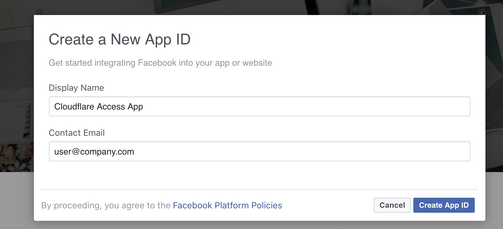
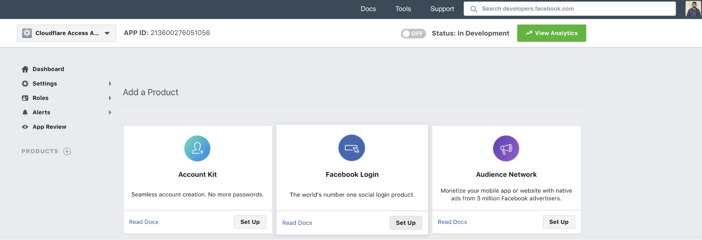
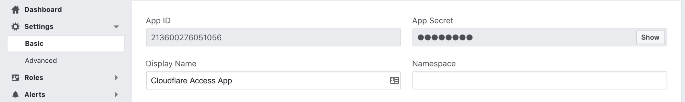
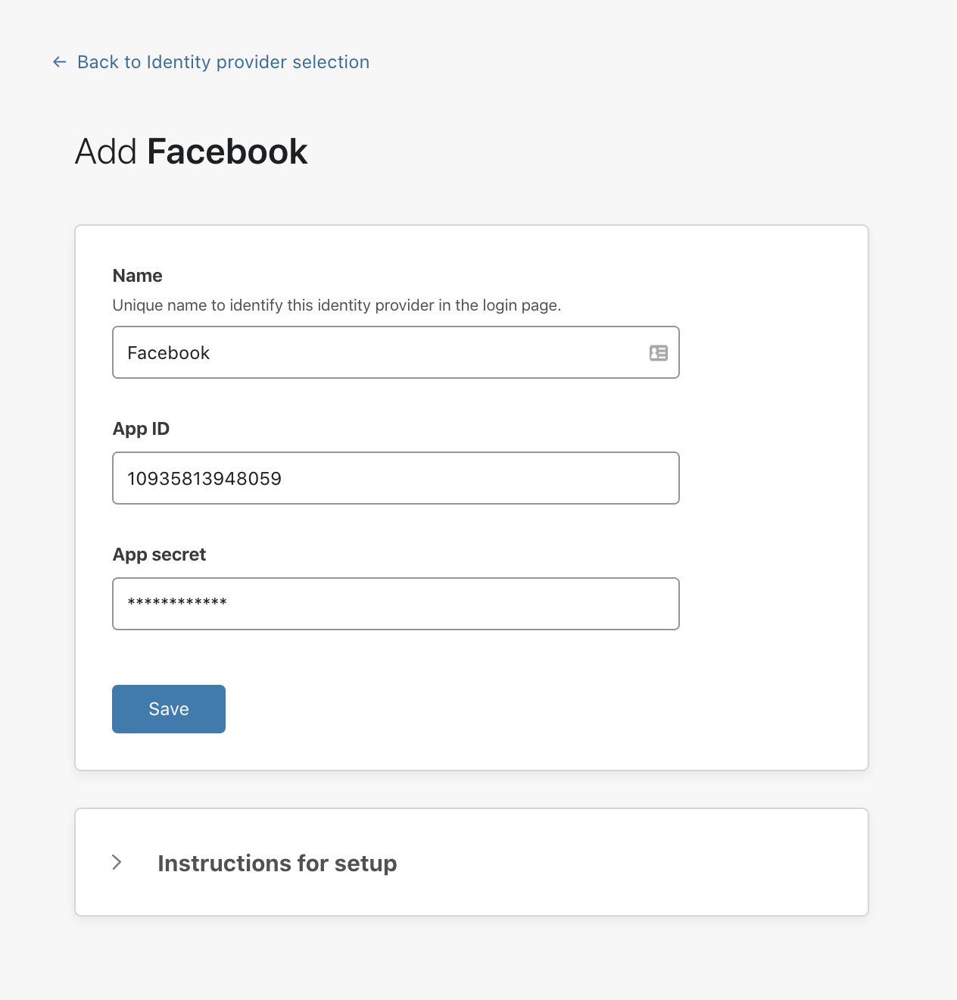

# Facebook

Use these steps to set up Facebook as your identity provider.

1. Go to go to [developers.facebook.com](https://developers.facebook.com/).
1. Click **Create App** at the top-right.

    

   The **Create a New App ID** card displays.
1. Enter the **Display Name** and **Contact Email**.
1. Click **Create App ID**.

    The Create a New App ID window displays.

    

1. Enter the Captcha code to proceed.
1. Click **Submit**.
1. On the **Facebook Login** card, click **Set Up**.

    

    A Quickstart card displays offering platform choices.

    

1. Click **Web**.

    The *Web* tab displays.

1. Enter your **Site URL**.
1. Click **Save**.
1. Click **Continue**.

    Ignore any JavaScript page that suggests that you install it on your site.

1. Click **Settings > Basic** on the left-hand menu.

    

1. On the Teams dashboard, navigate to **Configuration > Authentication**.
1. Click *+ Add* under **Login Methods**, and select Facebook as your IdP. 

1. Copy the App ID and App Secret into the **OAuth ID** and **OAuth Secret** fields.

    

1. Click **Save**.

    

1. On [developers.facebook.com](https://developers.facebook.com/), set the **Use Strict Mode for Redirect URIs** slider to **Yes**.
1. In the **Valid OAuth redirect URIs** field, enter your [team domain](/glossary#team-domain), followed by this callback at the end of the path: `/cdn-cgi/access/callback`. For example:

    ```txt
    https://your-team-name.cloudflareaccess.com/cdn-cgi/access/callback
    ```
    
1. Click **Save Changes**.
1. On the Teams dashboard, click **Save**.

To test that your connection is working, navigate to **Authentication > Login methods** and click **Test** next to Facebook.

## Example API Configuration

```json
{
    "config": {
        "client_id": "<your client id>",
        "client_secret": "<your client secret"
    },
    "type": "facebook",
    "name": "my example idp"
}
