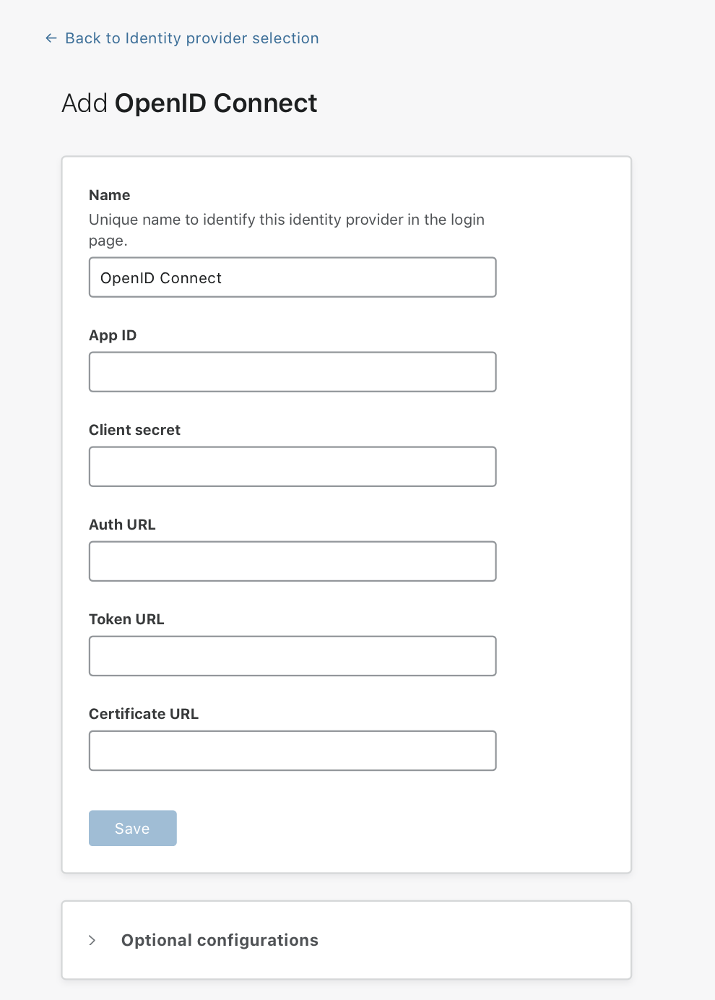

# Generic OIDC

Cloudflare Access has a generic OpenID Connect (OIDC) connector to help you integrate IdPs not already set in Access.

## Setting up a generic OIDC

To set up a generic OIDC:

1. Visit your identity provider and create a client/app.

1. Copy the content of these fields:
   * Client ID
   * Client secret
   * Auth URL: The `authorization_endpoint` URL of your IdP
   * Token URL: The token_endpoint URL of your IdP
   * Certificate URL: The `jwks_uri` endpoint of your IdP to allow the IdP keys to sign the tokens

    You can find these values on your identity provider’s OIDC discovery endpoint. Some providers call this the “well-known URL.”

1. On the Teams dashboard, navigate to **Configuration > Authentication**.

1. Under **Login methods**, click *+ Add*.

1. Choose **OpenID Connect** on the next page.

   

1. In the **Name** field, enter your IdP. Then, paste in the **Client ID** and **Client secret**.

1. In the **authorized redirect URI** field for your IdP, enter your [team domain](/glossary#team-domain) followed by this callback at the end of the path: `/cdn-cgi/access/callback`. For example:

    ```txt
    https://your-team-name.cloudflareaccess.com/cdn-cgi/access/callback
    ```

1. Click **Save**.

1. To test that your connection is working, navigate to **Authentication > Login methods** and click **Test** next to the login method you want to test.

On success, a confirmation screen displays.

## Example API Configuration

```json
{
	"config": {
		"client_id": "<your client id>",
		"client_secret": "<your client secret>",
		"auth_url": "https://accounts.google.com/o/oauth2/auth",
		"token_url": "https://accounts.google.com/o/oauth2/token",
		"certs_url": "https://www.googleapis.com/oauth2/v3/certs",
	},
	"type": "oidc",
	"name": "Generic Google"
}
```
