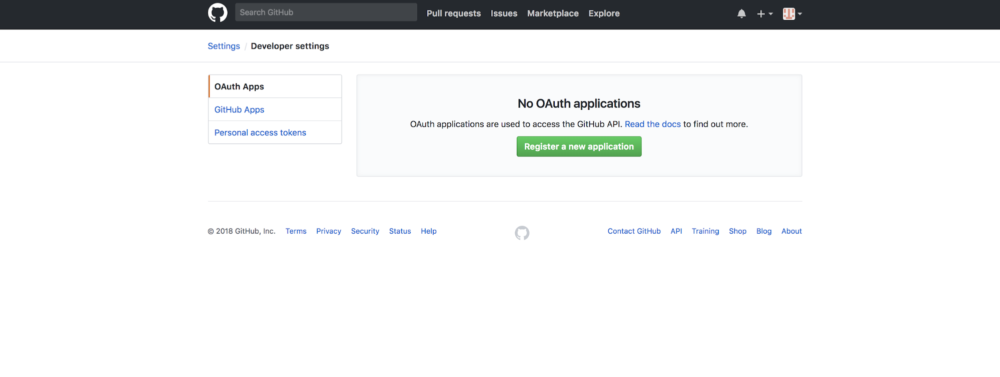
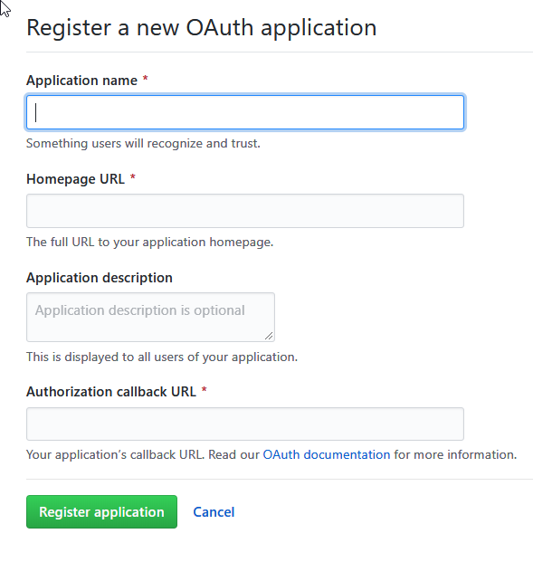
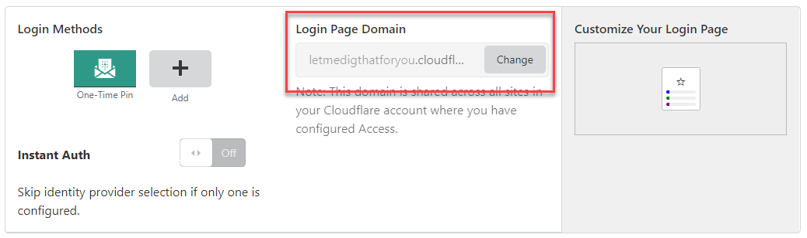
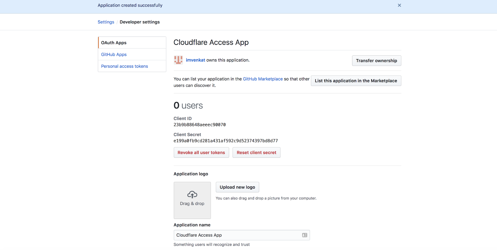
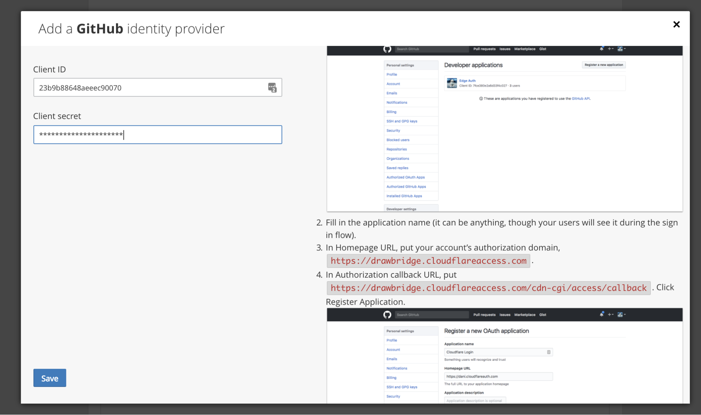
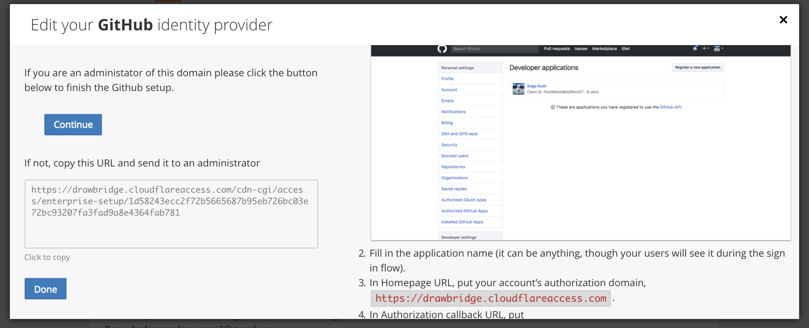

# GitHub

Cloudflare Access allows your to connect to your applications using their GitHub login. Administrators can build rules for specific individuals or using GitHub organizations. You do not need to have a GitHub organization to use the integration.

## Set up GitHub Access

To configure GitHub access in both GitHub and Cloudflare Access:

1. Log into GitHub.
2. Go to your account **Settings > Developer Setting**, select **OAuth Apps** and click **Register a new application**.

    

    The **Register a new OAuth application** window displays.

    

3. Enter an **Application name**.

    You users see this name on the login page.

4. Enter your account’s authorization domain in the **Homepage URL** field.

    For example, `https://something.cloudflareaccess.com`

    You can find this in the **Login Page Domain** field in **Cloudflare Access**.

    

    Click anywhere in the field to copy the content to your clipboard.

5. Paste the domain in the GitHub **Authorization callback URL** field, and add this to the end of the path: `/cdn-cgi/access/callback`
6. Click **Register application**.
7. Copy the **Client ID** and **Client Secret**.

    

8. In Cloudflare Access, scroll to **Login Methods** and click **GitHub**.

    The _Add a GitHub identity provider_ window displays.

    

9. Paste in the **Client ID** and **Client secret**.
10. Click **Save**.
11. Click **Done**.

    

12. Click **Save and Test.**

    On success a confirmation screen displays.

    

> **Note:** If you have GitHub two-factor authentication enabled, you will need to first login to GitHub directly and return to Access.

## Example API Configuration

```json
{
    "config": {
        "client_id": "<your client id>",
        "client_secret": "<your client secret"
    },
    "type": "github",
    "name": "my example idp"
}
```
