# Google

You can integrate Google authentication with Cloudflare Access without a Google Workspace account. The integration will allow any user with a Google account to login (if the Access policy allows them to reach the resource). Unlike the instructions for [Google Workspace](/identity/idp-integration/gsuite), the steps below will not allow you to pull group membership information from a Google Workspace account.

1. Visit the Google Cloud Platform console. Create a new project.

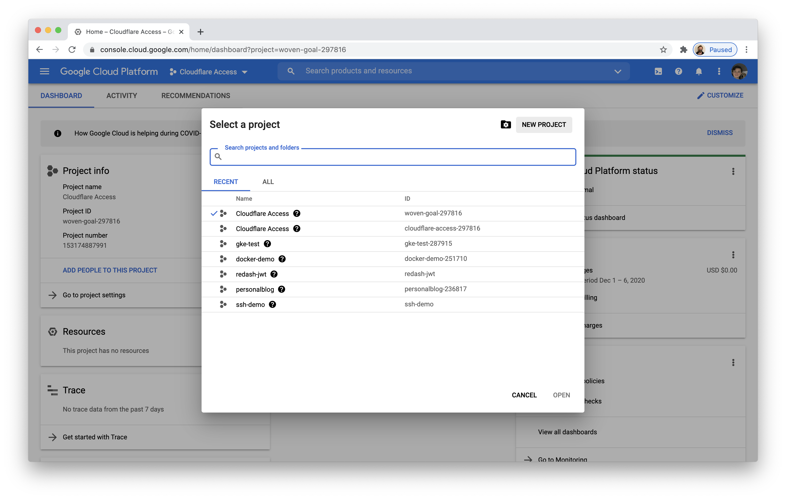

2. Name the project and click **Create**.

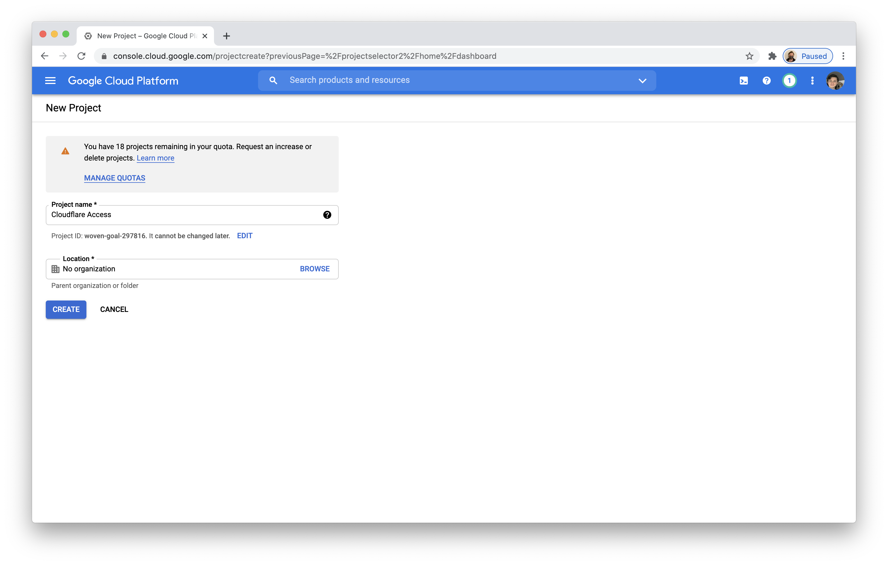

3. On the project home page that loads, select `APIs & Services` from the sidebar and click **Dashboard**.

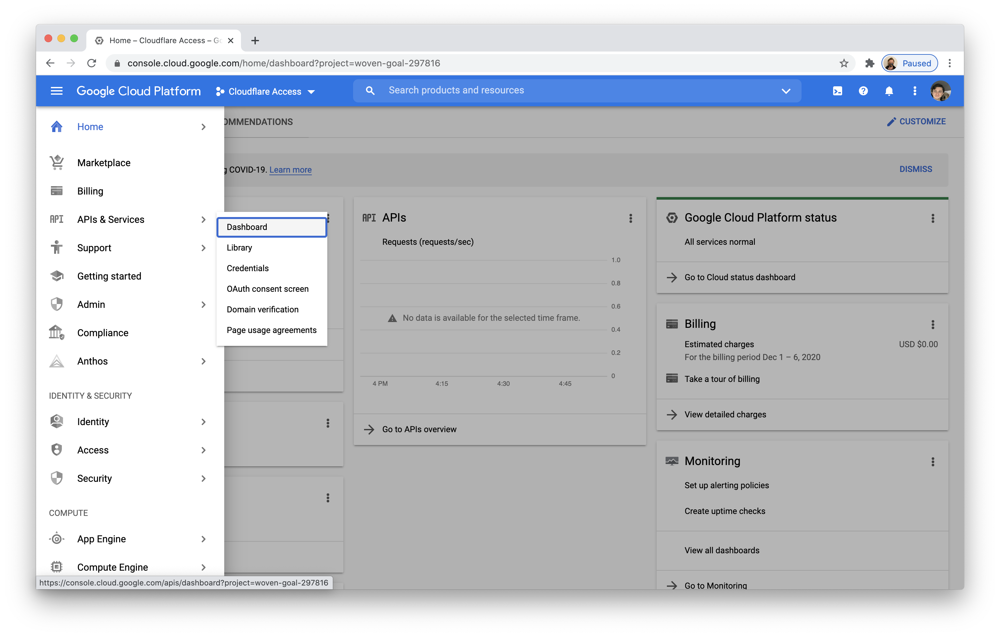

4. You will first need to configure a consent screen. Click **Configure Consent Screen** at the top of the page.


5. Choose `External` as the User Type. Since this application is not being created in a Google Workspace account, the only types of users are external.

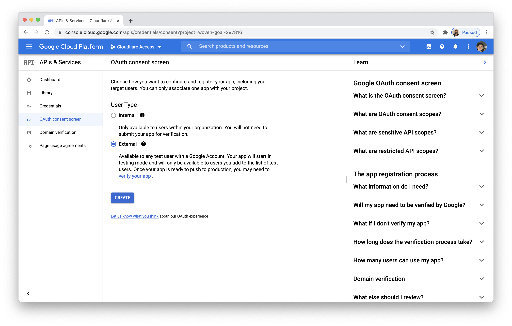

6. Name the application and add a support email (GCP will require you to add an email in your account).


You will also be prompted to input contact fields.


7. In the `Scopes` section, we recommend adding the `userinfo.email` scope. This is not required for the integration to work, but will indicate to users authenticating what information is being gathered.

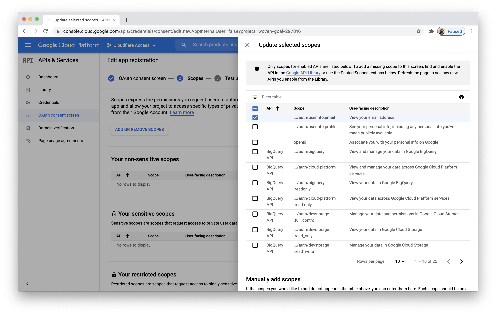

You do not need to add test users.

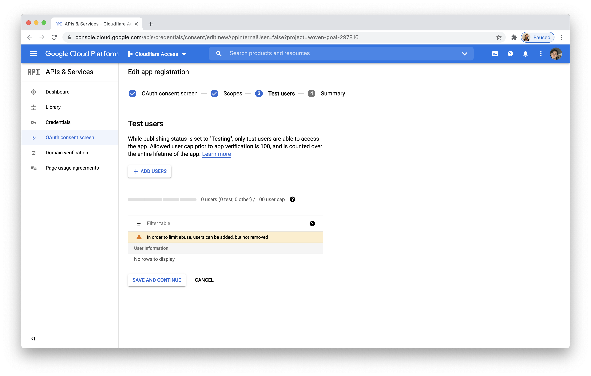

You can review the summary information and return to the dashboard at the bottom of the page.


8. Return to the `APIs & Services` page and click **+ Create Credentials**. Select `OAuth client ID`.

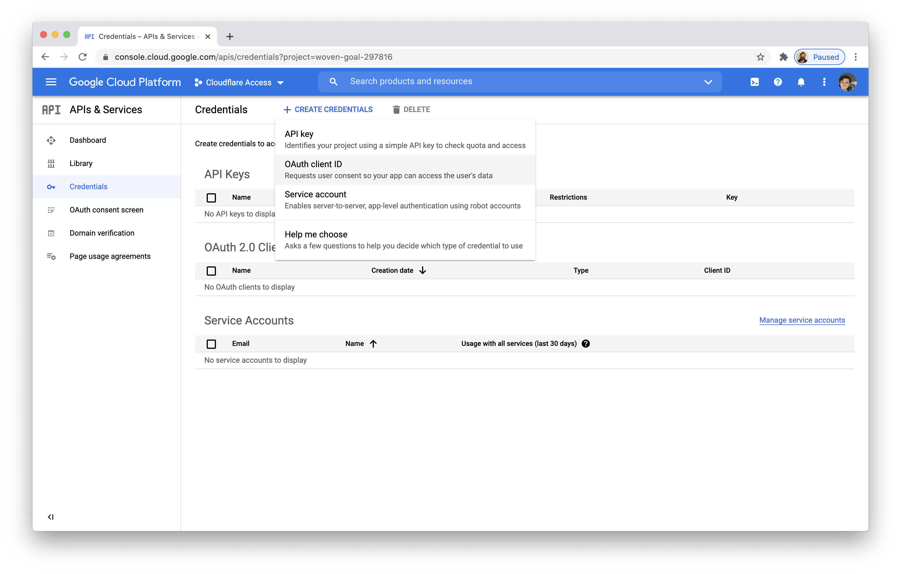

9. Name the application.

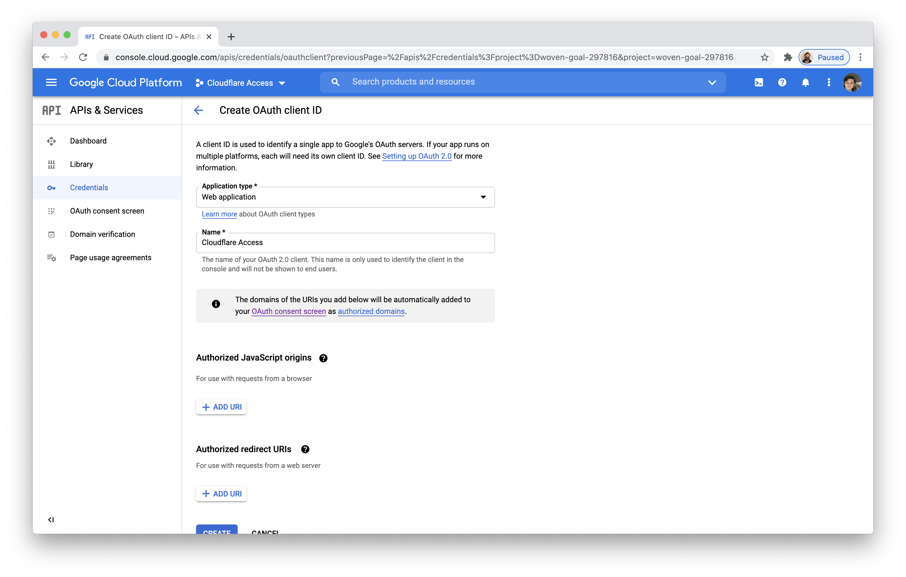

10. In the **Authorized JavaScript origins**, input your [organization domain](/glossary#organization-domain).

 In the** Authorized redirect URIs** section, input your organization domain with the path below:

```text
https://<your-organization-name>.cloudflareaccess.com/cdn-cgi/access/callback
```

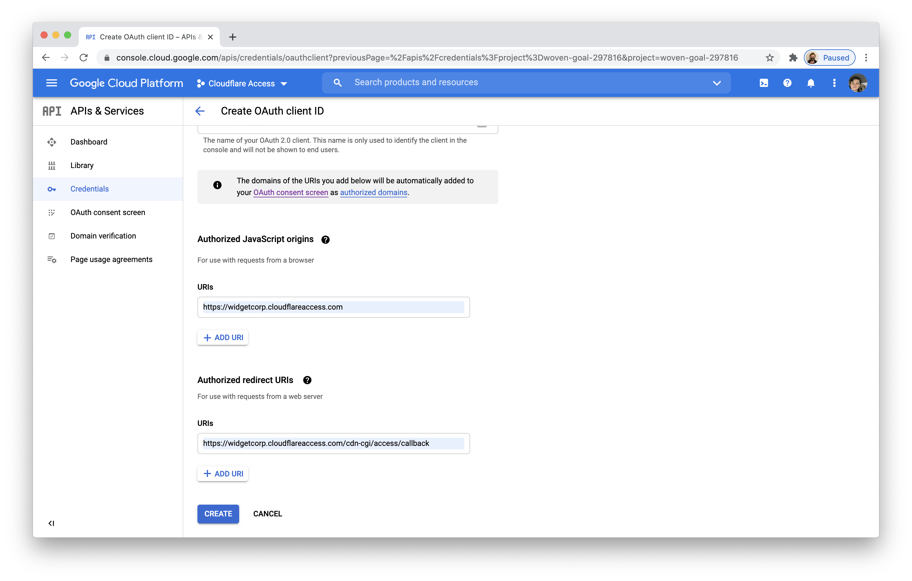

11. Google will present the OAuth Client ID and Secret values. The secret field functions like a password and should be kept securely and not shared. For the purposes of this tutorial, the secret field is kept visible. Copy both values.

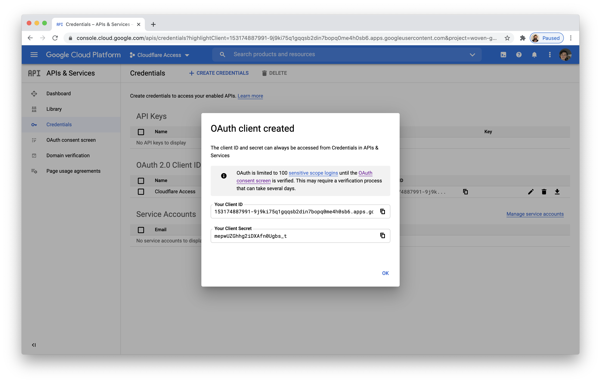

16. Navigate to the Cloudflare for Teams dashboard. In the `Authentication` page of the Access section, click **+ Add**.

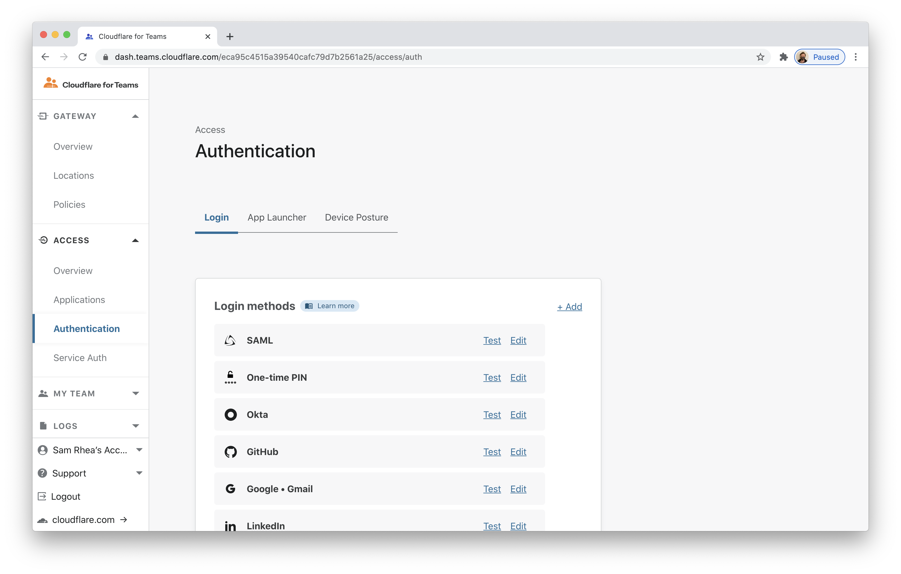

17. Select `Google`.

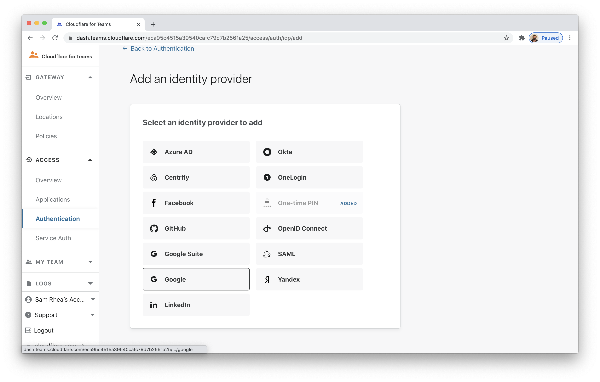

18. Input the Client ID and Client Secret fields generated previously. Click **Save**.


21. You can now return to the list of identity providers in the `Authentication` page of the Cloudflare for Teams dashboard. Select Google Suite and click **Test**.

Your user identity should return.

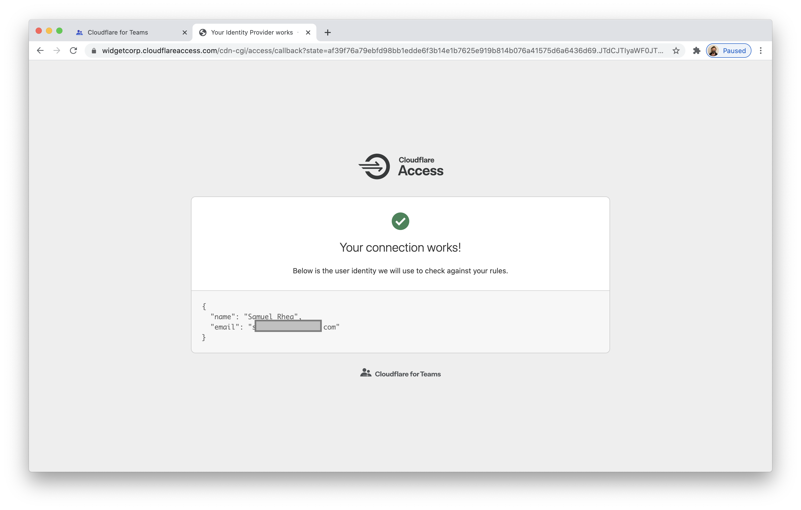

## Example API Config

```json
{
    "config": {
        "client_id": "<your client id>",
        "client_secret": "<your client secret",
    },
    "type": "google",
    "name": "my example idp"
}
