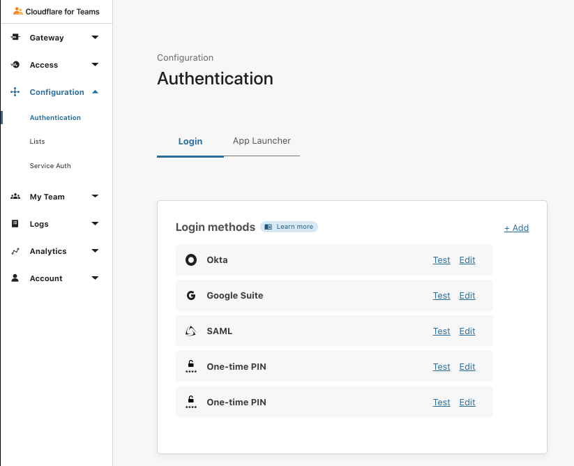
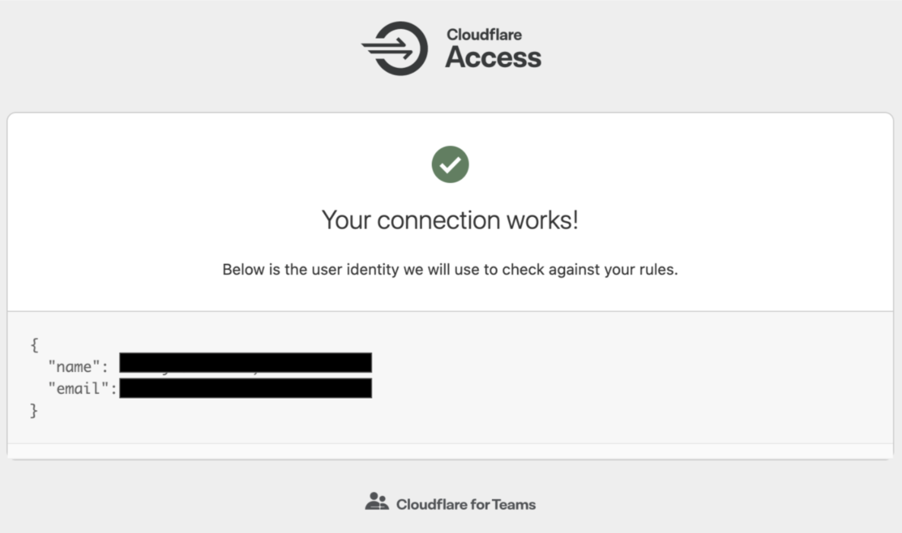

# SSO integration

Cloudflare for Teams allows you to integrate your organization's identity providers (IdPs) with Cloudflare Access. Your team can simultaneously use multiple providers, reducing friction when working with partners or contractors.

Adding an identity provider as a login method requires configuration both on the [Teams dashboard](https://dash.teams.cloudflare.com) and with the identity provider itself. Consult our IdP-specific documentation to learn more about what you need to set up.

<Aside>

Cloudflare Access supports social identity providers that do not require administrator accounts, open source providers, and corporate providers. Cloudflare also supports using signed AuthN requests with SAML providers.
</Aside>

## Set up IdPs on the Teams dashboard

1. On the [Teams dashboard](https://dash.teams.cloudflare.com), navigate to **Configuration > Authentication**.

2. In the **Login methods** card, click *+Add*.

3. Select the identity provider you want to add. You can add multiple providers of the same type.

4. Fill in the necessary fields to set up your identity provider.

Each identity provider will have different required fields for you to fill in. If you need help, step-by-step instructions can be expanded below the input form.

If you do not see your identity provider listed, but they support SAML or OAuth, these providers can typically still be enabled. If they support SAML select the SAML option. If they support OAuth select the **OpenID Connect** option.

4. Once you have filled in the necessary fields, click **Save**.

Your IdP will now be listed in the **Login methods** card.

## Test IdPs on the Teams dashboard

To test if an IdP is correctly configured, navigate to **Configuration** > **Authentication**. Next, click **Test** next to the IdP you'd like to test. This will attempt to connect to the IdP to verify if a valid connection is established.

### Your provider is connected

If your provider is connected, another window will open in your browser, with this message:

 
### Your provider is not connected

If your provider is not connected, another window will open in your browser. Along with an error message, you will receive a detailed explanation of why the test has failed.

## Using The API

We recommend that you use our dashboard to configure your identity providers. However, if you would like to use the [Cloudflare API](https://api.cloudflare.com/), each of the identity provider topics covered here include an example API configuration snippet as well.