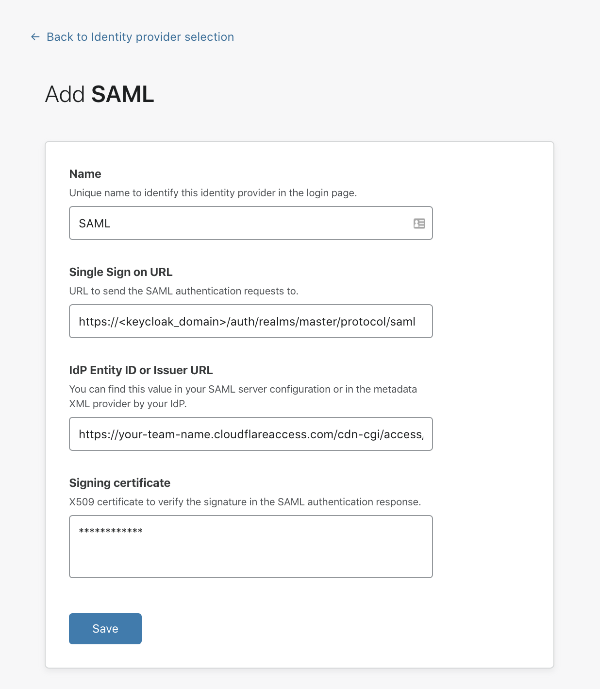

# SAML | Keycloak 

Keycloak is an open source identity and access management solution built by JBoss. Need a Keycloak lab environment for testing? An example is available [here](https://github.com/mw866/tunnel-keycloak).

## Set up Keycloak (SAML)

To set up Keycloak (SAML) as your identity provider:

1. In Keycloak, select **Clients** in the navigation bar and create a new client.

    

1. Under **Client AD**, enter your [team domain](/glossary#team-domain) followed by this callback at the end of the path: `/cdn-cgi/access/callback`. For example:

    ```txt
    https://your-team-name.cloudflareaccess.com/cdn-cgi/access/callback
    ```
    
    

1. Next, set the valid redirect URI to the Keycloak domain that you are using. For example, `https://<keycloak_domain>/auth/realms/master/protocol/saml`.

1. Set the Master SAML Processing URL using the same Keycloak domain: `https://<keycloak_domain>/auth/realms/master/protocol/saml`.

1. Finally, if you wish to enable client signatures, you will need to [configure](/identity/idp-integration/signed_authn) signing in the Cloudflare Access dashboard.

1. Set the built-in protocol mapper for the `email` property.

    

1. Next, you'll need to integrate with Cloudflare Access. On the Teams dashboard, navigate to **Access > Authentication**.

1. Under **Login methods**, click *+ Add*.

1. Choose **SAML** on the next page.

    You will need to input the Keycloak details manually. The examples below should be replaced with the specific domains in use with Keycloak and Cloudflare Access.

    | Field | Example |
    | ----- | ------- |
    | Single Sign-On URL | `https://<keycloak_domain>/auth/realms/master/protocol/saml` |
    | IdP Entity ID or Issuer URL | `https://<unique_id>.cloudflareaccess.com/cdn-cgi/access/callback` |
    | Signing certificate | Use the X509 Certificate in the Realm Settings from Keycloak |

    

1. Click **Save**.

To test that your connection is working, navigate to **Authentication > Login methods** and click **Test** next to the login method you want to test.