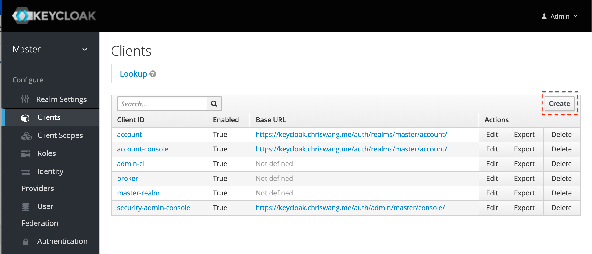
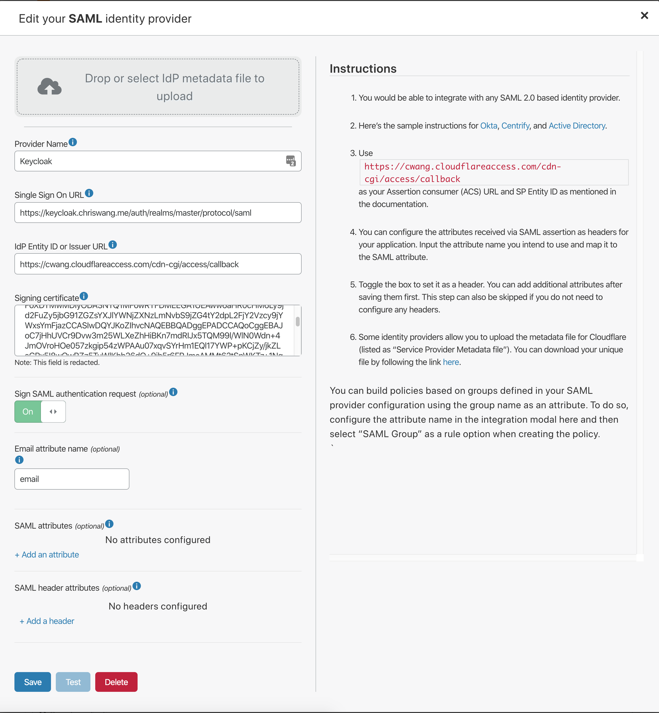
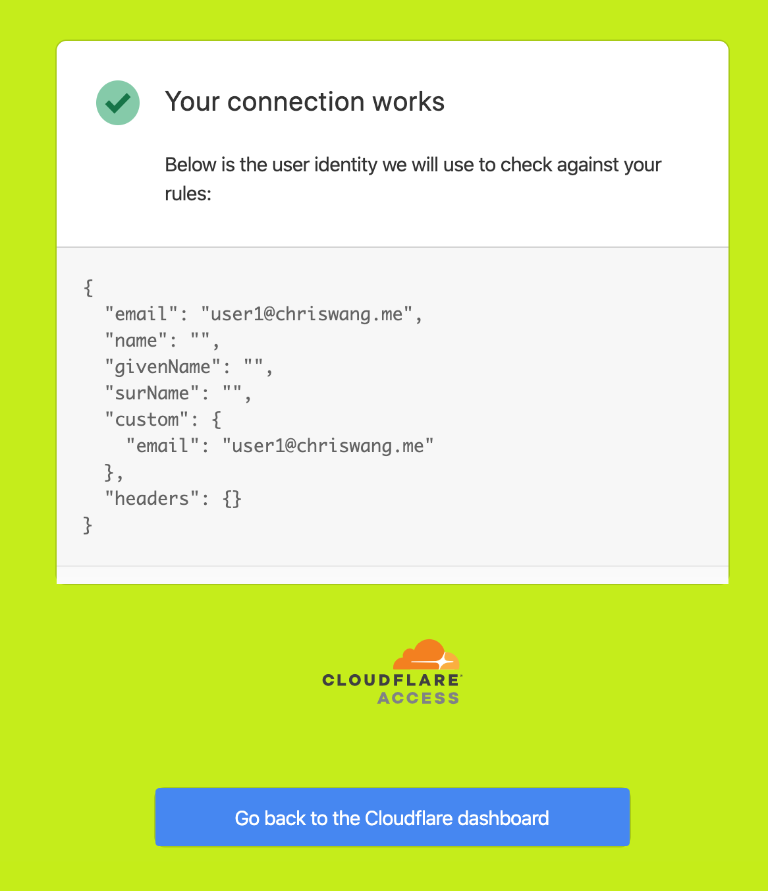
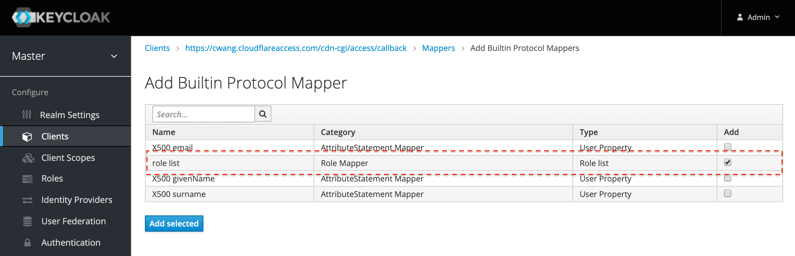
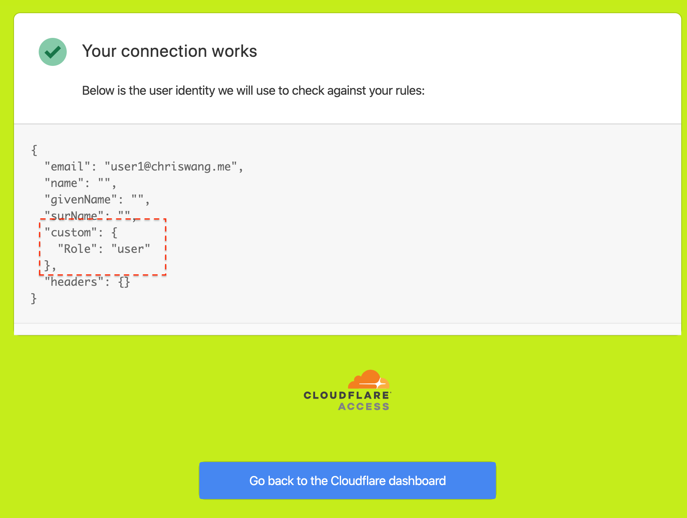
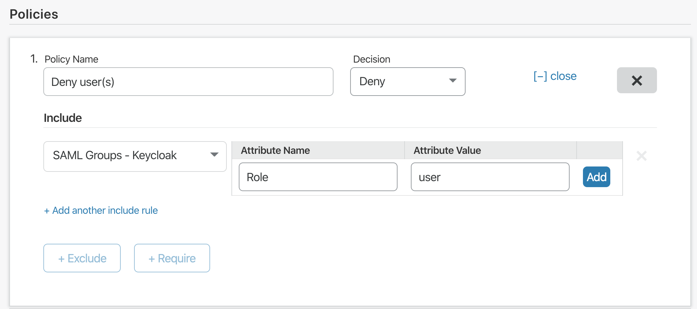
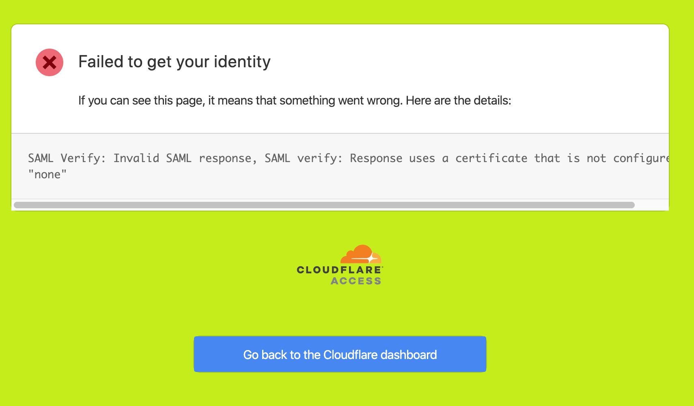
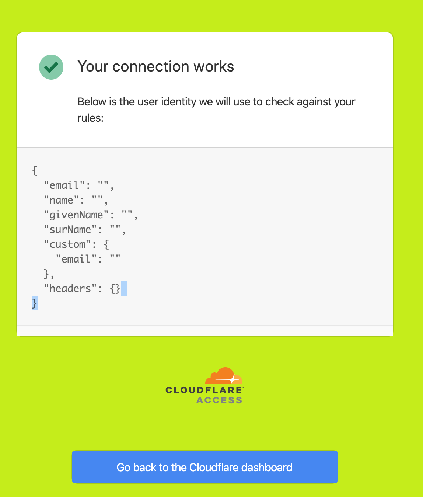

# Keycloak SAML

Keycloak is an open source identity and access management solution built by JBoss. Need a Keycloak lab environment for testing? An example is available [here](https://github.com/mw866/tunnel-keycloak).

## Set up Keycloak with Access

1. Create the SAML client

    In Keycloak, select "Clients" in the navigation bar and create a new client.

    

1. Configure the SAML client

    

    Set the Client AD as the Access callback URL. The format will resemble the following URL; replace the `your-domain` value with your [organization name](/glossary#organization-name).

    `https://<your-domain>.cloudflareaccess.com/cdn-cgi/access/callback`

    Next, set the valid redirect URI to the Keycloak domain that you are using. For example, `https://<keycloak_domain>/auth/realms/master/protocol/saml`.

    Set the Master SAML Processing URL using the same Keycloak domain: `https://<keycloak_domain>/auth/realms/master/protocol/saml`.

    Finally, if you wish to enable client signatures, you will need to [configure](/identity/idp-integration/signed_authn) signing in the Cloudflare Access dashboard.

1. Email property

    Set the built-in protocol mapper for the `email` property.

    

1. Integrate with Cloudflare Access

    You will need to input the Keycloak details manually. The examples below should be replaced with the specific domains in use with Keycloak and Cloudflare Access.

    Single Sign-On URL: `https://<keycloak_domain>/auth/realms/master/protocol/saml`
    IdP Entity ID or Issuer URL: `https://<unique_id>.cloudflareaccess.com/cdn-cgi/access/callback`
    Signing certificate: Use the X509 Certificate in the Realm Settings from Keycloak

    

1. Save and Test

    Click "Save" and then confirm the connection is working by clicking "Test".

    

## Optional: Custom SAML Attributes

Keycloak can be configured to pass on custom SAML attributes for consumption by Access Policy. For example, role-based access policy.

1. Roles

    In Keycloak, add the `role list` inside of the "Builtin Protocol Mapper" tab.

    

1. Access setting

    In Cloudflare Access, add `Role` as a SAML attribute. Click "Save" and test the connection.

    

1. Build a policy

    In Access, build a policy to use a SAML attribute. In this example, use "Role".

    

## Troubleshooting

**Keycloak: We are sorry... Invalid requester**

Solution: Disable "Client Signature Required " in Client Settings

**Access Test: Response uses a certificate that is not configured.**
Solution: Use the X509 Certificate in the Realm Settings  rather than from Client Setting.

**Access Test: Successful bu email property is empty**

Solution: Solution: Configure the protocol mapper in Keycloak's SAML Client.
