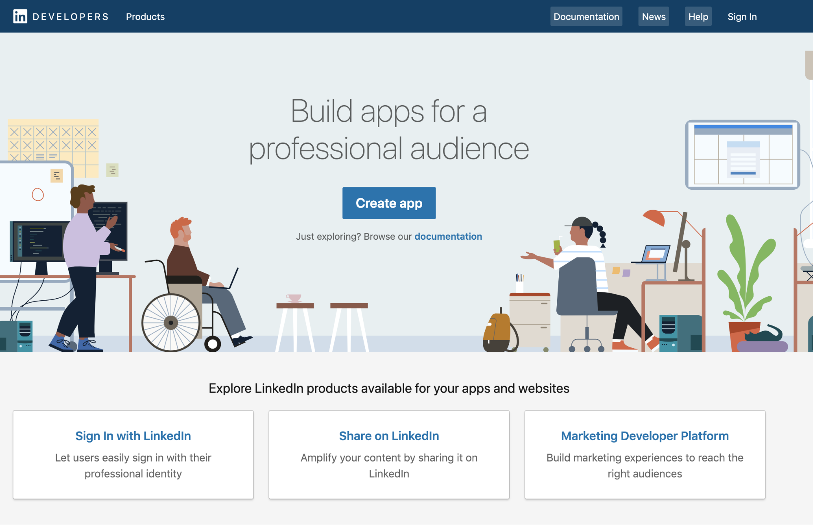
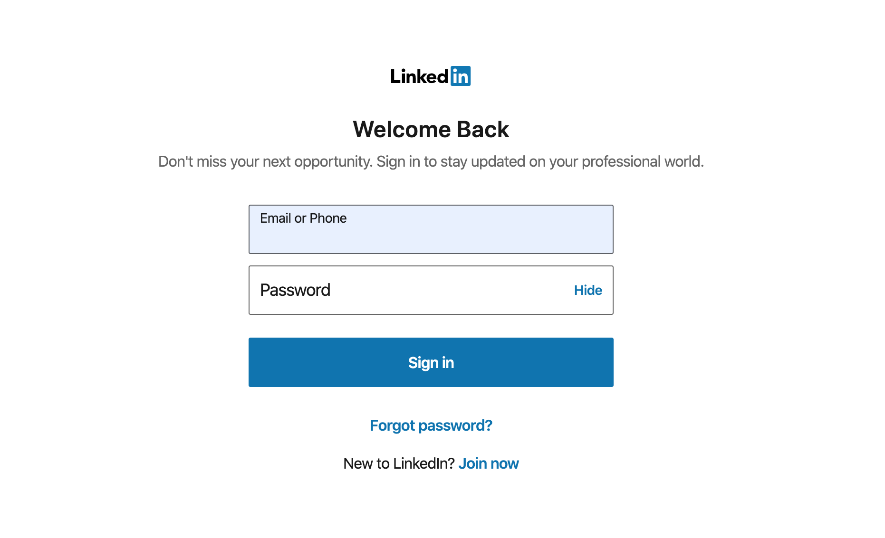
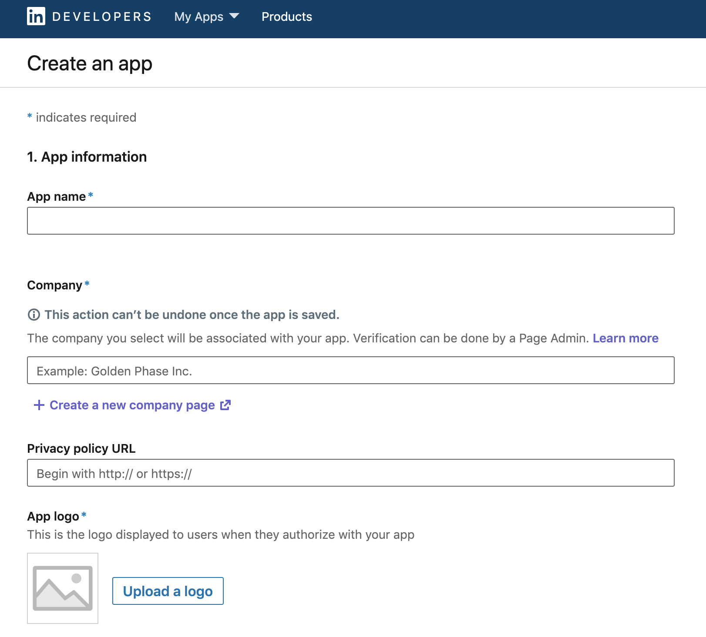
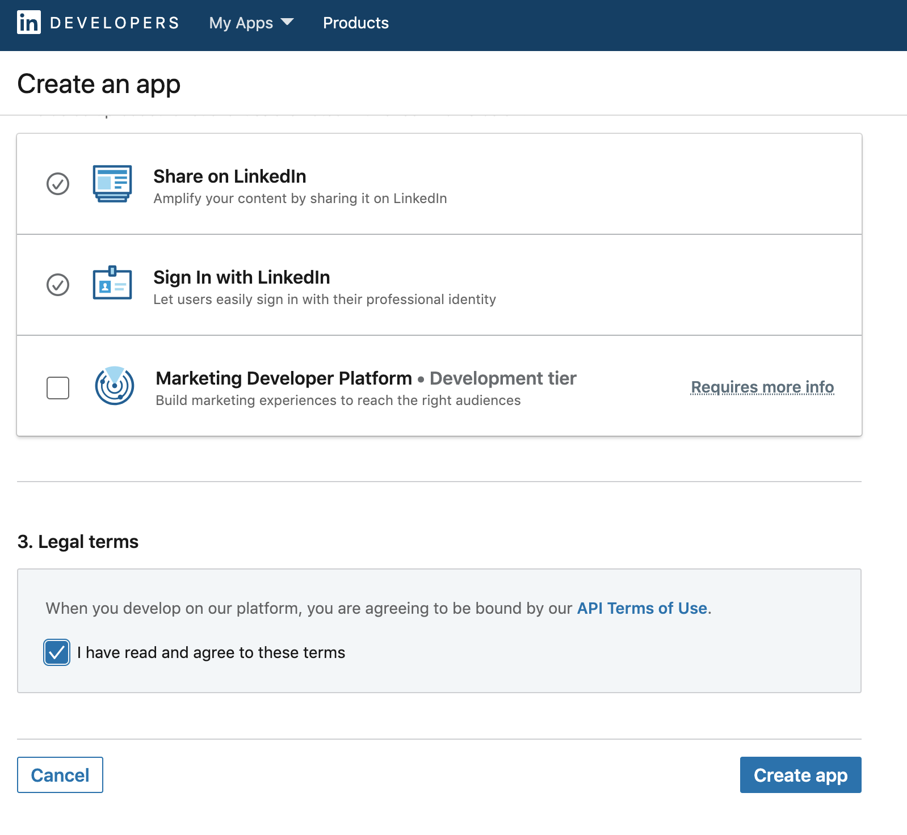
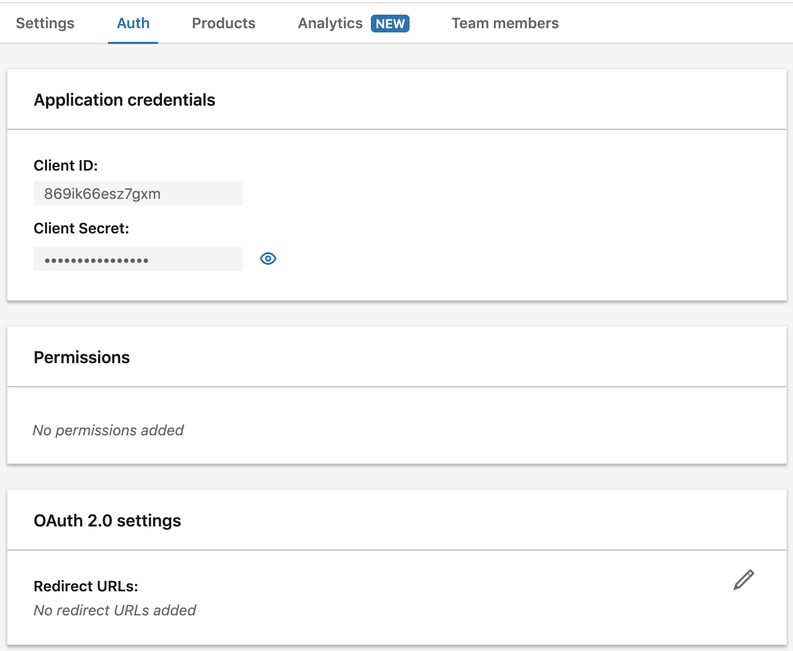
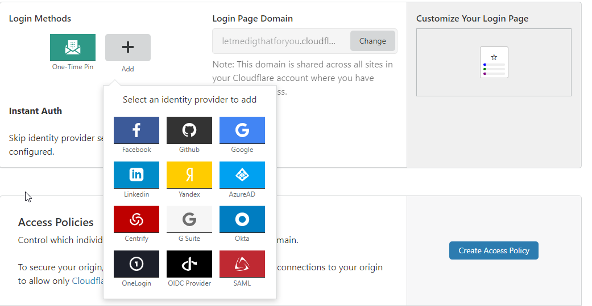
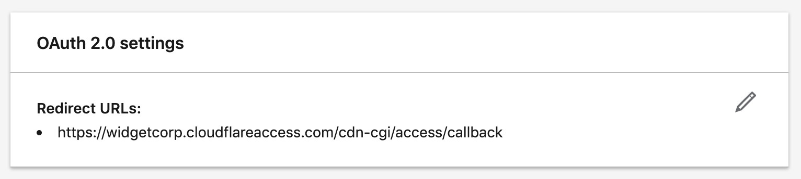

# LinkedIn

Cloudflare Access allows your users to use LinkedIn as their identity provider (IdP).

## Set up LinkedIn as an IdP

Configuring LinkedIn as a Cloudflare Access IdP requires a LinkedIn account.

To configure LinkedIn as an IdP:

1. Go to [the LinkedIn Developer Portal](https://www.linkedin.com/developers).
1. Click **Create App**.

    

1. Sign in to your LinkedIn account.

    

    The **Create an app** screen displays.

    

1. Enter an **App name** for your application.
1. Enter the URL for your business page.
1. Click **Upload a logo** and navigate to your company logo image file.
1. Click **OK**.
1. (optional) Select the **Share on LinkedIn** option to announce that your clients can use LinkedIn to access your app.

    

1. Select the **Sign In with LinkedIn** option.
1. Click the **API Terms of Use** link to read the terms of use.
1. If you agree to the terms, check the **I have read and agree to these terms** option.
1. Click **Create app**.
1. Go to your account Settings page.

    

1. Click the **Auth** tab.
1. Copy the **Client ID** and **Client Secret**.
1. On the Teams dashboard, navigate to **Access > Authentication**.

    

1. Under **Login methods**, click *+ Add*.

1. Choose **LinkedIn** on the next page.

1. Provide a name for the IdP, and paste in the **Client ID** and **Client Secret**.

1. In the **LinkedIn** **Auth** tab, scroll to **OAuth 2.0 settings** and click the **pencil icon** to edit the settings.

    

1. Enter your [team domain](/glossary#team-domain) followed by this callback at the end of the path: `/cdn-cgi/access/callback`.

1. In the Cloudflare Access **Add a LinkedIn identity provider** window, click **Save** and then **Test**.

    On successful connection to your identity provider, a confirmation window displays.

    

## Example API configuration

```json
{
    "config": {
        "client_id": "<your client id>",
        "client_secret": "<your client secret"
    },
    "type": "linkedin",
    "name": "my example idp"
}
```
