# Okta

You can integrate Okta with Cloudflare Access to allow users to reach applications protected by Access with their Okta account.

1. In your Okta dashboard, click **Admin**.

 

1. Select the **Applications** tab in the Admin dashboard.

 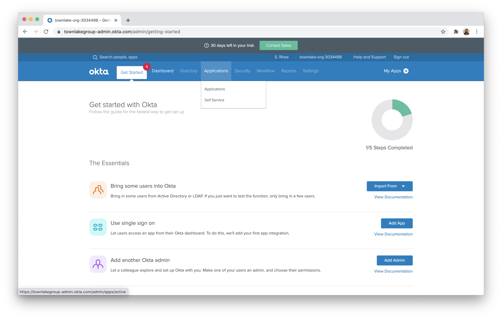

1. Click **Add Application** on the next page.

 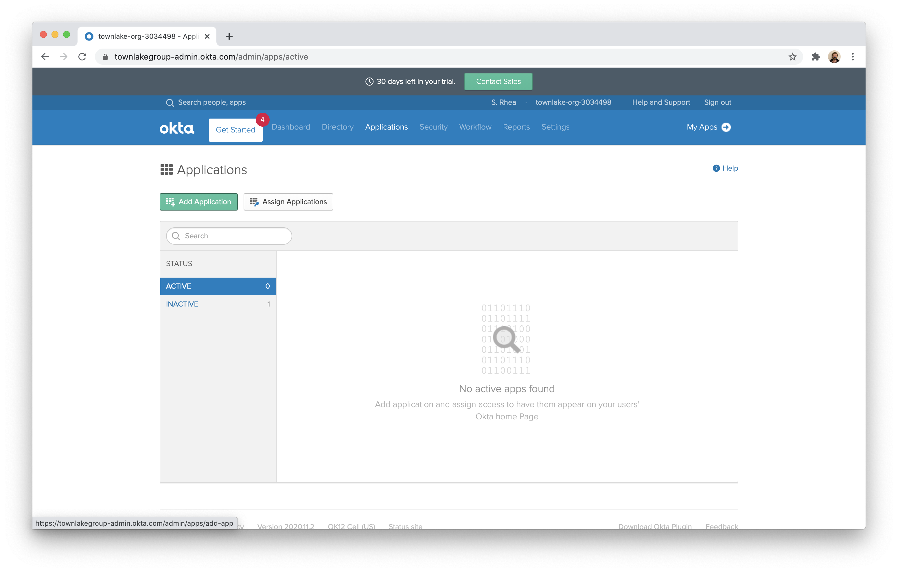

1. Click **Create New App** in the top right corner.

 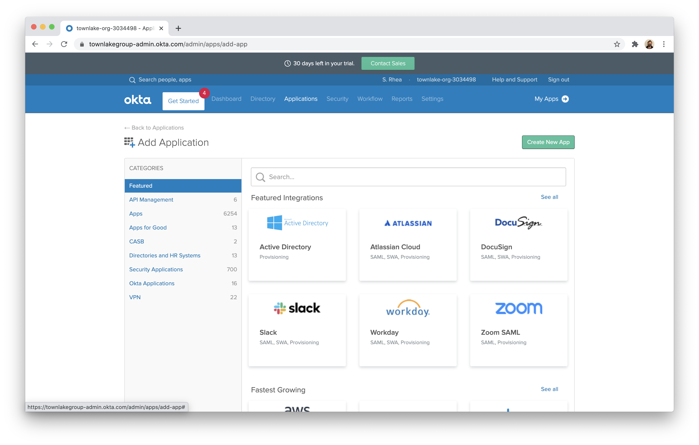

1. Choose `Web` as the Platform and toggle **OpenID Connect**. Click **Create**.

 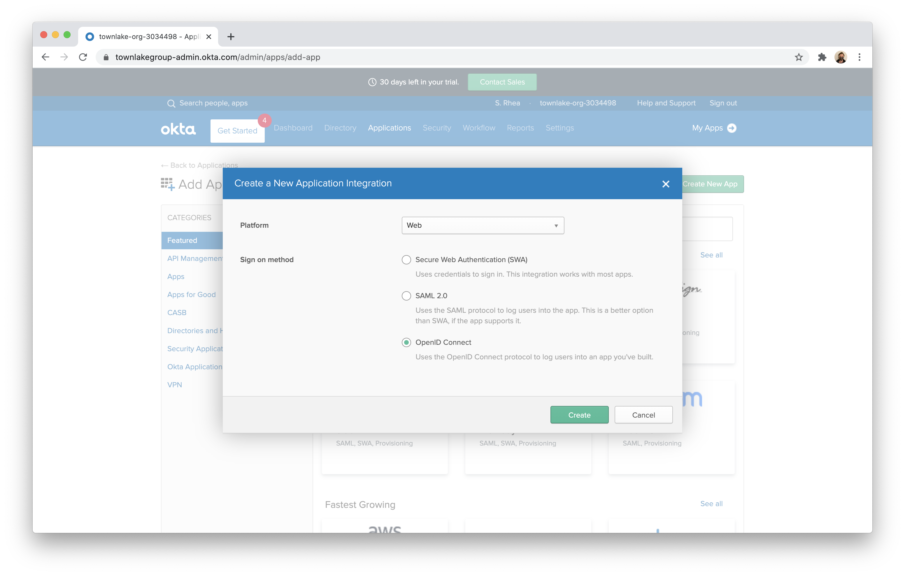

1. You can name the application to be any value. In the **Login redirect URIs** field, input your [team domain](/glossary#team-domain) followed by this callback at the end of the path: `/cdn-cgi/access/callback`. For example:

    ```txt
    https://your-team-name.cloudflareaccess.com/cdn-cgi/access/callback
    ```

 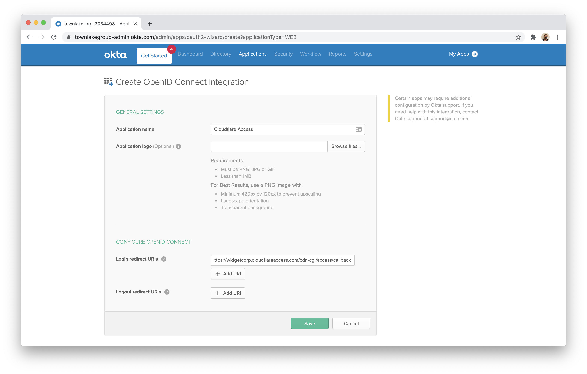

1. Once saved, choose the `Sign On` tab from the application view.

 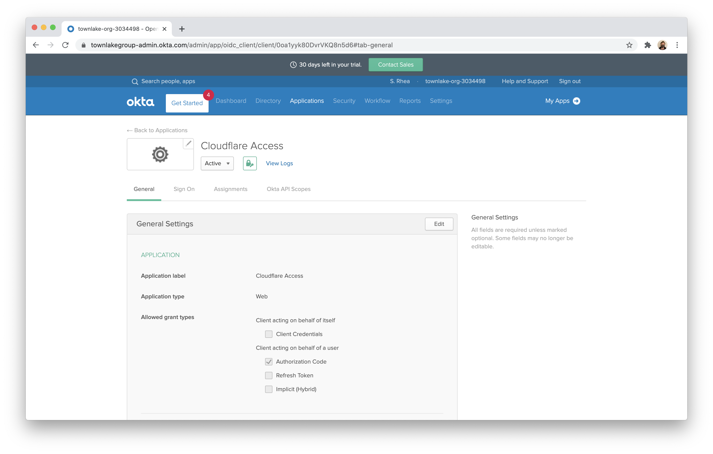

1. Scroll down to the `OpenID ConnectID Token`.

 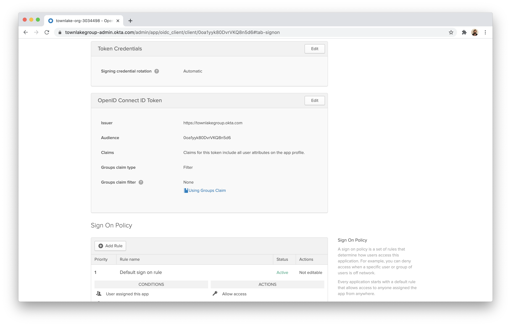

1. Click **Edit** and edit the Groups claim filter to Matches regex and the value `.*`.

 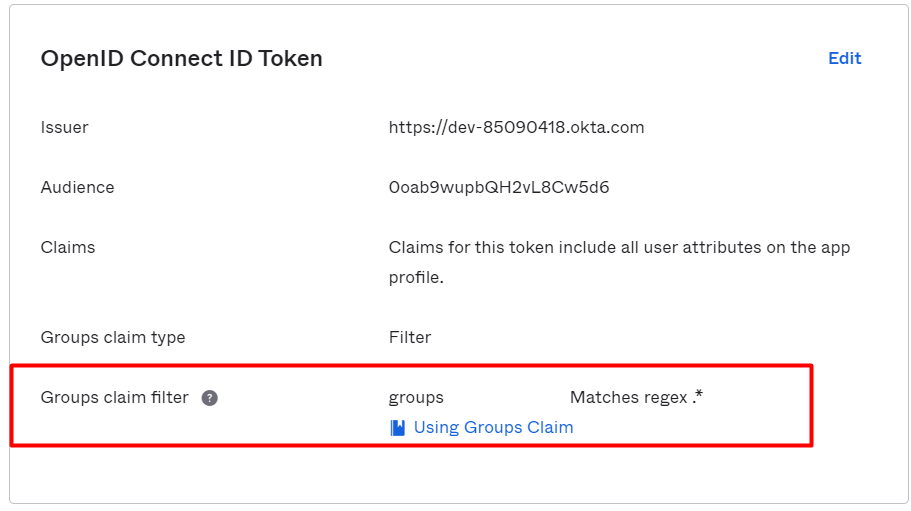

1. Next, click the **Assignments** tab.

 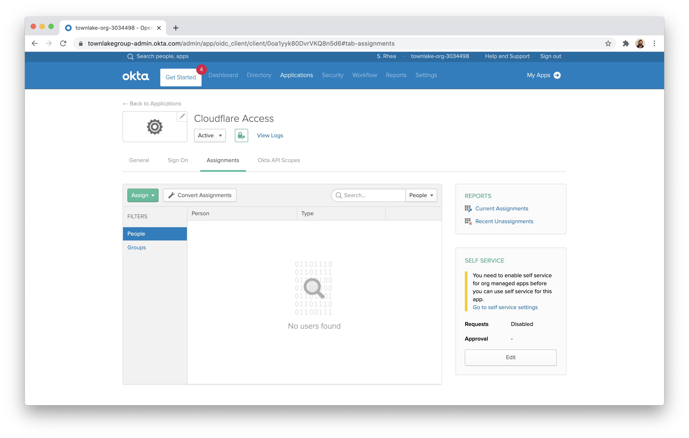

1. Click **Assign** and assign the application to all users in your organization.

 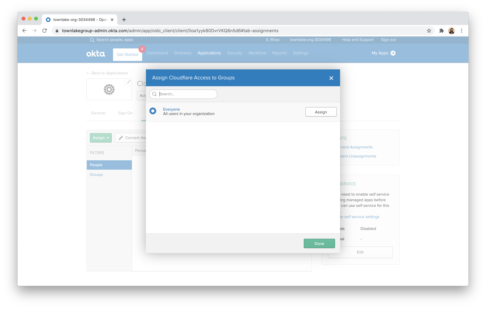

1. Return to the **General** tab. Scroll down to find your credentials. Copy the ID and secret.

 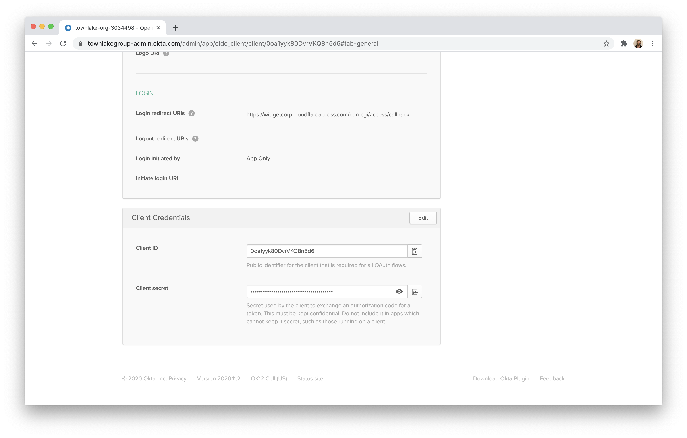

1. On the Teams dashboard, navigate to **Configuration > Authentication**.

1. Click *+ Add* under **Login Methods**, and select **Okta** as your IdP.

1. Input the ID, secret, and the Okta account URL.

1. Click **Save**.

   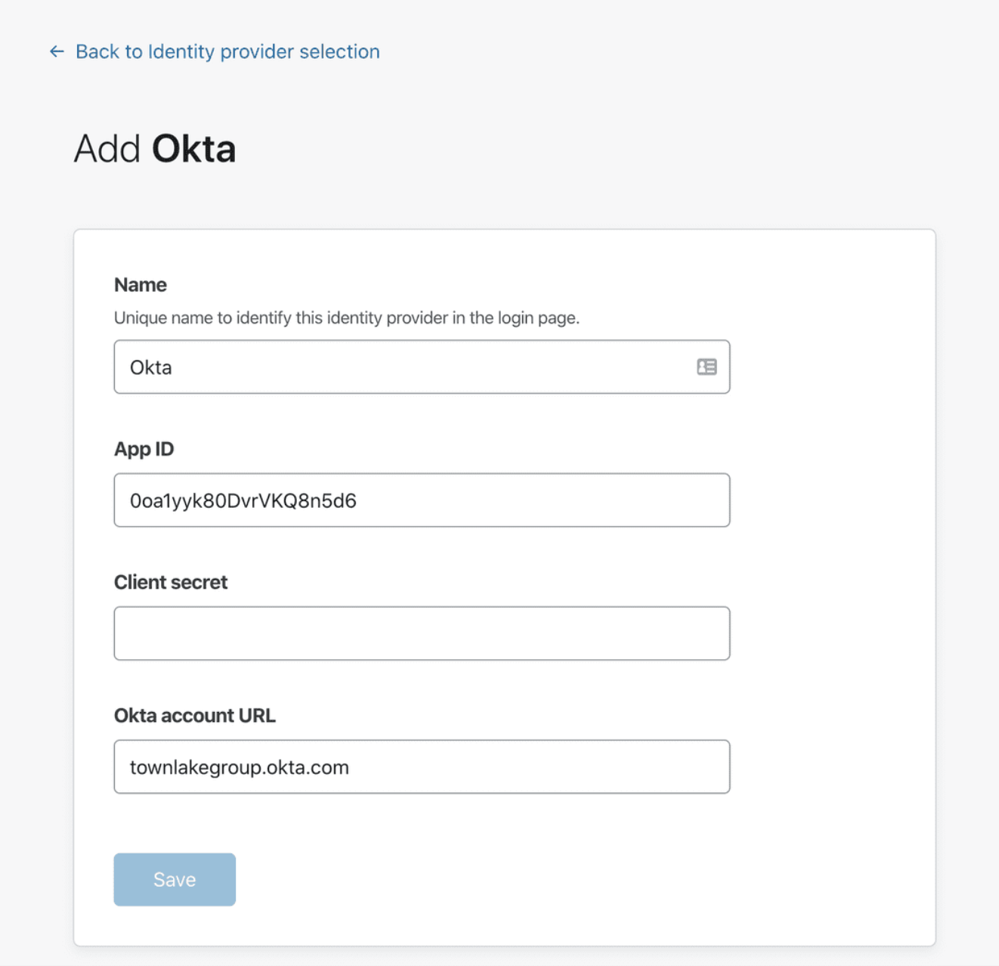

To test that your connection is working, navigate to **Authentication > Login methods** and click **Test** next to Okta.

## Example API Configuration

```json
{
    "config": {
        "client_id": "<your client id>",
        "client_secret": "<your client secret>",
        "okta_account": "https://dev-abc123.oktapreview.com",
    },
    "type": "okta",
    "name": "my example idp"
}
```
