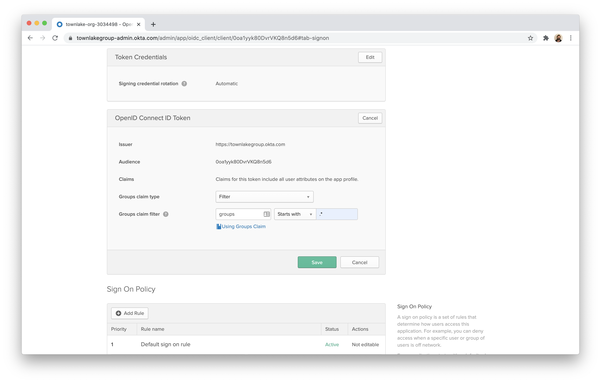
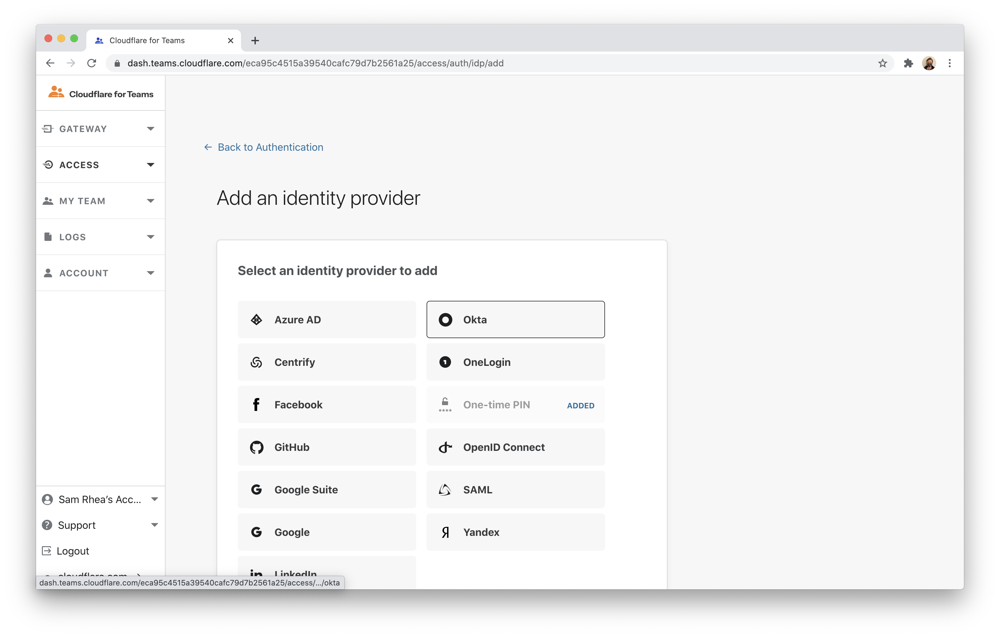
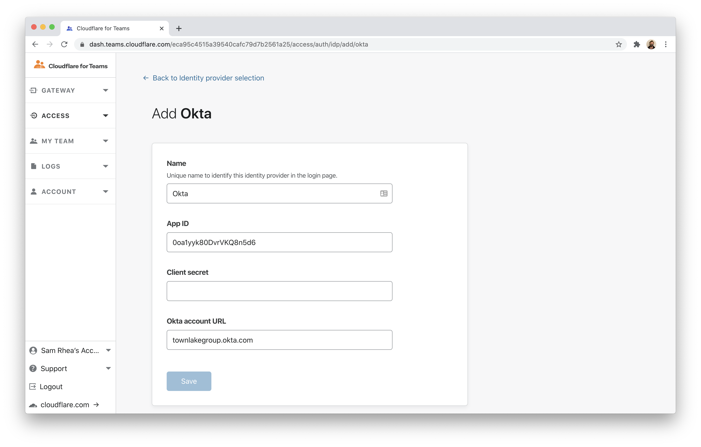
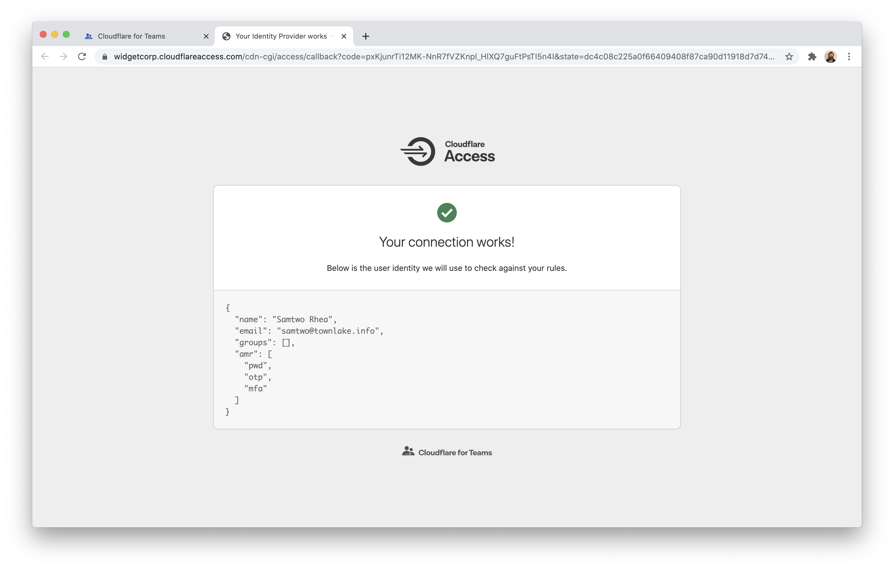

# Okta

You can integrate Okta with Cloudflare Access to allow users to reach applications protected by Access with their Okta account.

1. In your Okta dashboard, click **Admin**.


2. Select the `Applications` tab in the Admin dashboard.


3. Click **Add Application** on the next page.


4. Click **Create New App** in the top right corner.


5. Choose `Web` as the Platform and toggle `OpenID Connect`. Click **Create**.


6. You can name the application to be any value. In the `Login redirect URIs` field, input your Cloudflare [organization domain](/glossary#organization-domain) followed by `/cdn-cgi/access/callback`, for example:

```text
https://example.cloudflareaccess.com/cdn-cgi/access/callback
```


7. Once saved, choose the `Sign On` tab from the application view.


8. Scroll down to the `OpenID ConnectID Token`.


9. Click **Edit** and edit the Groups claim filter to `Starts with` and the value `.*`.



10. Next, click the `Assignments` tab.


11. Click **Assign** and assign the application to all users in your organization.


12. Return to the `General` tab. Scroll down to find your credentials. Copy the ID and secret.


13. Visit the Cloudflare for Teams dashboard and navigate to the `Authentication` page of the Access section. Click **+Add** to add a new identity provider. Choose `Okta`.



14. Input the ID, secret, and the Okta account URL. Click **Save**.



15. In the application list, you can now test the connection by clicking the **Test** button.



## Example API Configuration

```json
{
    "config": {
        "client_id": "<your client id>",
        "client_secret": "<your client secret",
        "okta_account": "https://dev-abc123.oktapreview.com",
    },
    "type": "okta",
    "name": "my example idp"
}
```
