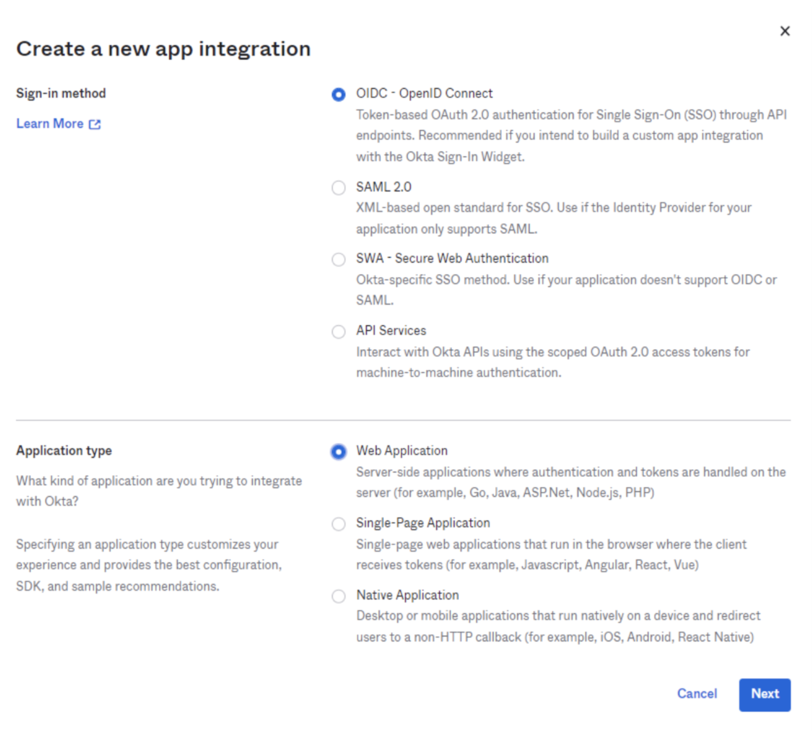
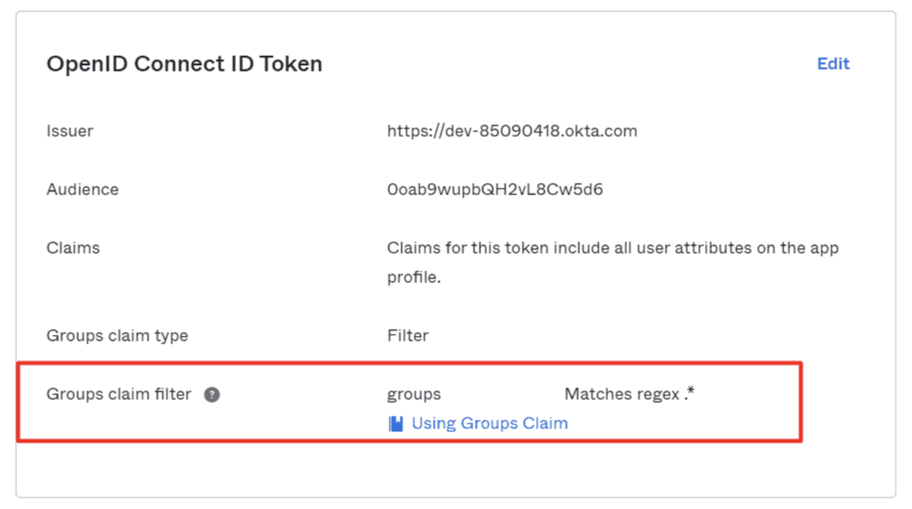
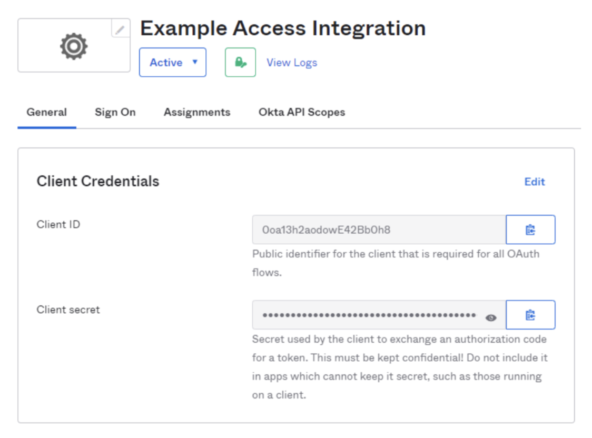

# Okta

You can integrate Okta with Cloudflare Access to allow users to reach applications protected by Access with their Okta account.

1. In your Okta dashboard, click **Admin**.
1. Select the **Applications** tab in the Admin dashboard.
1. Click **Create App Integration** in the top right corner.
1. In the pop-up dialog, select **OpenID Connect**.

 

1. Choose `Web Application` as the Application type and click **Next**.

1. Enter any name for the application. In the **Login redirect URIs** field, input your [team domain](/glossary#team-domain) followed by this callback at the end of the path: `/cdn-cgi/access/callback`. For example:

    ```txt
    https://<your-team-name>.cloudflareaccess.com/cdn-cgi/access/callback
    ```

1. Specify an assignment. Any value can be selected based on the desired behavior.
1. Click **Save**.
1. From the application view, navigate to the **Sign On** tab.
1. Scroll down to the OpenID ConnectID Token.

    

1. Click **Edit** and set the Groups claim filter to *Matches regex* and the value `.*`.
1. Return to the **General** tab. Scroll down to find your credentials, and copy the ID and secret.

    

1. On the Zero Trust dashboard, navigate to **Settings** > **Authentication**.
1. Under **Login methods**, click **Add new**.
1. Select **Okta** as your identity provider.
1. Input the ID, secret, and the Okta account URL.
1. (optional) Create an Okta API token and enter it in the Zero Trust dashboard (the token can be read-only). This will prevent your Okta groups from failing if you have more than 100 groups.
1. Click **Save**.

To test that your connection is working, navigate to **Settings** > **Authentication** > **Login methods** and click **Test** next to Okta.


## Example API Configuration

```json
{
    "config": {
        "client_id": "<your client id>",
        "client_secret": "<your client secret>",
        "okta_account": "https://dev-abc123.oktapreview.com",
    },
    "type": "okta",
    "name": "my example idp"
}
```
