# SAML with Centrify

Centrify secures access to infrastructure, DevOps, cloud, and other modern enterprise so you can prevent the #1 cause of breaches – privileged access abuse.

## Set up Centrify

To set up SAML with Centrify as your identity provider (IdP):

1. Log in to your **Centrify** admin portal and click **Apps**.

    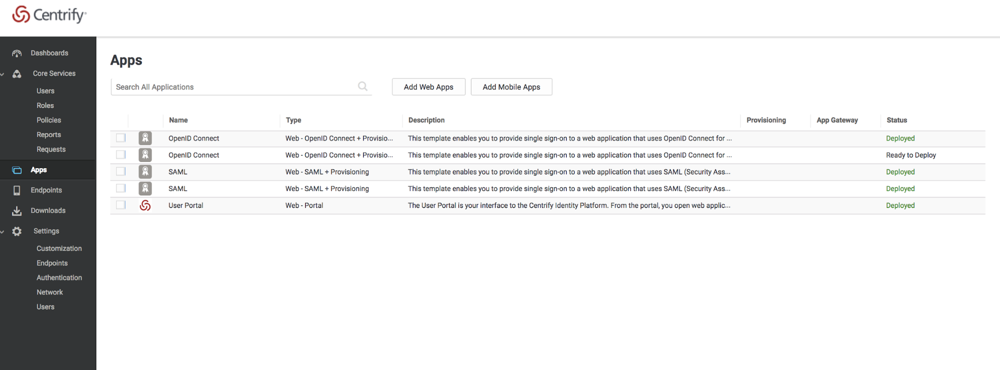

1. Select **Add Web Apps**.

    The **Add Web Apps** card displays.

    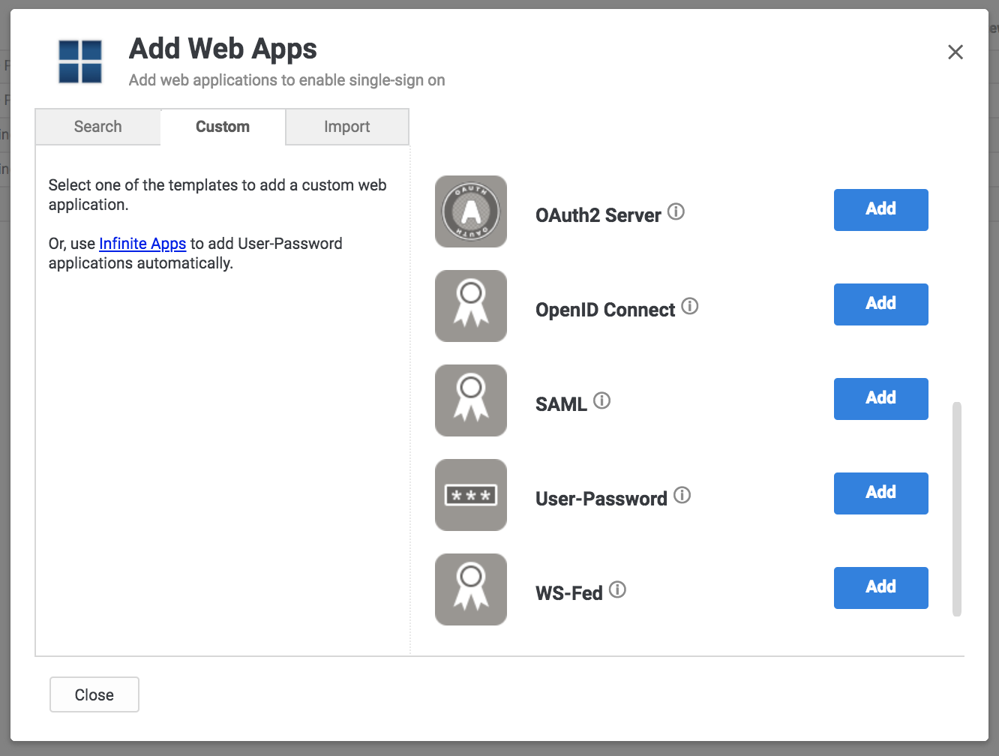

1. Click the **Custom** tab.
1. Next to the **SAML** icon click **Add**.

    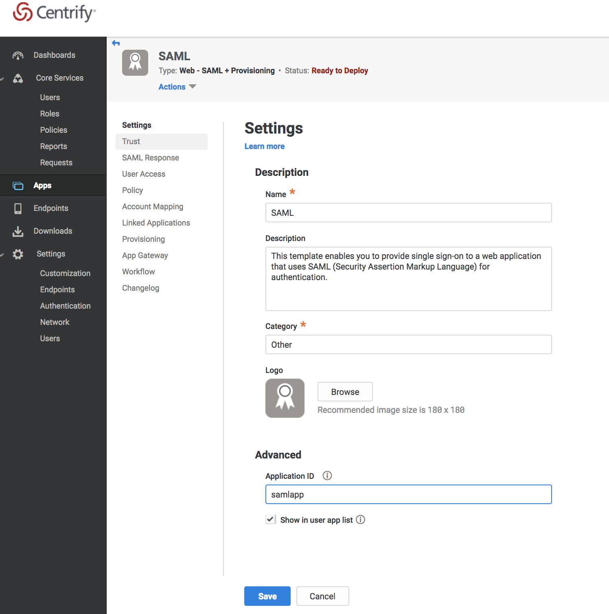

1. Enter the required information for your application.
1. Click **Save**.
1. Click **Settings** in the left pane.
1. In the middle menu pane, select **Trust**.

    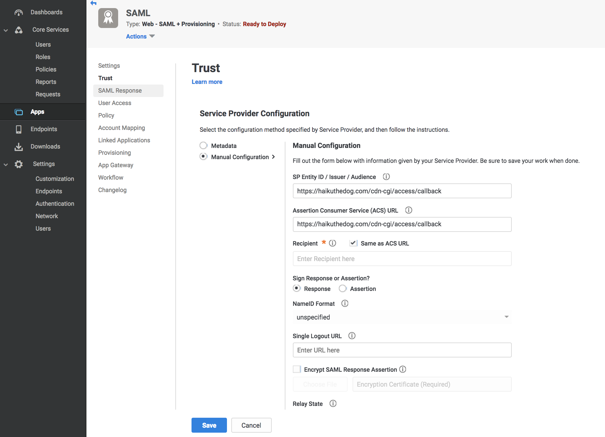

1. Choose the **Manual Configuration** option.
1. Enter your authorization domain in the **SP Entity ID** and **Assertion Consumer Service (ACS) URL fields** and include this callback at the end of the path: `/cdn-cgi/access/callback`.

    In your **Cloudflare Access** app, click the **Login Page Domain** field to copy the authorization domain to the clipboard.

1. Click **Save**.
1. In the middle menu pane, select **User Access**.

    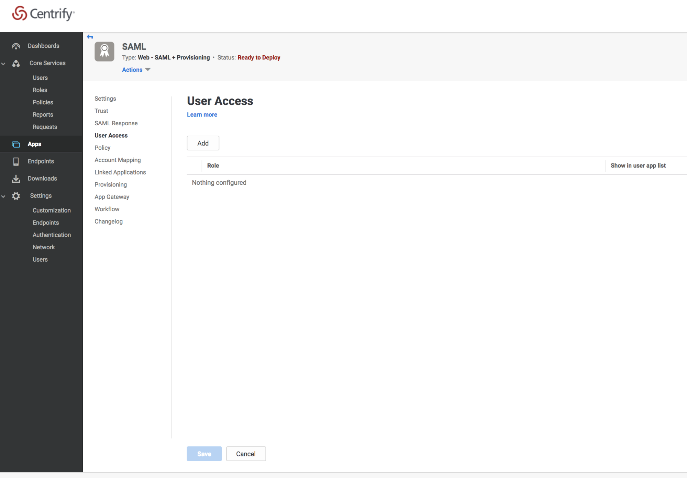

1. Click **Add**.

    The **Select Role** dialog displays.

    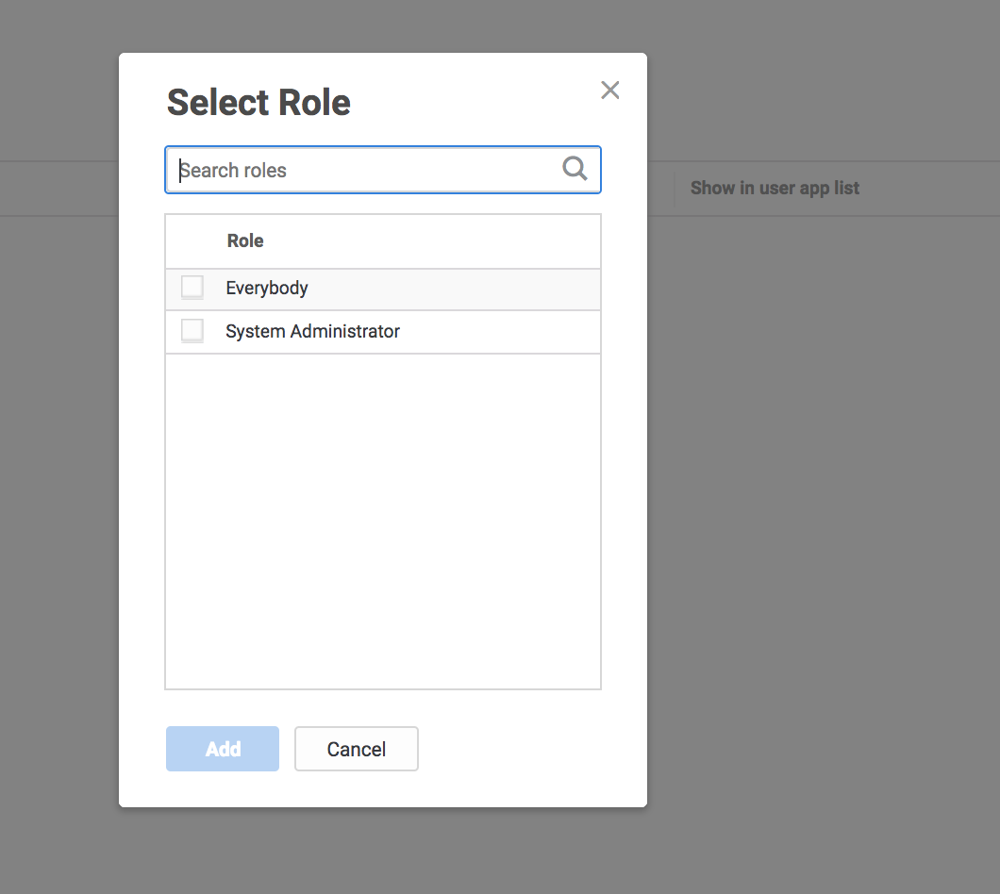

1. Complete your roles access assignments.

    The Role rules display on the **User Access** card.

    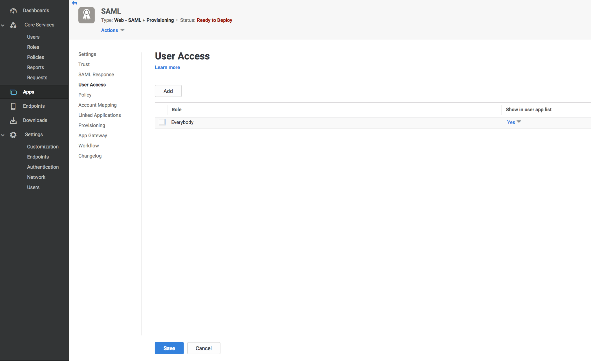

1. In the middle menu pane, select **SAML Response**.

    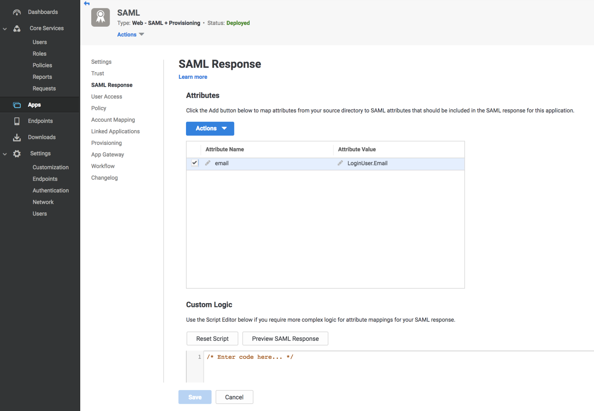

1. Click **Active > Add** to create a new **Attribute Name**, **Email**.

    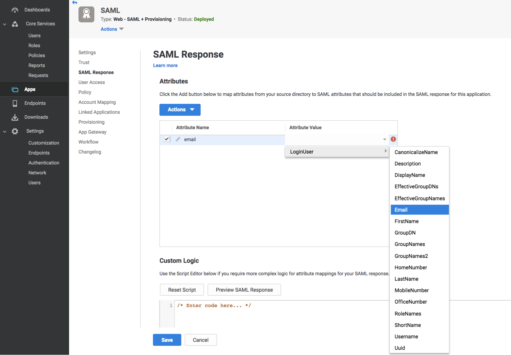

1. Enter the user email addresses in the **Attribute Value** field.
1. Click **Save**.
1. Select **Settings** again from the left menu pane, and **Trust**.

    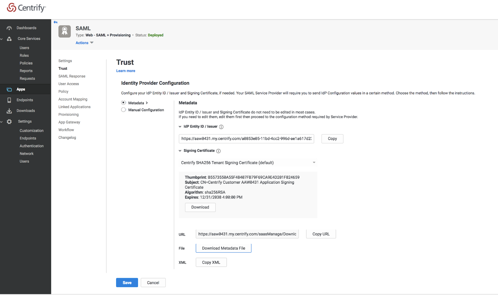

1. Select the **Metadata** option, and click **Download Metadata file**.

    The metadata XML file saves to your designated download directory.

1. In **Cloudflare Access**, scroll to **Login Methods**, click **Add** and select the **SAML** icon.

    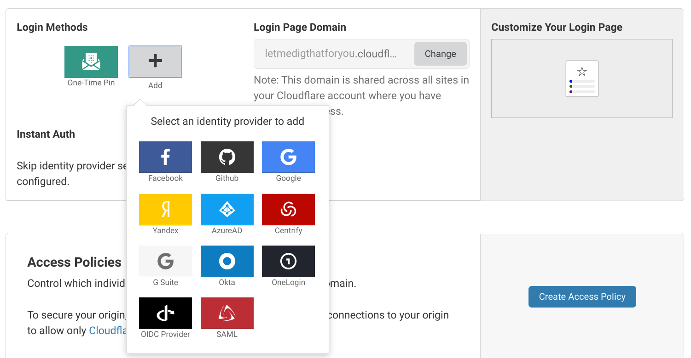

    The **Add a SAML identity provider** dialog displays.

1. Click to browse and select or drag the metadata file into the file upload box.

    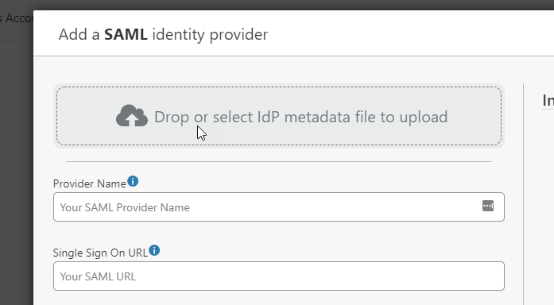

1. Confirm that the field entries from the metadata file upload are accurate.
1. Click **Save** and then **Test**.

    On successful connection to your Ping Identity deployment, a confirmation displays.

    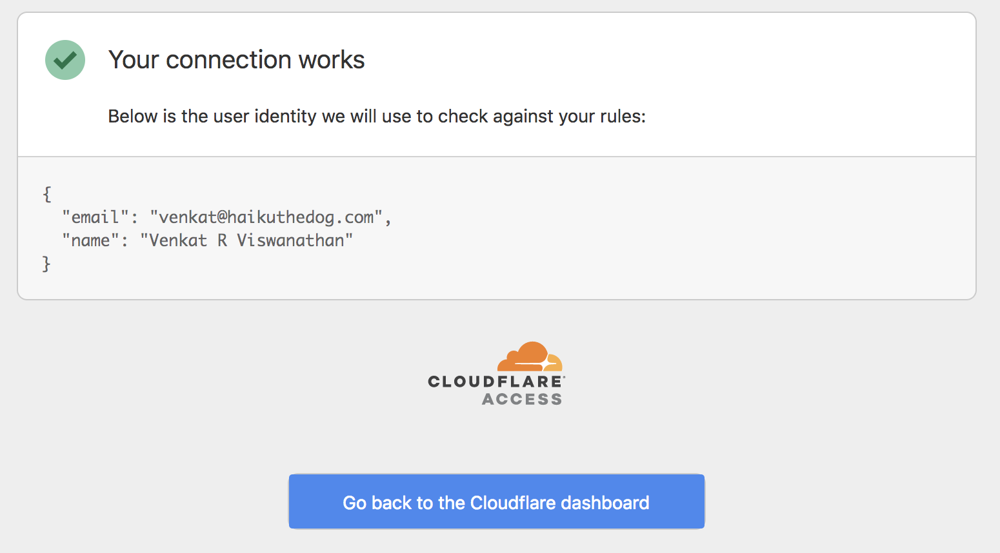

## To manually enter data in Cloudflare Access from your Centrify IdP

1. In your Centrify account, click **Settings** in the left pane.
1. In the middle menu pane, choose **Trust**.

    

1. Select the **Manual Configuration** option.
1. Copy and paste the corresponding information from Centrify into the fields in the **Edit a SAML identity provider** dialog in **Cloudflare Access**.

    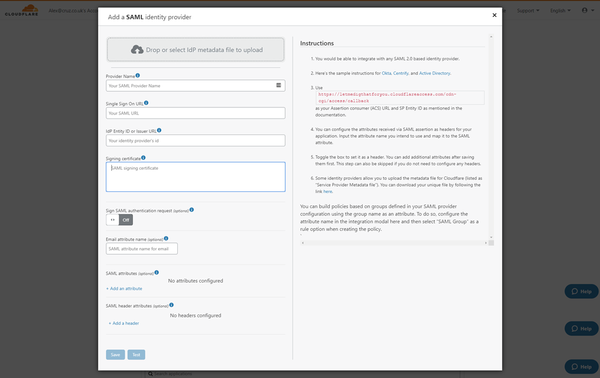

1. Enter an **Email Attribute name**.
1. Click **Save** and then **Test**.

    On successful connection to your Ping Identity deployment, a confirmation displays.

    

1. Close the dialog.

## Download SP metadata (optional)

Some IdPs allow administrators to upload metadata files from their SP (service provider).

To get your Cloudflare metadata file:

1. Download your unique SAML metadata file at the following URL:

    ```txt
    https://example.cloudflareaccess.com/cdn-cgi/access/saml-metadata
    ```

    Replace `example` with your [organization name](/glossary#organization-name).

    In Cloudflare Access, you can find a link to this URL in the **Edit a SAML identity provider** dialog. The link returns a web page with your SAML SP data in XML format.

1. Save the file in XML format.
1. Upload the XML document to your **Centrify** account.

## Example API Config

```json
{
    "config":
    {
        "issuer_url": "https://abc123.my.centrify.com/baaa2117-0ec0-4d76-84cc-abccb551a123",
        "sso_target_url": "https://abc123.my.centrify.com/applogin/appKey/baaa2117-0ec0-4d76-84cc-abccb551a123/customerId/abc123",
        "attributes": ["email"],
        "email_attribute_name": "",
        "sign_request": false,
        "idp_public_cert": "MIIDpDCCAoygAwIBAgIGAV2ka+55MA0GCSqGSIb3DQEBCwUAMIGSMQswCQYDVQQGEwJVUzETMBEG\nA1UEC.....GF/Q2/MHadws97cZg\nuTnQyuOqPuHbnN83d/2l1NSYKCbHt24o"
    },
    "type": "saml",
    "name": "centrify saml example"
}
```
