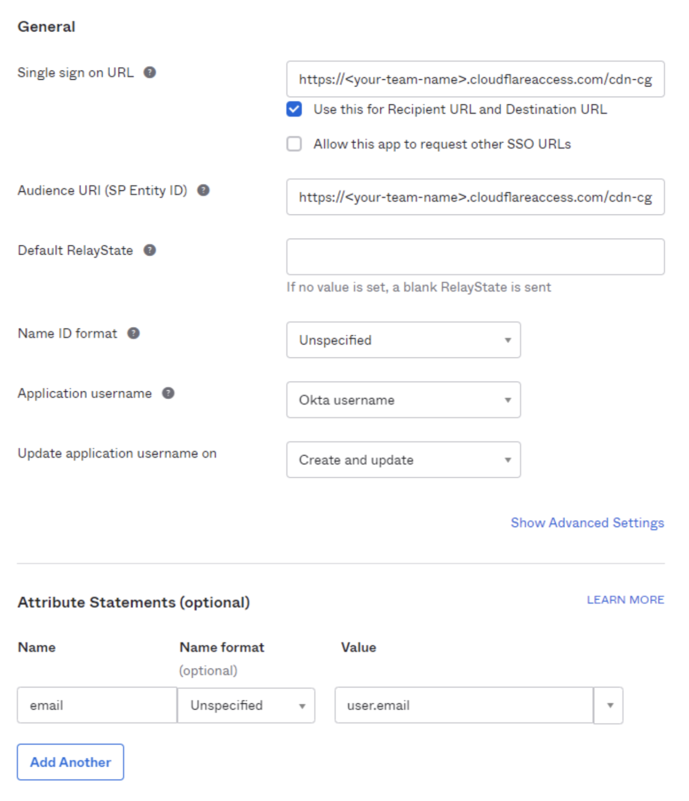
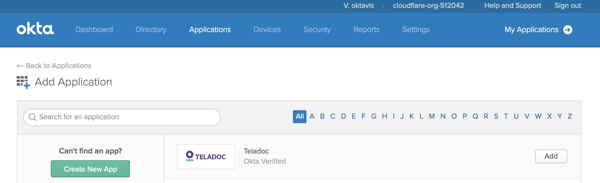
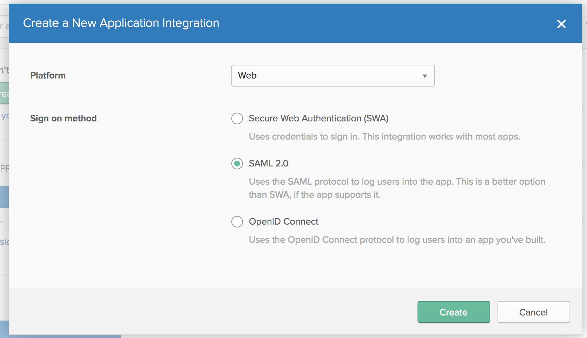
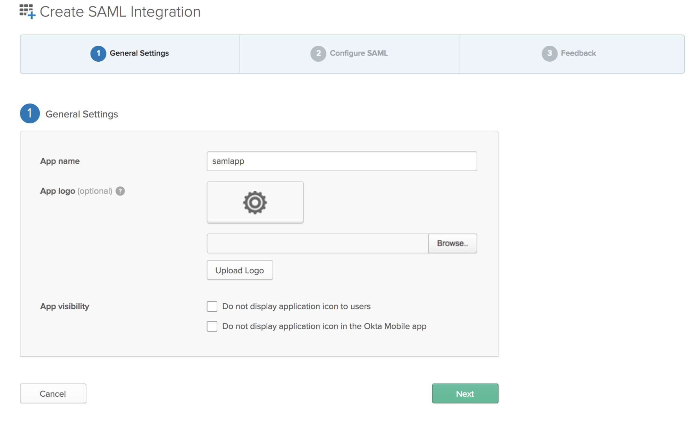
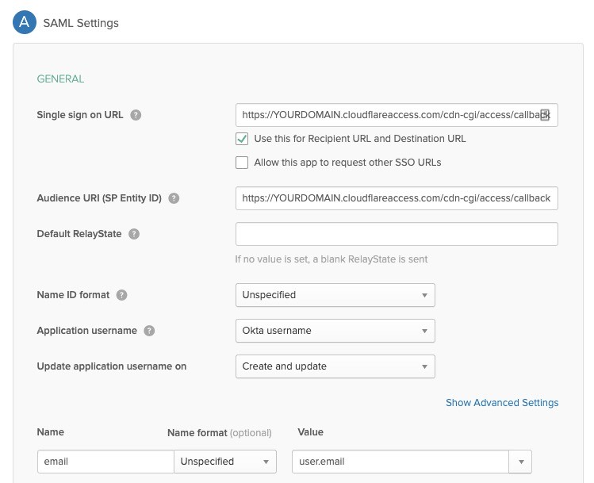
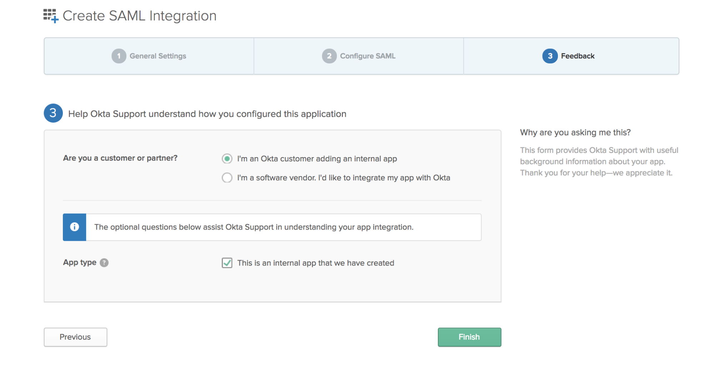
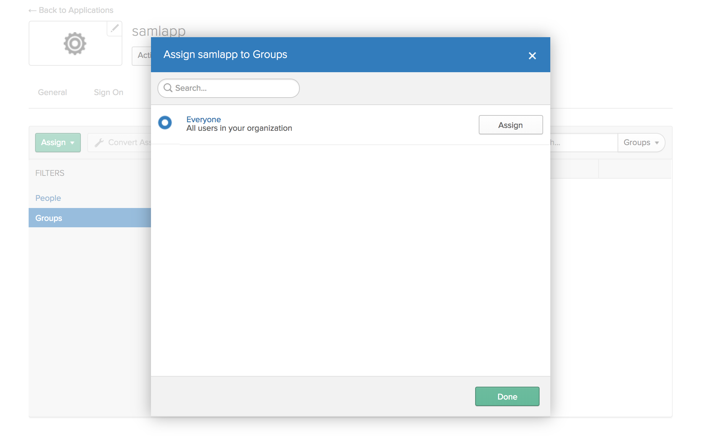
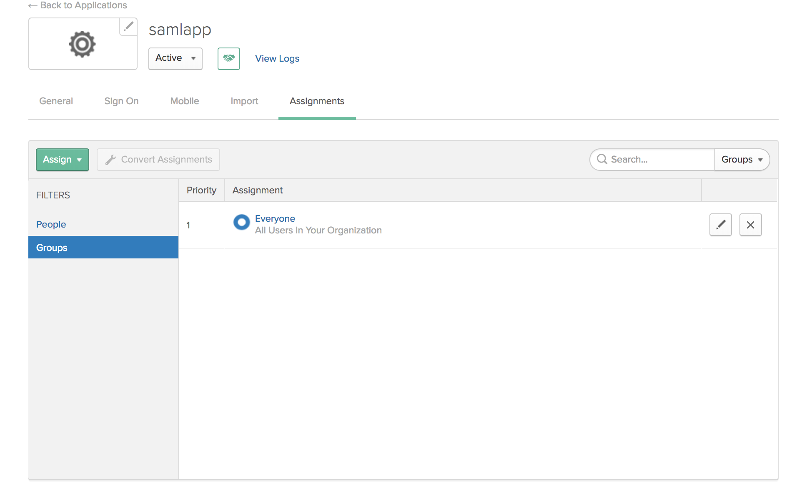
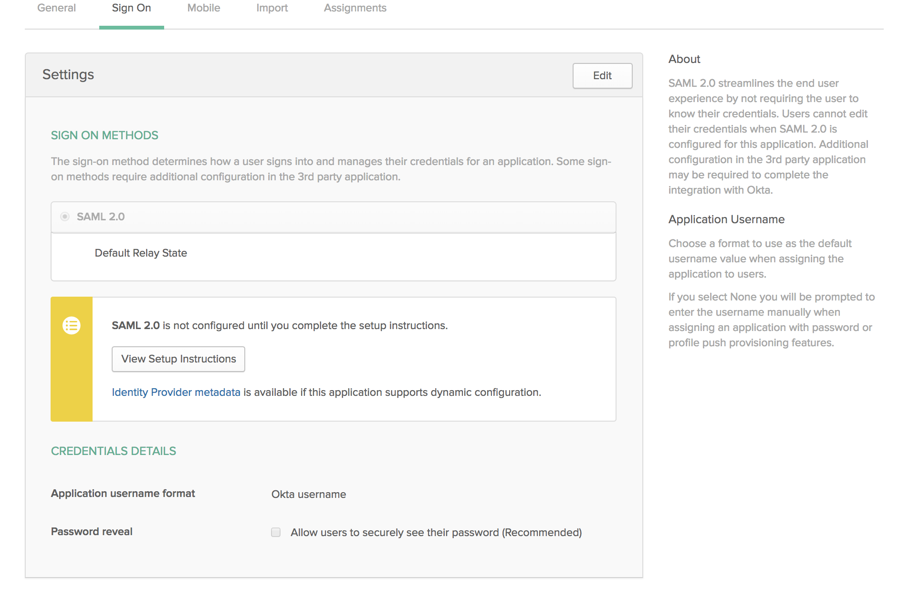
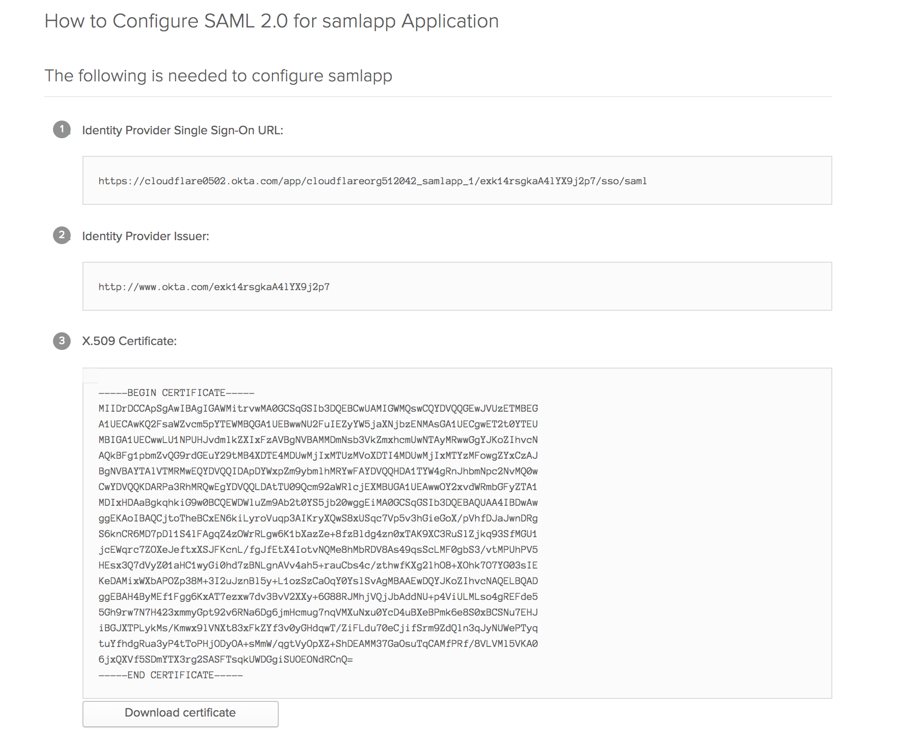

# SAML with Okta

Okta provides cloud software that helps companies manage and secure user authentication to modern applications, and helps developers build identity controls into applications, website web services, and devices. Cloudflare Access can integrate SAML with Okta as an IdP.

## Set up Okta as your IdP

To set up SAML with Okta as your IdP:

1. Log in to your Okta Admin portal, and choose **Applications**.
1. Click **Add Application**.

    

1. Click **Create New App**.

    

    The Create a New Application Integration card displays.

1. Select **SAML 2.0**.

    

1. Click **Create**.

    The **Create SAML Integration** card displays.

    

1. Enter an **App name**.
1. Click **Next**.

    The SAML Settings card displays.

    

1. In the **Single sign on URL** and the **Audience URI** **(SP Entity ID)** fields, enter your authorization domain, and include this  callback at the end of the path: `/cdn-cgi/access/callback`.

    **Tip**: You can find your organization’s authorization domain in Cloudflare Access. It begins with a subdomain unique to your organization and ends with the domain `cloudflareaccess.com`, including the callback path specified above.

1. Select the value to pass from the **Name ID** drop-down list.
1. In **Attribute Statements** **Name** field, enter “email” to create a new attribute.
1. In the **Value** field, enter a user email.
1. Click **Next**.
1. Click **Finish**.

    

    The _Applications_ page displays.

1. Click **Assign Applications**.

    The _application name_ page displays where you assign groups or users who can access this application. Our example application name is _samlapp_.

1. Click **People** or **Groups**.

    The _Assign application name to Groups_ card displays, where you grant users or groups permission to access your application.



1. Click **Done**.

    The assignments display on the Application page.

    

1. Choose the **Sign On** tab to retrieve the identity provider information.

    

1. Scroll to the bottom of the screen, copy the metadata and save it as an XML file.

    

1. Name the metadata file `sp-metadata.xml`.
1. In **Cloudflare Access**, scroll to **Login Methods**, click **Add** and select the **SAML** icon.

    

    The **Add a SAML identity provider** card displays.

1. Click to browse and select or drag the metadata file into the file upload box.

    

1. Confirm that the field entries from the metadata file upload are accurate.
1. Click **Save** and then **Test**.

    On successful connection to your Ping Identity deployment, a confirmation displays.

    

## To manually enter metadata from your Okta IdP

1. Copy and paste the following information into the Cloudflare Access **Edit a SAML identity provider** card.

   * **Provider Name**: Name your IdP.
   * **Single Sign On URL**: Enter the IdP Single-Sign-On URL.
   * **IdP Entity ID**: Enter the IdP issuer.
   * **Signing Certificate**: Copy the certificate from Okta in **X.509 Certificate** between **Begin Certificate** and **End Certificate**.

    

1. After completing the information, enter the name “email” as your email attribute for the **SAML assertion** field.
1. Click **Save**.
1. Click **Close**.
1. Click **Save** and then **Test**.

    On successful connection to your Okta deployment, a confirmation displays.

    

1. Close the **Edit a SAML identity provider** card.

## Download SP metadata (optional)

Some IdPs allow administrators to upload metadata files from their SP (service provider).

To get your Cloudflare metadata file:

1. Download your unique SAML metadata file at the following URL:

    ```txt
    https://auth-domain.cloudflareaccess.com/cdn-cgi/access/saml-metadata
    ```

    Replace authentication domain with your account’s **Login Page Domain** found in the **Access** tab in **Cloudflare Access**.

    In Cloudflare Access, you can find a link to this URL in the **Edit a SAML identity provider** dialog. The link returns a web page with your SAML SP data in XML format.

1. Save the file in XML format.
1. Upload the XML document to your **Okta **account.

## Example API Configuration

```json
{
    "config": {
        "issuer_url": "http://www.okta.com/exkbhqj29iGxT7GwT0h7",
        "sso_target_url": "https://dev-abc123.oktapreview.com/app/myapp/exkbhqj29iGxT7GwT0h7/sso/saml",
        "attributes": [
            "email",
            "group",
            "email_attribute_name": "",
            "sign_request": false,
            "idp_public_cert": "MIIDpDCCAoygAwIBAgIGAV2ka+55MA0GCSqGSIb3DQEBCwUAMIGSMQswCQYDVQQGEwJVUzETMBEG\nA1UEC.....GF/Q2/MHadws97cZg\nuTnQyuOqPuHbnN83d/2l1NSYKCbHt24o"
        ]
    },
    "type": "saml",
    "name": "okta saml example"
}
```
