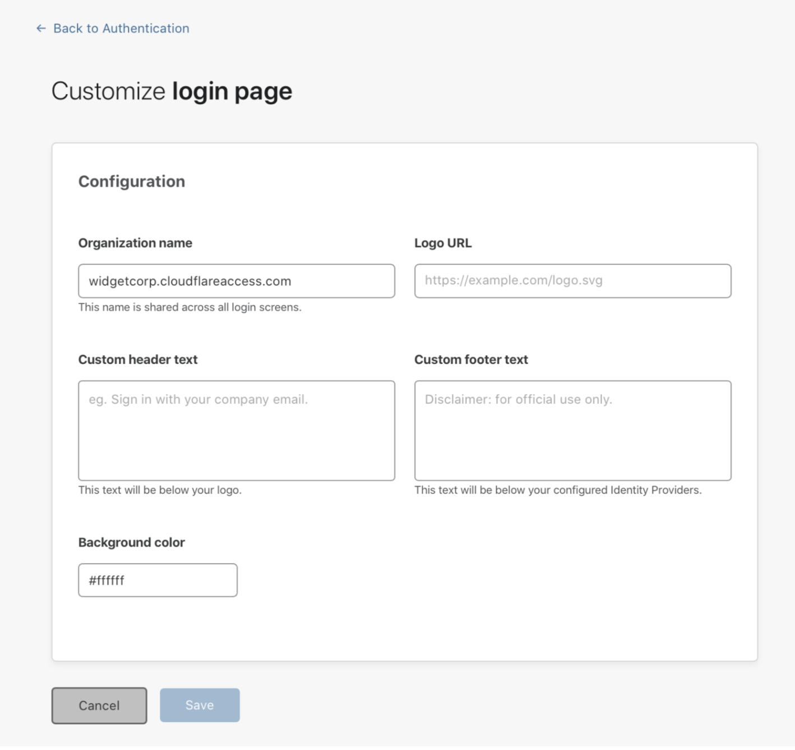
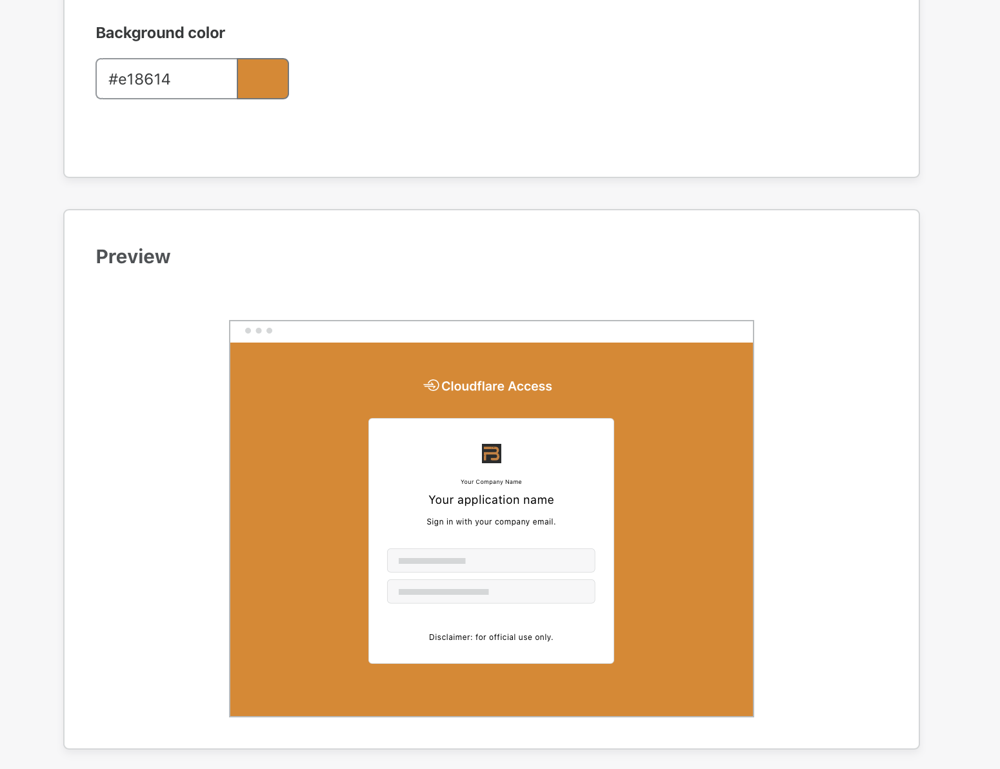

# Login page

The **Authentication > Login** tab lets you customize your end users' login experience, so that it meets your organization's needs. 

This means you can:
* Choose your preferred [login methods](#login-methods)
* Specify your [organization domain](#organization-domain)
* Customize your [login page](#login-page)

## Login methods

Use the **Login Methods** card to add new login methods, or edit/test any login methods you may have already added.

## Organization domain

Use the **organization domain** card to edit your organization domain. To do so, click **Edit** and input your desired domain name.

This domain is shared across all sites in your Cloudflare account where you have configured Access.

## Login page

Use the **Login Page** card to customize the login page your end users will see. To do so, click **Customize**.

This will allow you to add an organization name, a custom header and footer, a logo, and a preferred background color to your login page.

Any changes you make will be reflected in real time in the **Preview** card.

Once you’re satisfied with your customization, click **Save**.

Your login page will now reflect your changes.

