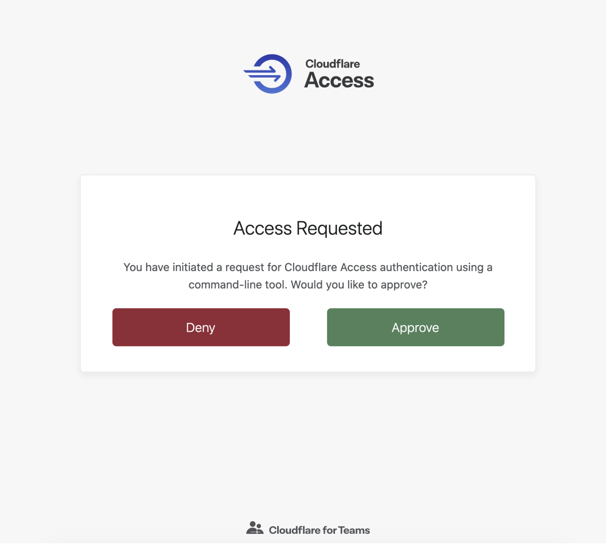

# `cloudflared` authentication

<Aside>

This should only be enabled if a [service token](/identity/users/service-tokens) cannot be used for your automated service. 
</Aside>

<TableWrap>

| Before you start |
| ------------------- |
| Ensure you have an automated service relying on `cloudflared` authentication |
| Ensure you have an active IdP session when logging in through `cloudflared` |

</TableWrap>

When you log into Access through `cloudflared`, your browser prompts you to allow access by 
displaying this page:

To avoid seeing this page every time you authenticate through `cloudflared`, you can toggle on *Enable automatic `cloudflared` authentication* when adding a [self-hosted application](/applications/configure-apps/).

This option will still prompt a browser window in the background, but the authentication will be automatic.
