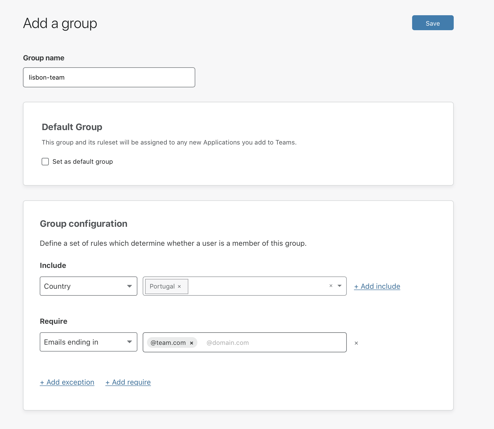
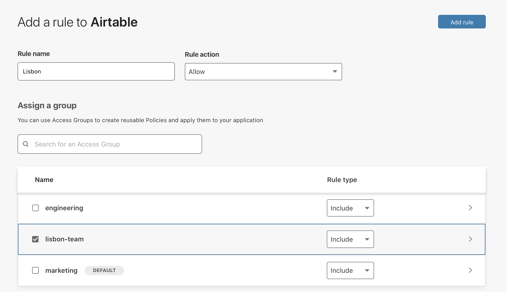
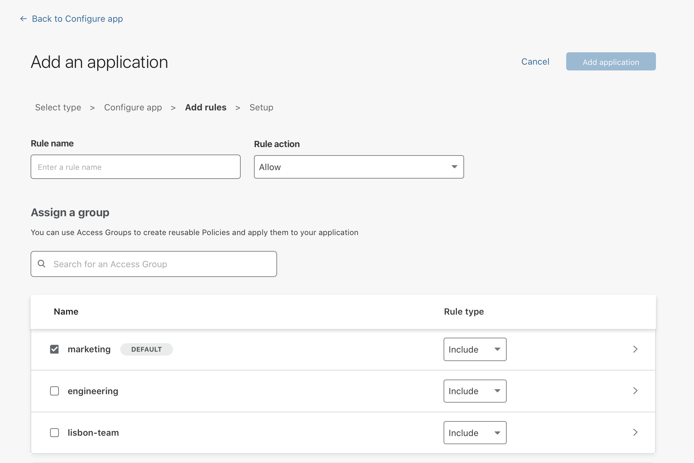

# Groups

## Definition
A group is a set of rules that can be configured once and then quickly applied across many Access applications. You can select a group as a selector in any zero-trust rule, and all the criteria from the selected group will apply to that application.

<Aside>

Groups in Teams are distinct from groups in your identity provider, like Okta groups. Groups in Teams can contain a mix of individual users, groups from identity providers, and service authentication options like service tokens.

</Aside>

## Example scenario

Imagine you want to grant access to your applications to your team based in Lisbon, Portugal. In order to avoid building the same set of rules over and over across your applications, you can create a group called `lisbon-team`, which comprises:
* an Include rule granting access to everyone in Portugal, and
* a Require rule restricting access to users whose email ends in `@team.com`.

Once you've created the group, you can use it in your existing rules, or you can include it in any new rule:

## Creating a group

To create and manage groups:

1. On the [Teams dashboard](https://dash.teams.cloudflare.com), navigate to the **My Teams** section.
2. Open the Groups tab.
3. Click **Add a Group**.
4. Enter a name for the group.
5. Specify as many rules as needed to define your user group.
8. Check the *Set as default group* option if you want to [select your group as default](#setting-a-group-as-default).
7. Click **Save**.

## Setting a group as default

Setting a group as default will automatically apply the group to any newly created applications. Once a group is set as default:

* **It will not apply retroactively to any applications created before you made the group default**. You’ll still need to add the group to any pre-existing application manually.
* **If you turn off the group as default, that group will not be removed from any applications**. If there is a specific application to which you do not want to apply the default group, you’ll need to edit that application’s policy manually.

Once you've set a group as default, it will automatically appear as checked when you add a new application. If you do not wish to apply the default group to a new application, you can uncheck the group.

## Group criteria

Group criteria determine whether or not a user is a member of a particular group.

Groups follow the same [logic](/policies/) as rules for zero-trust policies in Access.

Group criteria help define whether to include or exclude a team member from a  group. Here is a list of criteria and examples:
* **Emails** — `you@company.com`
* **Emails ending in** — `@company.com`
* **Access groups** — `example-team`
* **IP ranges** — `192.168.100.14` (supports IPv4 and IPv6)
* **Everyone** — allows, denies, or bypasses access to everyone.
* **Country** – uses the IP address to determine country
* **Valid Certificate** - The request will need to present any valid client certificate
* **Common Name** - The request will need to present a valid certificate with an expected common name
* **Any Access Service Token** - The request will need to present the headers for any service token created for this account
* **Service Token** - The request will need to present the correct service token headers configured for the specific application
* **Identity provider groups** — Employs the user groups (if supported) you configured with your identity provider (IdP) or LDAP with Access. The IdP group option only displays if you use an identity provider that passes groups using SAML or OAuth Scope.

## Using groups For IP-based rules

We recommend using groups to define any IP address-based rules you configure in policies. Keeping IP addresses in one place allows you to modify or remove addresses once, rather than in each policy, and reduces the potential for mistakes.

<Aside>

If adding more than one IP address or range to a group, it’s best to use an Include rule. If you don’t use the Include rule, the policy using that  group attempts to require traffic to originate from all ranges.

</Aside>

## Using groups for country requirements

You can create an Access Group that consists of countries to allow or block. The Access Group will treat the countries in the `Include` policy with an `OR` operator. You can use this Access Group inside of a `Require` rule to require at least one of the countries inside of the group.

## Legacy groups

Cloudflare Access supported a flow in the UI to build policies with IdP groups, called *Legacy groups*. Native integration with groups surfaced from your IdP has replaced this feature.

If your account built policies with Legacy groups, these are still available and continue to work as you intend.

If your account uses Legacy groups, a banner displays in the Access dashboard.

Unfortunately, Access cannot automatically migrate your Legacy groups. This is due to the risk of Legacy group names not matching identity provider group names or, in some cases, IdP groups consisting of a unique ID unknown to Access.
To migrate from Legacy groups:

1. Open policies using Legacy groups.

1. Navigate to your Access policies and open any using Legacy groups.

1. Replace Legacy groups with identity provider groups.

1. Replace the policy rules using Legacy groups by adding a new, mirrored rule that pulls groups from your identity provider.
For example, if you have a Legacy group that allows “Engineers,” and that Legacy group maps to the same membership of an Okta® group, add a new rule based on Okta groups to allow “Engineers.”

1. Remove the Legacy group rule.

1. Once you create a new rule with the group from your identity provider, remove the rule that uses Legacy groups.

1. Click **Save**.

**Note**: If you continue to use policies with Legacy groups, Access still prevents unauthorized users from reaching your applications; however, users who are members of Legacy groups are also prevented from being authenticated.

