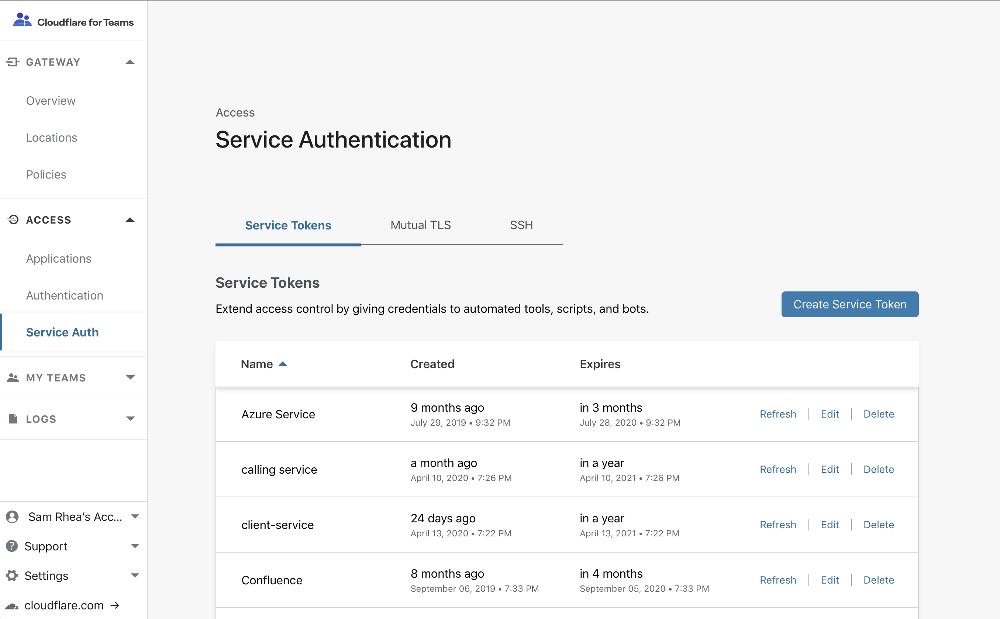
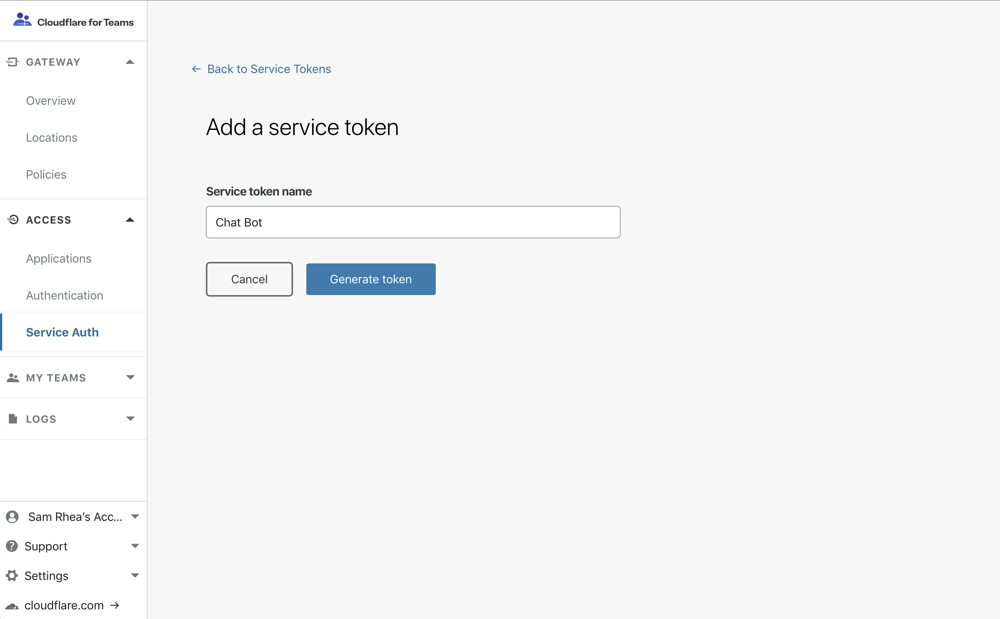
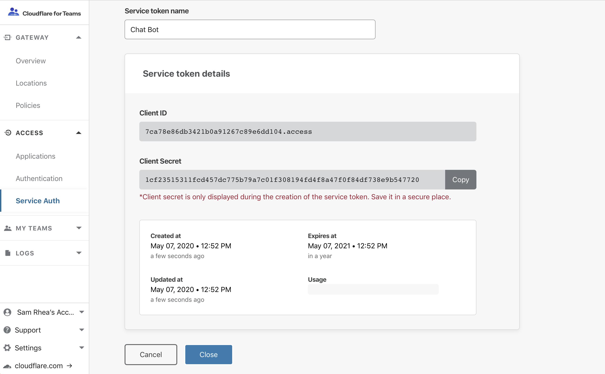

# Service tokens

Teams allows you to have systems authenticate to Access in an automated way, and without identity provider credentials. With Access, you can generate **service tokens** consisting of an ID and a Secret; automated systems or applications will then use these values to reach an application protected by Access. 

This section covers how to create, renew, and revoke a service token.

## Create a service token

1. On the [Teams dashboard](https://dash.teams.cloudflare.com), navigate to **Access > Service Auth**.

2. Click **Create Service Token**.

 

3. Next, name the service token.

  The name allows you to easily identify events related to the token in the logs and to revoke the token individually.

  

4. Click **Generate token**.
  
  The next page will display the generated `Client ID` and `Client Secret` for the service token.

5. In the next page, copy the `Client Secret`.

  

<Aside type='warning' header='Important'>

This is the **only time** Cloudflare Access will display the Client Secret. If you lose the Client Secret, you must generate a new service token.

</Aside>

6. Click **Close**.

You can now use the service token when you create [service auth policies](/policies/zero-trust/).

## Connect your service to Access
Access expects both values as headers in any request sent to the applications behind Access. Add the following to the headers of any requests and name them as follows:

`CF-Access-Client-Id: <Client ID>`
`CF-Access-Client-Secret: <Client Secret>`

When a request is made to an application behind our network, the request will submit them both to Access. If the service token is valid, Access generates a JWT scoped to the application. All subsequent requests with that JWT will succeed until the expiration of that JWT.

## Renew service tokens

By default, service tokens expire one year after creation. You can extend a token’s lifecycle by navigating to the **Service Tokens** tab and clicking the **Refresh** button for the token you want to renew.
The `Refresh` operation will extend the token's lifetime by **one year** from the date of the refresh.

## Revoke service tokens

By default, Access service tokens expire one year after they’re created. If you need to revoke access earlier, simply delete the token.

To revoke a service token immediately:
1. On the [Teams dashboard](https://dash.teams.cloudflare.com), navigate to **Access > Service Auth > Service Tokens**.

2. Click **Delete** for the token you need to revoke and delete.

When revoking service tokens, keep in mind:
* Services that rely on a deleted service token can no longer reach your application.
* Clicking **Revoke Existing Tokens** when editing a policy in the **Edit Access Policy** dialog revokes existing sessions but does not revoke access.

As long as the Client ID and Client Secret are still valid, they can be exchanged for a new token on the next request. To revoke access, you must *delete* the service token.
