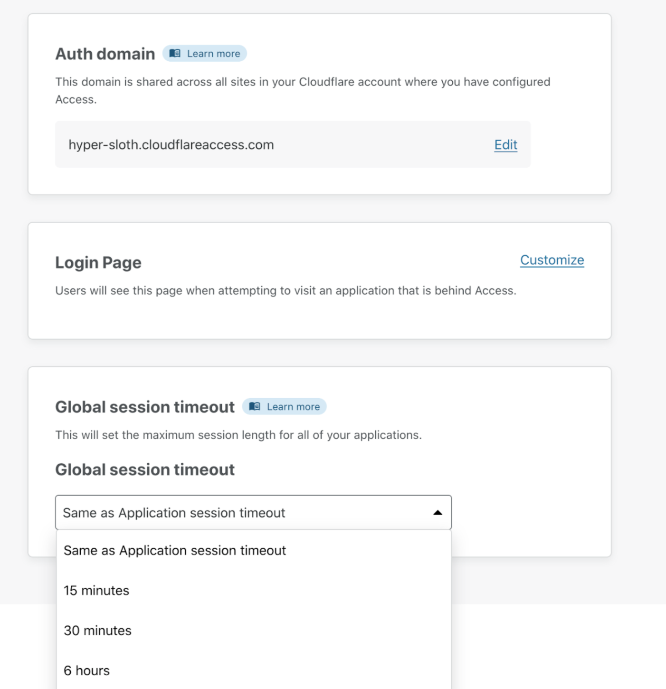
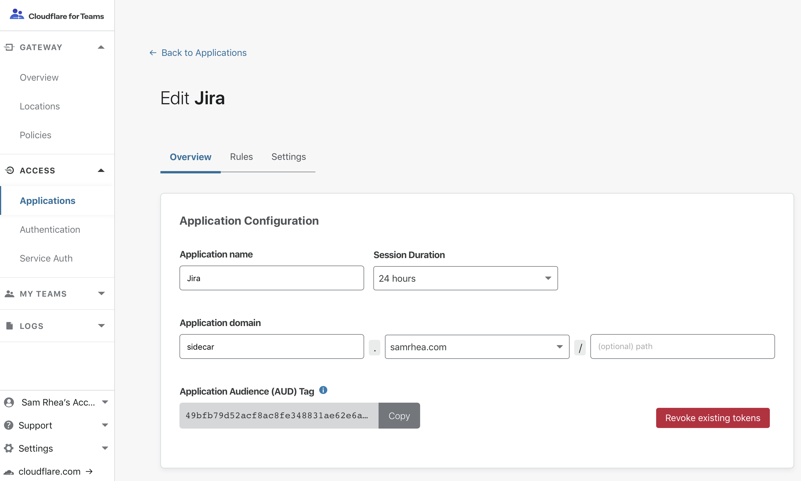
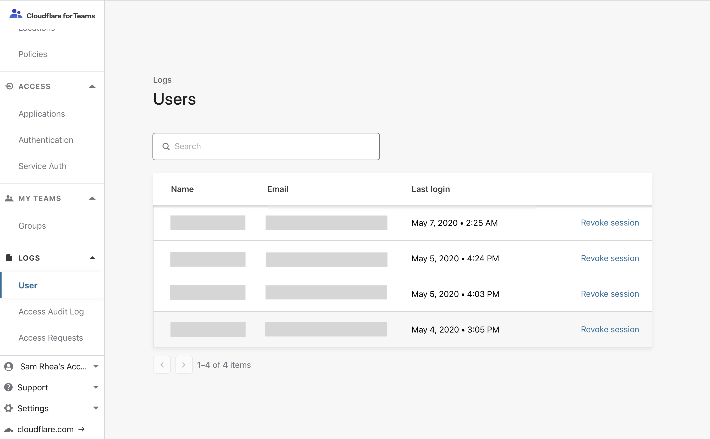
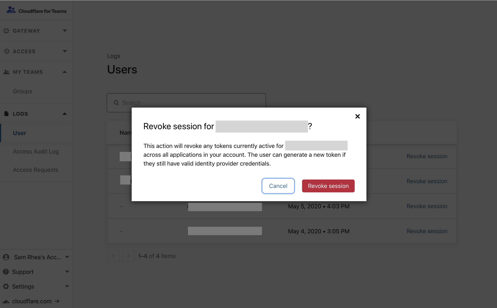
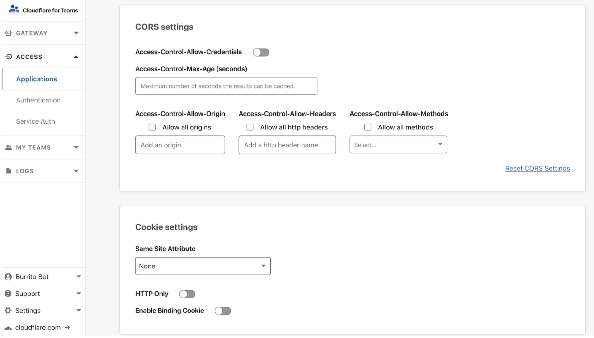

# Session management

## AJAX

Pages that rely heavily on AJAX or single-page applications can block sub-requests due to an expired Access token without prompting the user to re-authenticate.

You can configure Access to provide a `401` response on sub-requests with an expired session token. We recommend using this response code to either force a page refresh or to display a message to the user that their session has expired.

In order to receive a `401` for expired session, add the following header to all AJAX requests:

`X-Requested-With: XMLHttpRequest`

## Global session duration

When users log in to an application protected by Access, Access generates two session tokens:

<TableWrap>

| Token | Description | Storage |
|---|---|---|
| **Global session token**| Establishes the maximum amount of time for a user’s Access session | Your Cloudflare organization domain  `example.cloudflareaccess.com` |
| **Application token** | Establishes a session for a specific application | The hostname of the application protected |

</TableWrap>

You can configure the duration of both tokens on the dashboard. When users log in, the global session token will default to the duration of the application token. You can configure the duration of the global session token to be shorter or longer than the application’s session token.

* If the global session duration is **shorter** than an application’s session length, users will be required to re-authenticate each time the global session time elapses.

 This can be helpful to establish a maximum session duration across all applications.

* If the global session duration is **longer** than an application’s session length, a user’s application session will be automatically refreshed until the global session expires.

 This provides a more secure way, since the global session cookie cannot be used to directly access an application, to allow for longer user sessions.

## Revoke user sessions

Access provides two options for revoking user sessions: **per-application** and **per-user**.

The authentication process involves Cloudflare Access issuing a signed JSON Web Token (JWT) when a user authenticates and meets the criteria defined in your Access application policy. The token is valid for the duration configured in the application (default is 24 hours). The user can access the application for the entire duration of that token’s lifecycle without re-authenticating until the session expires.

### Per-Application

To immediately terminate all active sessions for a specific application:

1. On the Teams dashboard, navigate to **Access > Applications** and locate the application for which you would like to revoke active sessions.

2. Click **Edit** for that application.

3. In the Overview page, click **Revoke existing tokens**.

Unless there are changes to rules in the policy, users can generate a new token during authentication if their profile in your identity provider is still active.

### Per-User

Access can immediately revoke a single user session across all applications in your account. Once revoked, the user cannot reach any application path protected by Access. However, if the user’s identity profile is still active, they can generate a new session.

If you want to permanently revoke a user's access:

1. Disable their account in your IdP so that they cannot authenticate, then revoke their Access user session.

2. On the Teams dashboard, navigate to **Logs** > **Users**.

 Users who have authenticated in the current calendar month will be displayed. Search for or select the user you need to revoke.

3. Click **Revoke session** and confirm.

### Subsequent Logins

When administrators revoke a user's Cloudflare Access token, that user will not be able to login again for up to 1 minute. If they attempt to do so, Cloudflare Access will display an error.

## Options for browser cookies configuration 

Cloudflare Access provides optional security settings that can be added to the browser cookies generated by Access for an authenticated user. The three enhanced browser cookie settings available are:

* HttpOnly flag
* Binding cookie
* SameSite

All three settings can be enabled in an Application’s settings menu.

To reach the settings menu:

1. On the [Teams dashboard](https://dash.teams.cloudflare.com), navigate to **Access > Applications**.
1. Locate the application for which you would like to enable these settings.
1. Click **Edit**.
1. Select **Settings**.

### HTTP Only

The HTTP Only flag is a cookie attribute that prevents the cookie from being accessed by any client-side scripts, reducing the likelihood of XSS attacks.

#### When not to use HttpOnly

Do not enable HttpOnly if:
* You are using the Access application for non-browser based tools
* You have software that relies on being able to access a user’s cookie generated by Access

### Enable Binding Cookie

The Binding Cookie is an additional cookie created when a user successfully authenticates, shared with Cloudflare to verify identity, and then stripped before it reaches the origin server. The Binding Cookie associates the browser with the Access token; the association protects against compromised authorization tokens because the origin webapp would never see this binding cookie. This protects against session hijack style attacks.

#### When not to use the Binding Cookie
* Do not use the Binding Cookie for non-browser based Access applications that rely on protocols like SSH, RDP, etc.

### SameSite Attribute

The [SameSite](https://web.dev/samesite-cookies-explained/) Attribute selector is a cookie attribute that restricts the cookie to only being sent if the cookie’s defined site matches the site being requested in the browser. This adds protection against CSRF attacks.

The selector options are[[1](#source)]:
* **None** - Cookies will be sent in all contexts, i.e sending cross-origin is allowed.
* **Lax** - Cookies are allowed to be sent with top-level navigations and will be sent along with GET requests initiated by third party websites.
* **Strict** - Cookies will only be sent in a first-party context and not be sent along with requests initiated by third party websites.

See [here](https://developer.mozilla.org/en-US/docs/Web/HTTP/Headers/Set-Cookie/SameSite) for specific behaviors of these options.

#### When not to use SameSite
* If you have additional sites or applications that rely on a specific application’s authorization cookie.

#### References

###### 1.  Source: [SameSite Cookies](https://developer.mozilla.org/en-US/docs/Web/HTTP/Headers/Set-Cookie/SameSite)