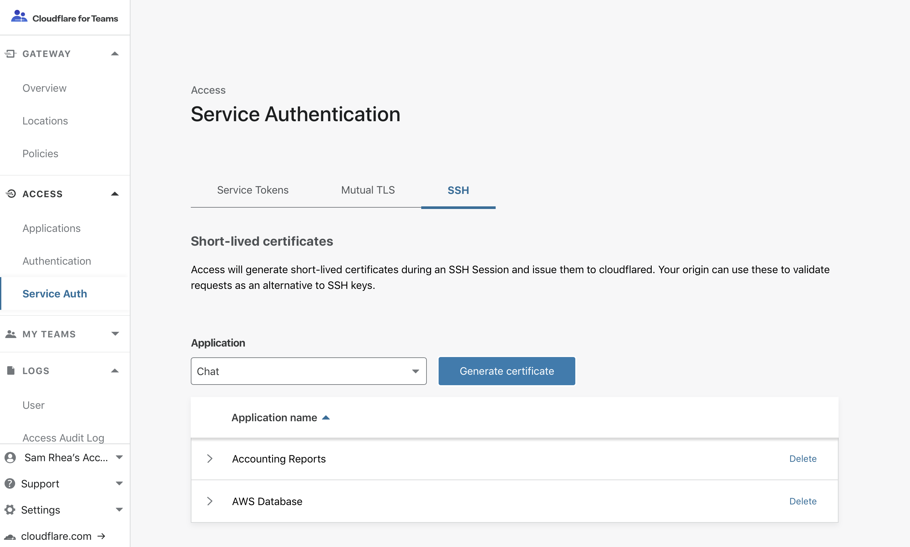
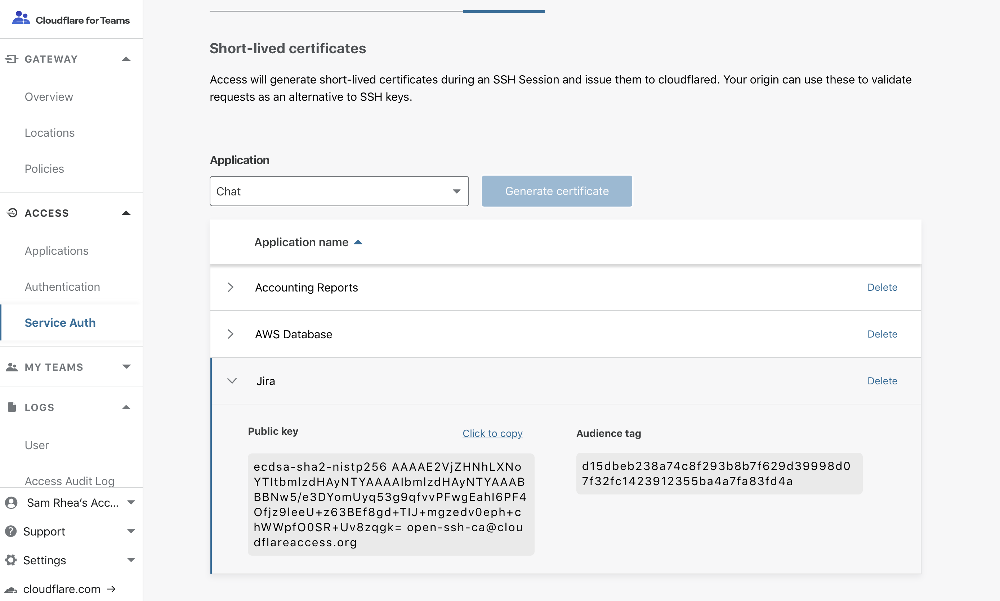

# Configure short-lived certificates

Cloudflare Access can replace traditional SSH key models with short-lived certificates issued to your users based on the token generated by their Access login. In traditional models, users generate a keypair and commit their public key into an infrastructure management tool, like [Salt](https://github.com/saltstack/salt), or otherwise upload it to an administrator. These keys can remain unchanged for months or years.

Cloudflare Access removes the burden on the end user of generating a key, while also improving security of access to infrastructure with ephemeral certificates.


## 1. **Secure a server behind Cloudflare Access**.

To protect a resource behind Cloudflare Access, first follow [these instructions](/applications/non-HTTP/ssh/ssh-connections) to secure the server.

## 2. **Generate a short-lived certificate public key**.

1. On the Teams dashboard, navigate to **Configuration > Service Auth**.

2. In the drop-down, choose the application that represents the resource you secured in Step 1.

    

3. Click **Generate certificate**. A row will appear with a public key scoped to your application.

4. Save the key or keep it somewhere convenient for configuring your server.
    You can return to copy this public key any time in the Service Auth dashboard.

    

## 3. **Ensure Unix usernames match user SSO identities**

Cloudflare Access will take the identity from a token and, using short-lived certificates, authorize the user on the target infrastructure. Access matches based on the identity that precedes an email domain. **Unix usernames must match the identity preceding the email domain**.

For example, if the user's identity in your Okta or GSuite provider is `jdoe@example.com` then Access will look to match that identity to the Unix user `jdoe`.

For testing purposes, you can run the following command to generate a Unix user on the machine:

```sh
$ sudo adduser jdoe
```
## 4. **Save your public key**

1. Save the public key generated from the dashboard in Step 2 as a new `.pub` file in your system.

2. Use the following command to change directories to the SSH configuration directory on the machine:

```sh
$ cd /etc/ssh
```

3. Once there, you can use the following command to both generate the file and open a text editor to input the public key.

```sh
$ vim ca.pub
```

4. In the `ca.pub` file, paste the public key generated in Access without any modifications. Save the file. In some systems, you may need to use the following command to force the file to save depending on your permissions.

```bash
:w !sudo tee %
:q!
```

## 5. Modify your SSHD config

Cloudflare Access requires two changes to the `sshd_config` file used on the target machine.

The first change requires that you uncomment a field already set in most default configurations; the second change adds a new field.

1. While staying within the `/etc/ssh` directory, open the `sshd_config` file.

```sh
$ vim /etc/ssh/sshd_config
```
2. Navigate to the row named `PubkeyAuthentication`. In most default configurations, the row will appear commented out as follows:

```bash
# PubkeyAuthentication yes
```

3. Remove the # symbol to uncomment the line; keep the setting `yes` enabled.

4. Next, add a new line below `PubkeyAuthentication` as follows:

```bash
TrustedUserCAKeys /etc/ssh/ca.pub
```

The change above will tell your SSH configuration to use the public key saved in Step 5 for authorizing users. Save the file and quit the editor. You might need to use the following command again to save and exit.

```bash
:w !sudo tee %
:q!
```

## 6. Restart your SSH server

Once you have modified your SSHD configuration, you still need to restart the SSH service on the machine. Commands are provided below that cover servers running systemd, as well. You can execute both.

```sh
$ sudo service ssh restart
$ sudo systemctl restart ssh
```

## 7. Configure your client SSH config
On the client side, follow [these instructions](/applications/non-HTTP/ssh/ssh-connections/) to configure your device to use Cloudflare Access to reach the protected machine. To use short-lived certificates, you must include the following settings in your SSH config file.

To save time, you can use the following cloudflared command to print the required configuration command:

```sh
$ cloudflared access ssh-config --hostname vm.example.com --short-lived-cert
```

If you prefer to configure manually, these are the required commands:

```bash
Host vm.example.com
    ProxyCommand bash -c '/usr/local/bin/cloudflared access ssh-gen --hostname %h; ssh -tt %r@cfpipe-vm.example.com >&2 <&1'
```
```bash
Host cfpipe-vm.example.com
    HostName vm.example.com
    ProxyCommand /usr/local/bin/cloudflared access ssh --hostname %h
    IdentityFile ~/.cloudflared/vm.example.com-cf_key
    CertificateFile ~/.cloudflared/vm.example.com-cf_key-cert.pub
 ```
