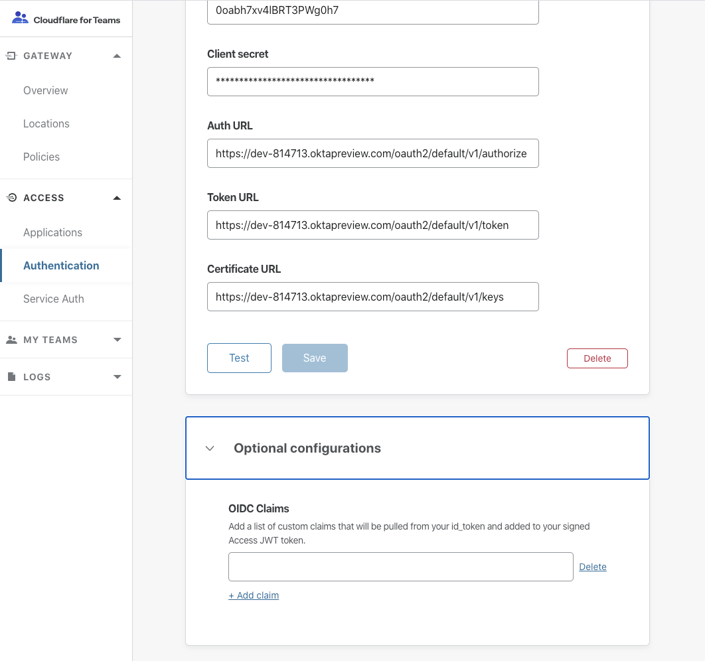

# JSON web tokens

Cloudflare Access uses JSON Web Tokens (JWTs) and their contents to confirm a user’s identity before allowing or denying access to sensitive resources. Cloudflare securely creates these tokens through the OAUTH or SAML integration between Cloudflare Access and the configured identity provider.

Two tokens are generated:

* **Team Domain Token**: a token stored at the [team domain](/glossary#team-domain) that prevents a user from needing to login to each application. The token is stored as a cookie at your account's team domain, for example, `https://your-team-name.cloudflareaccess.com`.

* **App Token**: a token generated for each application that a user reaches. The token is stored as a cookie on the application, for example, `https://jira.site.com`.

You can use the JWT created by Cloudflare Access to validate requests on your origin.

| Best practices |  |
| -------------- | ------ |
| **Only validate tokens using the external endpoint, rather than saving the public key as a hard-coded value.** Cloudflare signs both tokens with a key pair that you can validate using the corresponding public certificate, available at an external endpoint. As a security best practice, Cloudflare rotates the key pair in use periodically. |  |
| **Do not only look for the first certificate of the two in the list.** The ordering of which certificate is current will change. It is possible that clock skew between your server and Cloudflare's would result in a failure when validating a token's IAT or NBF fields. A grace period can help prevent downtime if that is the case.  |

## Manual verification

<Aside>

<b>Before you start</b>

Install [`lokey`](https://github.com/jpf/lokey) and [`jq`](https://stedolan.github.io/jq/download/).

</Aside>

1. Run this command:

    ```bash
    curl -s https://<your team domain>/cdn-cgi/access/certs | jq .keys[0] | lokey to pem -----BEGIN PUBLIC KEY----- MIIBIjANBgkqhkiG9w0BAQEFAAOCAQ8AMIIBCgKCAQEA01SvMv4TgFIECQgzHaRL DGVaKhRQHjgdiSOpbqhHQMdcNtBIM0HAQbrs7YS6sQCCdZC5wCvlq3xgqdU5J6k YI5OCSsIWXKkobAl6PbXHdN0bJximeiHGa3O0hMREP6RKBoI6ayNmZ3WlVGWY 6ie47KGqN69l7fPKyZvszb4GdpxE0r8gllZZwIuPjzlghXRlrkaP48ucQwo+tq PSSdDdW57TCFmy+G547W5iWZWJIeNkfVu9t6FktvCwSZ1ekum3X7IQcd0O0DWSR Aj9tzNDPkzOeSFxmQkKpWs8Qw7ZBIfLOsO3DCH6VPNhS2cqhw1AAMunh8alDKQU aQIDAQAB -----END PUBLIC KEY-----
    ```

    If an error occurs while running `lokey`, install the [Python six](https://pypi.python.org/pypi/six) library, and try again:

    ```sh
    $ pip install six==1.10.0
    ```

1. Go to [jwt.io](https://jwt.io/).
1. Select the RS256 algorithm.
1. Paste the JWT into the field on the left.
1. Enter the public key in the **Public Key** field.
1. Ensure that the signature says **verified**.

## Programmatic verification

<Aside>

<b>Before you start</b>

Click the **Settings** button to copy the AUD tag from your **Access** app on your Cloudflare dashboard in the _Edit Access Policy_ dialog box:

 Certificate URL: `https://<Your Team Domain>/cdn-cgi/access/certs`

 JWT Issuer: `https://<Your Team Domain>`

</Aside>

### Golang example

```go
package main


import (
    "context"
    "fmt"
    "net/http"

    "github.com/coreos/go-oidc"
)

var (
    ctx        = context.TODO()
    teamDomain = "https://test.cloudflareaccess.com"
    certsURL   = fmt.Sprintf("%s/cdn-cgi/access/certs", teamDomain)

    // policyAUD is your application AUD value
    policyAUD = "4714c1358e65fe4b408ad6d432a5f878f08194bdb4752441fd56faefa9b2b6f2"

    config = &oidc.Config{
        ClientID: policyAUD,
    }
    keySet   = oidc.NewRemoteKeySet(ctx, certsURL)
    verifier = oidc.NewVerifier(teamDomain, keySet, config)
)

// VerifyToken is a middleware to verify a CF Access token
func VerifyToken(next http.Handler) http.Handler {
    fn := func(w http.ResponseWriter, r *http.Request) {
        headers := r.Header

        // Make sure that the incoming request has our token header
        //  Could also look in the cookies for CF_AUTHORIZATION
        accessJWT := headers.Get("Cf-Access-Jwt-Assertion")
        if accessJWT == "" {
            w.WriteHeader(http.StatusUnauthorized)
            w.Write([]byte("No token on the request"))
            return
        }

        // Verify the access token
        ctx := r.Context()
        _, err := verifier.Verify(ctx, accessJWT)
        if err != nil {
            w.WriteHeader(http.StatusUnauthorized)
            w.Write([]byte(fmt.Sprintf("Invalid token: %s", err.Error())))
            return
        }
        next.ServeHTTP(w, r)
    }
    return http.HandlerFunc(fn)
}

func MainHandler() http.Handler {
    return http.HandlerFunc(func(w http.ResponseWriter, r *http.Request) {
        w.Write([]byte("welcome"))
    })
}

func main() {
    http.Handle("/", VerifyToken(MainHandler()))
    http.ListenAndServe(":3000", nil)
}
```

### Python example

`pip` install the following:

* flask
* requests
* PyJWT

```python
from flask import Flask, request
import requests
import jwt
import json
import os
app = Flask(__name__)


# Your policies audience tag
POLICY_AUD = os.getenv("POLICY_AUD")

# Your CF Access team domain
TEAM_DOMAIN = os.getenv("TEAM_DOMAIN")
CERTS_URL = "{}/cdn-cgi/access/certs".format(TEAM_DOMAIN)

def _get_public_keys():
    """
    Returns:
        List of RSA public keys usable by PyJWT.
    """
    r = requests.get(CERTS_URL)
    public_keys = []
    jwk_set = r.json()
    for key_dict in jwk_set['keys']:
        public_key = jwt.algorithms.RSAAlgorithm.from_jwk(json.dumps(key_dict))
        public_keys.append(public_key)
    return public_keys

def verify_token(f):
    """
    Decorator that wraps a Flask API call to verify the CF Access JWT
    """
    def wrapper():
        token = ''
        if 'CF_Authorization' in request.cookies:
            token = request.cookies['CF_Authorization']
        else:
            return "missing required cf authorization token", 403
        keys = _get_public_keys()

        # Loop through the keys since we can't pass the key set to the decoder
        valid_token = False
        for key in keys:
            try:
                # decode returns the claims that has the email when needed
                jwt.decode(token, key=key, audience=POLICY_AUD)
                valid_token = True
                break
            except:
                pass
        if not valid_token:
            return "invalid token", 403

        return f()
    return wrapper


@app.route('/')
@verify_token
def hello_world():
    return 'Hello, World!'


if __name__ == '__main__':
    app.run()
```

## JWT contents

JWTs contain three Base64-URL, separated by dots:
* Header
* Payload
* Signature

A typical JWT looks like this:

```
eyJhbGciOiJSUzI1NiIsImtpZCI6IjkzMzhhYmUxYmFmMmZlNDkyZjY0.eyJhdWQiOlsiOTdlMmFhZ TEyMDEyMWY5MDJkZjhiYzk5ZmMzNDU5MTNh.zLYsHmLEginAQUXdygQo08gLTExWNXsN4jBc6PKdB
```

JWTs generated by Access are available in a request header as `Cf-Access-Jwt-Assertion` and as cookies as `CF_Authorization`. When not using Argo Tunnel, the tokens must be validated by the application to ensure the authenticity of the token and the security of the origin. Validation of the header alone is not sufficient — the JWT and signature must be confirmed to avoid identity spoofing.
Cloudflare signs the JWT using the RSA Signature with `SHA-256` (`RS256`). `RS256` follows an asymmetric algorithm; a private key signs the JWTs and a separate public key verifies the signature.

When you configure Access, the public certificates are available at this URL, where `your-team-name` is your [team name](/glossary#team-name): `https://your-team-name.cloudflareaccess.com/cdn-cgi/access/certs`.

### Header

```json
{
    "alg": "RS256",
    "kid": "9338abe1baf2fe492f646a736f25afbf7b025e35c627be4f60c414d4c73069b8",
    "typ": "JWT"
}
```
The header contains the encoding algorithm. kid identifies the key used to sign tokens. Typ designates the token format.

### Payload

```json
{
    "aud": ["97e2aae120121f902df8bc99fc345913ab186d174f3079ea729236766b2e7c4a"],
    "email": "admin@example.com",
    "exp": 1519418214,
    "iat": 1519331815,
    "iss": "https://drawbridge.cloudflareaccess.com",
    "nonce": "1d8083f708a47982296f2d9896d70f207a27938f026540c392b903e5fdf4d6e9",
    "sub": "ca639bb9-26ab-42e5-b9bf-3aea27b331fd"
}
```

The payload contains the actual claim and user information to pass to the application.
* `aud` identifies the application to which the JWT is issued. Our example uses test.example.com.
* `email` contains the email address of the authenticated user.
* `sub` contains the identifier of the authenticated user.
* `iss` the issuer is the application’s Cloudflare Access Domain URL.
* `iat` and exp are the issuance and expiration timestamps.
* `nonce` is the session identifier.
* `identity_nonce` is available in the Application Token and can be used to query all group membership for a given user.
* `custom` contains SAML attributes in the Application Token specified by an administrator in the identity provider configuration.

### Signature

To generate the signature, the encoded header, encoded payload, and the algorithm specified in the header are signed using the Cloudflare Access private key. Users validate the token using the public key.

Cloudflare includes the JWT with all authenticated requests in two places:
* The response header `Cf-Access-Jwt-Assertion`
* The cookie `CF_Authorization`

Visit [jwt.io](https://jwt.io/) for more information on JWTs.

### User Identity

After a visitor authenticates to Cloudflare Access, all subsequent requests to the application server contain a `Cf-Access-Authenticated-User-Email` header with the authenticated user. Our example uses `user@example.com`.

This allows you to identify the user currently logged in. It is critical to ensure that only Cloudflare can send requests to the origin when relying on this header. Even so, validating the header alone is not sufficient. JWTs and signatures must be confirmed to avoid identity spoofing.

Based on security requirements, you can allow users to have longer or shorter sessions than the default. The longer the user session, the less frequently they need to log in, but long sessions remain valid if the user doesn’t log out.

You can set the Session Duration on the Settings page of the Edit Access Policy dialog box in the Access app on your Cloudflare dashboard.

Click **Revoke existing tokens** to revoke JWTs associated with the selected policy.

## Groups within a JWT

The JWT created by Cloudflare Access contains the user identity and also a mechanism for your application to identify the user's SSO group membership. For example, your application can validate that a given user is a member of an Okta or AzureAD group like `Finance-Team` or `Eng`.

Requests sent to the origin contain the JWT in a header, `Cf-Access-Jwt-Assertion`, as well as a cookie in the user's browser titled `CF_Authorization`. If your application retrieves that cookie, it can then make a request to `https://<teamDomain>.cloudflareaccess.com/cdn-cgi/access/get-identity`, where the teamDomain is your account's team domain. The request should be structured as follows:

```
curl -H 'cookie: CF_Authorization=<users token>' https://<teamDomain>.cloudflareaccess.com/cdn-cgi/access/get-identity
```

The response will be structured as JSON:

```json
{
  "groups": [
    {
      "id": "02fk6b3p3majl10",
      "email": "finance@cloudflaredemo.com",
      "name": "FinanceTeam"
    },
    {
      "id": "04k668n318e7vu5",
      "email": "eng@cloudflaredemo.com",
      "name": "Eng"
    }
  ]
}
```

Alternatively, organizations using SAML providers can specify attributes to be included directly inside of the Application Token sent to the origin.
To do so, add the desired attributes in the SAML attributes section of the identity provider configuration. Cloudflare Access will attempt to add as many attributes as possible before capping the list to avoid size issues. Access attempts to add attributes in the order they are listed.

## Support Additional OIDC Claims with your JWT

Access allows you to add additional OIDC claims (if supported by your IdP) to your JWT for enhanced verification. This can be configured for the OpenID authentication option under Optional Configurations.


