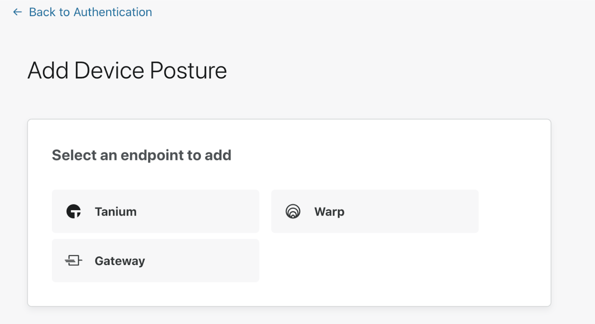

#  Require Gateway for Access

With Access, you can require that all traffic to specific applications is monitored by Cloudflare Gateway. With Gateway protecting and filtering all requests to your applications, you will be able to see all user traffic and activity in each of these applications, broken down by user and device.

You can choose to require Gateway by configuring it as an option within an Access policy, or alternatively, you can choose to include or require WARP, Cloudflare’s secure and modern VPN, which ensures that all user traffic is encrypted and routed through Cloudflare.

The first step you need to take in order to require Gateway or WARP is to add a device posture integration.

To do that:

1. Log in to your [Teams dashboard](https://dash.teams.cloudflare.com/) and navigate to **Access > Authentication > Device Posture**.
2. Select **Gateway** if you’d like to require all traffic to flow through your Gateway instance. Select **WARP** if you’d like to require all traffic to flow through Cloudflare’s VPN.

You are now ready to start requiring Gateway for your Access applications:

1. Log in to your **Access** dashboard and open an application’s policy.

1. In the policy, add an **Include** or **Require** rule with the option *Gateway* selected. If you'd like to require WARP instead, select *WARP*.

The policy will now check that the Gateway instance, or the WARP client, is running on a user's machine before granting them access to the application.
