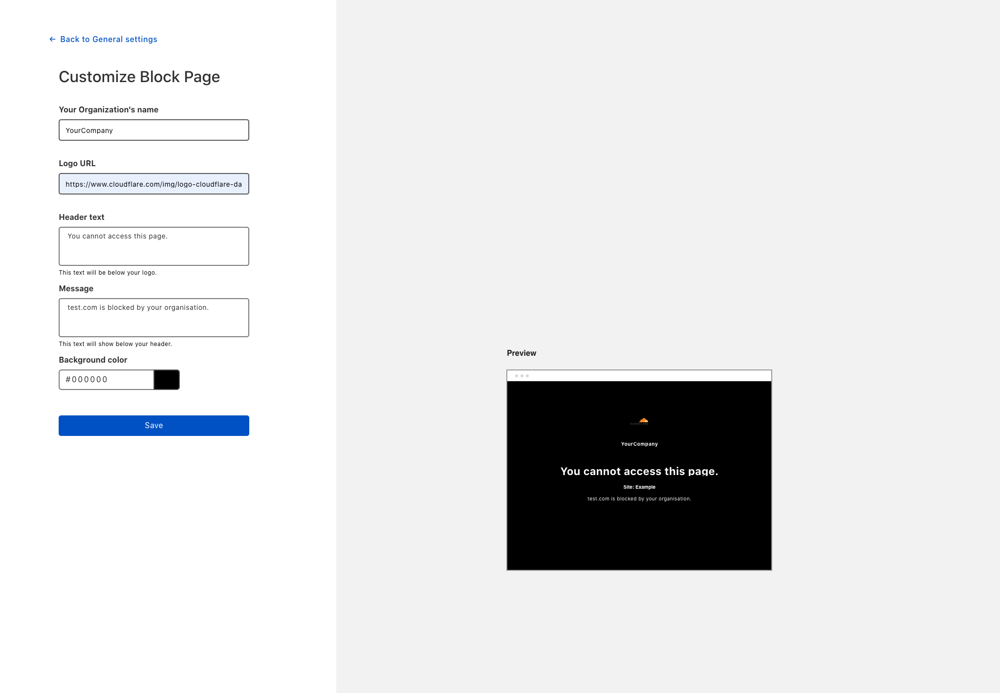

# Custom block page

Gateway responds to any blocked domain with 0.0.0.0, and does not return the blocked domain's IP address. As a result, the browser will not take the user to that website, and users will see a default browser error page. This may be confusing for some people, as they may think that their Internet is not working.

To avoid this confusion, you can configure a **custom block page**, and include a message — for example, a message explaining that the website has been blocked by Gateway, why, and whom in the organizations users should contact for support.

Follow these three steps to configure a block page:

1. [Download the Cloudflare certificate](#download-the-cloudflare-certificate).
1. [Add the certificate to your system](#add-the-certificate-to-your-system).
1. [Enable the block page](#enable-the-block-page).
1. [Customize the block page](#customize-the-block-page).

## Download the Cloudflare certificate

1. On the [Teams dashboard](https://dash.teams.cloudflare.com), navigate to **Account**.
1. Scroll down to find the **Certificates** card.

  

1. Click on **Download**.

You will now need to add the certificate to your system to ensure your web browser will use this certificate to establish HTTPS connections.

## Add the certificate to your system

1. If you are on a Mac, **double-click** on the `.pem` file.
1. The certificate is now listed in the **Keychain Access** application.

 

1. Double-click on the certificate and then click on **Trust**.

 

1. Select **Always Trust** from the drop-down menu for **When using this certificate**.

 

1. Close the menu.

If your system asks for admin permission, enter your password or use your fingerprint ID to confirm the changes.

### Firefox

If you are not using Firefox, you can skip this section.

Follow the instructions below to finish configuring the block page:

1. Enter **about:config** in the address bar.
1. Click on **Accept the risk!** if you see a prompt from Firefox.
1. Set `security.enterprise_roots.enabled` to `true`.

## Enable the block page

The Custom Block Page is automatically enabled for all HTTP policies. For DNS policies:

1. On the [Teams dashboard](https://dash.teams.cloudflare.com), navigate to **Policies > DNS**.
1. Find the policy for which you would like to set up a block page.
1. Click **Edit**.
1. Scroll down to find the **Configure policy settings** step.
1. Toggle the **Display custom block page** switch.

 

1. Click **Save**.

Your custom block page is now enabled for this policy. The next step is to [customize it](#customize-the-block-page) in the Settings page by adding a message, a logo, and changing the background color.

<Aside header='Warning: Potential Security Risk'>

If your users are seeing the following error when navigating to a blocked page, double-check that you have downloaded the Cloudflare certificate and you have added it correctly to your system.

</Aside>

## Customize the block page

1. Navigate to **Settings > General**.

1. Click **Customize** in the **Block page** card.

 

1. Once you have completed your customization, click **Save**.

Your customers will now see the customized block page when navigating to a blocked website.
