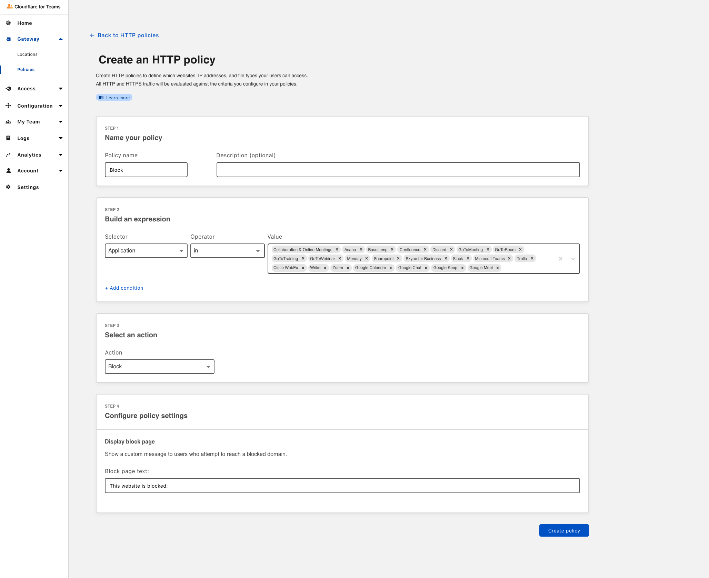
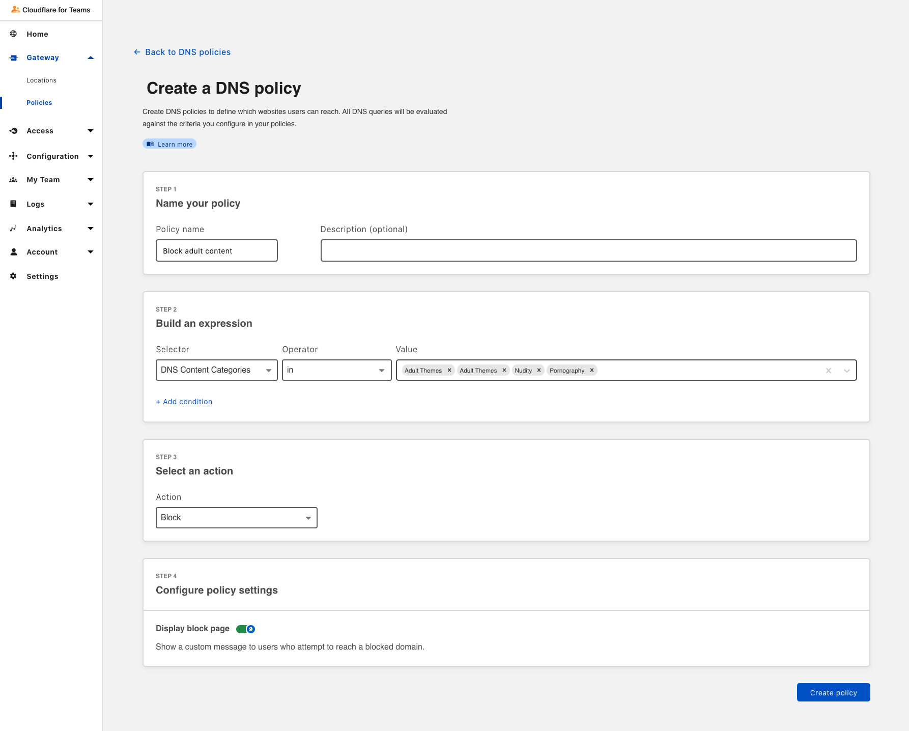
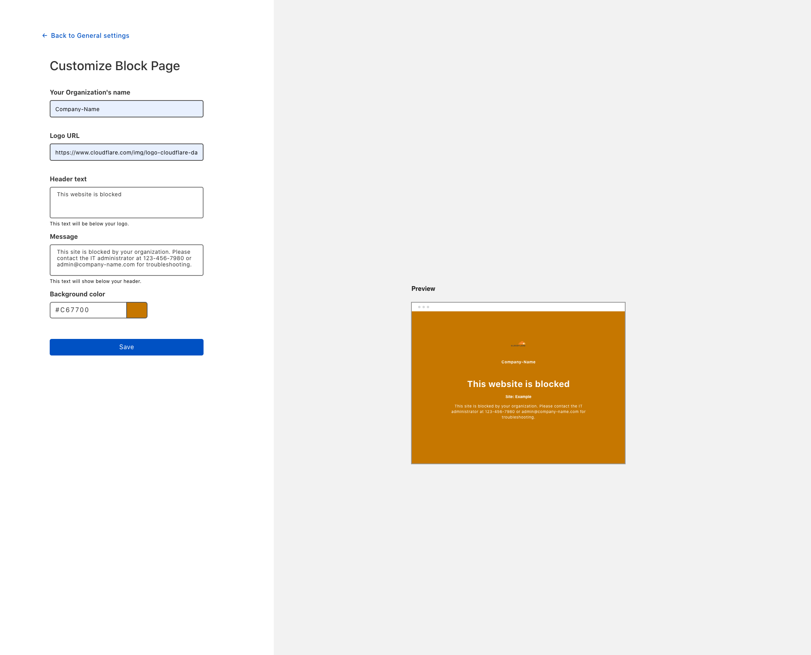
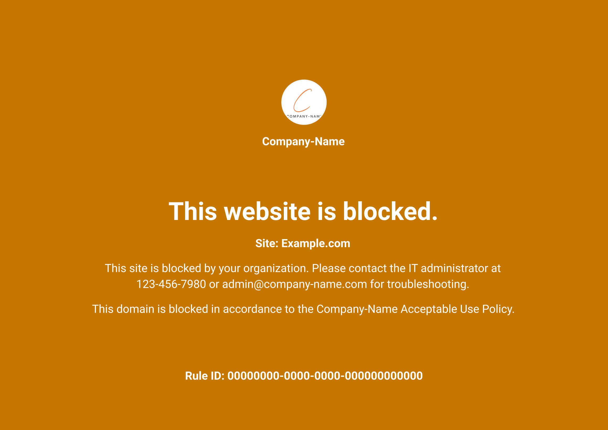

# Block page

Gateway responds to any blocked domain with 0.0.0.0, and does not return that blocked domain's IP address. As a result, the browser will show a default error page, and users will not be able to reach that website. This may cause confusion and lead some users to think that their Internet is not working.

Configuring a **block page** on the Teams dashboard helps avoid this confusion. Your block page will display information such as the rule ID of the policy blocking the website, a policy-specific block message, your organization's name, and a global message you may want to show — for example, a message explaining that the website has been blocked by Gateway, and whom in the organizations users should contact for support.

To configure a block page:

1. [Download the Cloudflare certificate](#download-the-cloudflare-certificate).
1. [Add the certificate to your system](#add-the-certificate-to-your-system).
1. Enable the block page for [HTTP](#enable-the-block-page-for-http-policies) or [DNS](#enable-the-block-page-for-dns-policies) policies.
1. [Customize the block page](#customize-the-block-page).

## Download the Cloudflare certificate

1. On the [Teams dashboard](https://dash.teams.cloudflare.com), navigate to **Settings > Devices**.

1. Scroll down to the **Certificates** card.

1. Click on **Download certificate**.

Now you will need to add the certificate to your system. This ensures your web browser can use it to establish HTTPS connections.

## Add the certificate to your system

1. If you are on a Mac, **double-click** on the `.pem` file.

 The certificate is now listed in the **Keychain Access** application.

 

1. Double-click on the certificate.

1. Click **Trust**.

 

1. Select **Always Trust** from the drop-down menu for **When using this certificate**.

1. Close the menu.

If your system asks for admin permission, enter your password or use your fingerprint ID to confirm the changes.

### Firefox

If you are not using Firefox, you can skip this section.

Follow the instructions below to finish configuring the block page:

1. Enter **about:config** in the address bar.
1. If you see a prompt from Firefox, click **Accept the risk!**.
1. Set `security.enterprise_roots.enabled` to `true`.

## Enable the block page for HTTP policies

The block page is automatically enabled for all HTTP policies. When a user is blocked at the HTTP layer, the block page is displayed. As you configure a policy with a Block action, you can specify a policy-specific block message.

 

## Enable the block page for DNS policies

For DNS policies:

1. On the [Teams dashboard](https://dash.teams.cloudflare.com), navigate to **Policies > DNS**.
1. Find the policy for which you would like to set up a block page.
1. Click **Edit**.
1. Scroll down to find the **Configure policy settings** step.
1. Toggle the **Display block page** switch.

 

1. Click **Save**.

Your block page is now enabled for this policy. 

<Aside header='Warning: Potential Security Risk'>

If your users are seeing the following error when navigating to a blocked page, double-check that you have downloaded the Cloudflare certificate and you have added it correctly to your system.

</Aside>

## Customize the block page

You can customize the block page by making global changes that will show up every time a user navigates to a block page, independently of the type of rule (DNS or HTTP) that's blocking the website. These global customizations include:

* Adding your organization's name
* Adding a logo 
* Adding a header text
* Adding a global block message
* Choosing a background color

All of these elements will display in addition to two fields specific to the policy that's blocking the website:

* **The policy-specific block message** you've specified while creating the policy. This message is displayed under your global block message, and above the Rule ID.

* **The Rule ID**, which will make it easier for admins to debug possible policy issues in relation to blocked websites.

To apply customizations to your block page, navigate to the **Block page** card under **Settings > General**.

 

Once you have completed your customization, click **Save**. Your customers will now see your custom block page when navigating to a blocked website.

 
