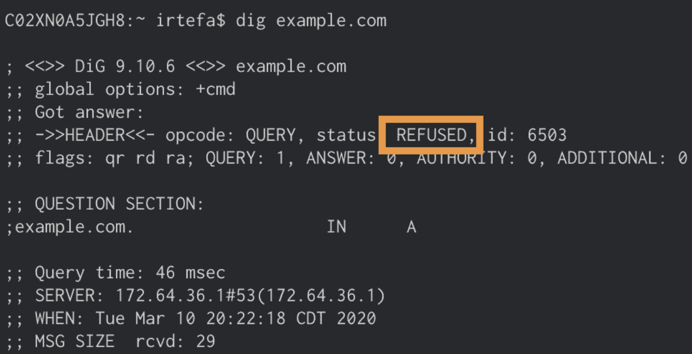

# Check that a policy is working

<Aside type='note'>

Before you start, please make sure you are connected to a network that is associated with the location where the policy is applied.

</Aside>

Once you have created a policy to block a domain, you can use either `dig` or `nslookup` on your to see if the policy is working as intended.

If you are using a policy to block `example.com`, you can do the following to see if Gateway is blocking `example.com`:

1. Open your terminal.

1. Type `dig example.com` (`nslookup example.com`) if you are using Windows) and press enter.

1. If the Block page is **disabled** for the policy, then you should see `REFUSED` in the answer section:

 

 If the Block page is **enabled** for the policy, then you should see `NOERROR` in the answer section and `162.159.36.12` and `162.159.46.12` as the answers when the domain is successfully blocked.

 