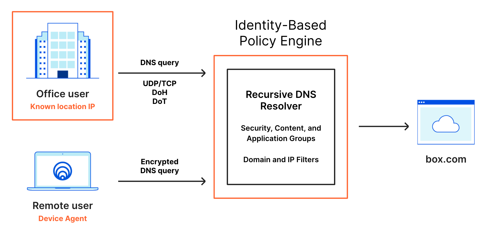

# DNS policies (New)

When a user makes a DNS request to Gateway, Gateway matches the request against the content or security categories you have set up for your organization. If the domain does not belong to any blocked categories, or if it matches an Override policy, the user's client receives the DNS resolution and initiates an HTTP connection. 



When creating a DNS policy, you can select as many security risk categories and content categories as needed to fully secure your network. 

Build a DNS policy by configuring the following elements:
* [Actions](#actions)
* [Expressions](#expressions)
* [Selectors](#selectors)
* [Operators](#operators)

<Aside>
Unless a more specific selector is configured in a policy (e.g., <code>user email</code> or <code>source IP address</code> for a registered location), then the policy will be evaluated against all DNS queries that reach Gateway from your organization.
</Aside>

## Actions

Just like actions in HTTP policies, actions in DNS policies allow you to choose what to do with a given set of elements. You can assign one action per policy.

These are the action types you can choose from:

* [Allow](#allow)
* [Block](#block)
* [Override](#override)
* [SafeSearch](#safesearch)
* [Youtube Restricted Mode](#youtube-restricted-mode)

### Allow

Policies with Allow actions allow DNS queries to reach destinations you specify within the Selector and Value fields. For example, the following configuration allows DNS queries to reach domains we categorize as belonging to the Education content category:

| Selector | Operator | Value | Action |
| --- | --- | --- | --- |
| Content Categories | In | Education | Allow |

### Block

Policies with Block actions block DNS queries to reach destinations you specify within the Selector and Value fields. For example, the following configuration blocks DNS queries from reaching domains we categorize as belonging to the Adult Themes content category:

| Selector | Operator | Value | Action |
| --- | --- | --- | --- |
| Content Categories | In | Adult Themes | Block |

### Override

Policies with Override actions allow you to respond to all DNS queries for a given domain to another destination. For example, you can provide a custom response IP of `1.2.3.4` for all queries to www.example.com with the following policy:

| Selector | Operator | Value | Action |
| --- | --- | --- | --- |
| Hostname | Is | `1.2.3.4` | Override |

### SafeSearch

SafeSearch is a feature of search engines that helps you filter explicit or offensive content. When you enable SafeSearch, the search engine filters explicit or offensive content and returns search results that are safe for children or at work.

You can use Cloudflare Gateway to enable SafeSearch on search engines like Google, Bing, Yandex, YouTube and DuckDuckGo. For example, to enable SafeSearch for Google, you can create the following policy:

| Selector | Operator | Value | Action |
| --- | --- | --- | --- |
| Domain | Is | `google.com` | SafeSearch |

#### Test SafeSearch

You can test if SafeSearch is working by performing `dig` on the search engines. Instead of returning the regular IP address, you should see the CNAMEs returned like below:

##### Google
Google will return `forcesafesearch.google.com`.


##### YouTube
YouTube will return `restrict.youtube.com`.


##### Bing
Bing will return `strict.bing.com`.


##### DuckDuckGo
DuckDuckGo will return `safe.duckduckgo.com`.


### YouTube Restricted Mode

Similarly, you can enforce YouTube Restricted mode by choosing the *Youtube Restricted* action. YouTube Restricted Mode is an automated filter for adult and offensive content built into YouTube. To enable Youtube Restricted Mode, you could set up a policy like the following:

| Selector | Operator | Value | Action |
| --- | --- | --- | --- |
| DNS Domain | Is | `youtube.com` | YouTube Restricted |

This setup ensures users will be blocked from accessing offensive sites using DNS.

## Expressions

Build expressions to determine the set of elements you want to impact with your policy. To build an expression, you need to choose a **Selector** and an **Operator**, and enter a value or range of values in the **Value** field. 

### Selectors

Gateway matches DNS traffic against the following selectors, or criteria:

<TableWrap>

| Selector | Description |
| -------- | ----------- |
| DOH Subdomain | Use this selector to match against DNS queries that arrive via DNS-over-HTTPS (DoH) destined for the DoH endpoint configured for each location. For example, a location with a DoH endpoint of `abcdefg.cloudflare-gateway.com` could be used in a DNS rule by choosing the DoH Subdomain selector and inputting a value of `abcdefg`. |
| Domain | Use this selector to match against a domain and all subdomains—for example, if you want to block example.com and all subdomains of example.com. |
| Host | Use this selector to match against only the hostname specified—for example, if you want to block only example.com but not subdomain.example.com. |
| Query Rtype | Use this selector to choose the DNS resource record type that you’d like to apply policies against — for example, you can choose to block A records for a domain but not MX records. |
| DNS Resolver IP | Use this selector to apply policies to DNS queries that arrived to your Gateway Resolver IP address aligned with a registered location. For most Gateway customers, this is an IPv4 AnyCast address and policies created using this IPv4 address will apply to all locations. However, each location has a dedicated IPv6 address and some Gateway customers have been supplied with a dedicated IPv4 address—these both can be used to apply policies to specific registered locations. | 
| Resolved IP | Use this selector to filter based on the IP addresses that the query resolves to. |
| Source IP | Use this selector to apply DNS policies to a specific source IP address that queries arrive to Gateway from — for example, this could be the WAN IP address of the stub resolver used by an organization to send queries upstream to Gateway. |
| Location | Use this selector to apply DNS policies to a specific location or set of locations. |

</TableWrap>

These selectors require Gateway with WARP mode to be enabled in the Cloudflare for Teams WARP client and the user to be enrolled in the organization via the WARP client:

<TableWrap>

| Selector | Description |
| -------- | ----------- |
| User Email | Use this selector to create identity-based DNS rules based on a user’s email. |
| User Group Emails | Use this selector to create identity-based DNS rules based on an IdP group email address of which the user is configured as a member in the IdP. |
| User Group IDs | Use this selector to create identity-based DNS rules based on an IdP group ID of which the user is configured as a member in the IdP. |
| User Group Names | Use this selector to create identity-based DNS rules based on an IdP group name of which the user is configured as a member in the IdP. | 
| User Name | Use this selector to create identity-based DNS rules based on an IdP username for a particular user in the IdP. |

</TableWrap>

For more detailed information on DNS categories, see the [DNS categories page](/policies/filtering/dns-policies-builder/dns-categories).

### Selectors - API Examples

You can use the [Cloudflare API](https://api.cloudflare.com/) to build DNS filtering policies. Examples of certain selectors are provided below.

* Block queries that resolve to IP `1.2.3.3` or in CIDR `1.2.3.4/30`:

  ```txt
  any(dns.resolved_ips[*] in {1.2.3.3 1.2.3.4/30})
  ```

* Block queries that resolve to the explicit IP `93.184.216.34`:

  ```txt
  any(dns.resolved_ips[*] == 93.184.216.34)`
  ```

* Block queries that resolve to an IP in an IP List, where `22509276-1c53-4a46-933a-9ff5e5e7b2ec` is the UUID for your IP List:

  ```txt
  any(dns.resolved_ips[*] in $225092761c534a46933a9ff5e5e7b2ec)`
  ```

### Operators

Operators are the way Gateway matches traffic to a selector. Matching happens as follows:

| Operator              |          Meaning
|:---------------------:|:---------------------------:|
|  is                   |  exact match, equals        |
|  is not               |  all except exact match     |
|  in                   |  in any of defined entries  |
|  not in               |  not in defined entries     |
|  matches regex        | regex evaluates to true         |
|  does not match regex |  all except when regex evals to true   |

## Blocking a subdomain

To block a domain and all subdomains, you can create the following policy:

| Selector | Operator | Value | Action |
| --- | --- | --- | --- |
| Domain | Is | `example.com` | Block |

## Blocking a top-level domain

Just like you can choose to block a domain and all subdomains, you can block an entire top-level domain (TLD) by creating a policy. For example, if you wish to block all domains and subdomains registered as a `.net`, create the following policy:

| Selector | Operator | Value | Action |
| --- | --- | --- | --- |
| Domain | Matches Regex | `[.]net` | Block |

Blocking a popular TLD like `.com` will prevent users from connecting to significant portions of the Internet.

## Custom block page

When choosing the Block action, toggle the **Display custom block page** setting to respond to queries with a block page, and to specify the message you want to display to users who navigate to blocked websites. If disabled, Gateway will respond to blocked queries with `0.0.0.0`. For more information, see the dedicated documentation on [customizing the block page](/policies/filtering/configuring-block-page).

