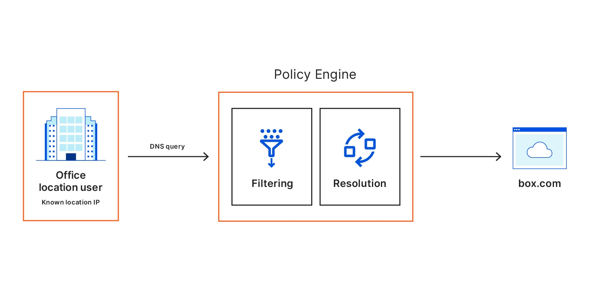

# DNS policies (New)

When a user makes a DNS request to Gateway, Gateway matches the request against the content or security categories you have set up for your organization. If the domain does not belong to any blocked categories, or if it matches an Override policy, the user's client receives the DNS resolution and initiates an HTTP connection. 

When creating a DNS policy, you can select as many security risk and content categories as you want to affect with the policy. 

Build a DNS policy by configuring the following elements:
* [Actions](#actions)
* [Expressions](#expressions)
* [Selectors](#selectors)
* [Operators](#operators)

<Aside>
Unless a more specific selector is configured in a rule (e.g., user email or source IP address for a registered location), then the rule will be evaluated against all DNS queries that reach Gateway from your organization.
</Aside>

## Actions
Just like actions in HTTP policies, actions in DNS policies allow you to choose what to do with a given set of elements. You can assign one action per policy.

These are the action types you can choose from:

* [Allow](#allow)
* [Block](#block)
* [Override](#override)
* [SafeSearch](#safesearch)
* [Youtube Restricted Mode](#youtube-restricted-mode)

### Allow

Rules with Allow actions allow DNS queries you specify within the Selectors and Value fields. For example, the following configuration allows DNS queries to domains we categorize as belonging to the Education content category:

| Selector | Operator | Value | Action |
| --- | --- | --- | --- |
| Content Categories | In | Education | Allow |

### Block

Rules with Block actions block DNS queries you specify within the Selectors and Value fields. For example, the following configuration blocks DNS queries to domains we categorize as belonging to the Adult Themes content category:

| Selector | Operator | Value | Action |
| --- | --- | --- | --- |
| Content Categories | In | Adult Themes | Block |

### Override

Rules with Override actions allow you to respond to all DNS queries for a given domain to another destination. For example, you can provide a custom response IP of 1.2.3.4 for all queries to www.example.com with the following rule:

| Selector | Operator | Value | Action |
| --- | --- | --- | --- |
| DNS Hostname | Is | `1.2.3.4` | Override |

### SafeSearch

SafeSearch is a feature of search engines that can help you filter explicit or offensive content. When you enable SafeSearch, the search engine filters explicit or offensive content and returns search results that are safe for children, you or at work.

You can use Cloudflare Gateway to enable SafeSearch on search engines like Google, Bing, Yandex, YouTube and DuckDuckGo. To enable SafeSearch, you can create the following rule:

| Selector | Operator | Value | Action |
| --- | --- | --- | --- |
| (None) | (None) | (None) | SafeSearch |

#### Test SafeSearch

You can test if SafeSearch is working by performing dig on the search engines. Instead of returning the regular IP address, you should see the CNAMEs returned like below:

##### Google
Google will return `forcesafesearch.google.com`.

##### YouTube
YouTube will return `restrict.youtube.com`.

##### Bing
Bing will return `strict.bing.com`.

##### DuckDuckGo
DuckDuckGo will return `safe.duckduckgo.com`.

### YouTube Restricted Mode

Similarly, you can enforce YouTube Restricted mode by choosing the Youtube Restricted Mode action. YouTube Restricted Mode is an automated filter for adult and offensive content that's built into YouTube.

| Selector | Operator | Value | Action |
| --- | --- | --- | --- |
| (None) | (None) | (None) | YouTube Restricted Mode |

This setup ensures users will be blocked from accessing offensive sites using DNS.

## Selectors

Gateway matches DNS traffic against the following selectors, or criteria:

* [DNS Content Categories](/policies/filtering/dns-policies-builder/dns-categories#dns-content-categories)
* DNS DoH Subdomain
* DNS Domain
* DNS Host
* DNS Query Rtype
* DNS Resolver IP
* [DNS Security Categories](/policies/filtering/dns-policies-builder/dns-categories#dns-security-categories)
* DNS Src IP
* User Email
* User Group Emails
* User Group IDs
* User Group Names
* User Name

<TableWrap>

| Selector | Description |
| -------- | ----------- |
| DNS Domain | Use this selector to match against a domain and all subdomains—for example, if you want to block example.com and all subdomains of example.com. |
| DNS Host | Use this selector to match against only the hostname specified—for example, if you want to block only example.com but not subdomain.example.com. |
| DNS Query Rtype | This selector allows you to choose the DNS resource record type that you’d like to apply policies against—for example, you can choose to block A records for a domain but not MX records. |
| DNS Resolver IP | This selector allows you to apply policies to DNS queries that arrived to your Gateway Resolver IP address aligned with a registered location. For most Gateway customers, this is an IPv4 AnyCast address and policies created using this IPv4 address will apply to all locations. However, each location has a dedicated IPv6 address and some Gateway customers have been supplied with a dedicated IPv4 address—these both can be used to apply policies to specific registered locations. |
| DNS Src IP | Use this selector to apply DNS policies to a specific source IP address that queries arrived to Gateway from—for example, this could be the WAN IP address of the stub resolver used by an organization to send queries upstream to Gateway |

</TableWrap>

For more detailed information on DNS categories, see the [DNS categories page](/policies/filtering/dns-policies-builder/dns-categories).

## Operators

Operators are the way Gateway matches traffic to a selector. Matching happens as follows:

| Operator              |          Meaning
|:---------------------:|:---------------------------:|
|  is                   |  exact match, equals        |
|  is not               |  all except exact match     |
|  in                   |  in any of defined entries  |
|  not in               |  not in defined entries     |
|  matches regex        | regex evaluates to true         |
|  does not match regex |  all except when regex evals to true   |

### Blocking a subdomain

To block a domain and all subdomains, you can create the following rule:

| Selector | Operator | Value | Action |
| --- | --- | --- | --- |
| DNS Domain | Is | `example.com` | Block |

### Blocking a top-level domain

Just like you can choose to block a domain and all subdomains, you can block an entire top-level domain (TLD) by creating a rule. For example, if you wish to block all domains and subdomains registered as a `.net`, create the following rule:

| Selector | Operator | Value | Action |
| --- | --- | --- | --- |
| DNS Domain | Matches Regex | `[.]net` | Block |

Blocking a popular TLD like `.com` will prevent users from connecting to significant portions of the Internet.

## Block Page

When choosing the Block action, toggle this setting to respond to queries with a block page. If disabled, Gateway will respond to blocked queries with `0.0.0.0`.

