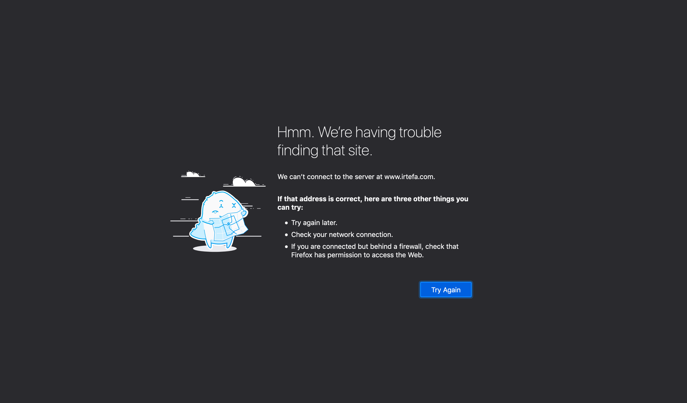
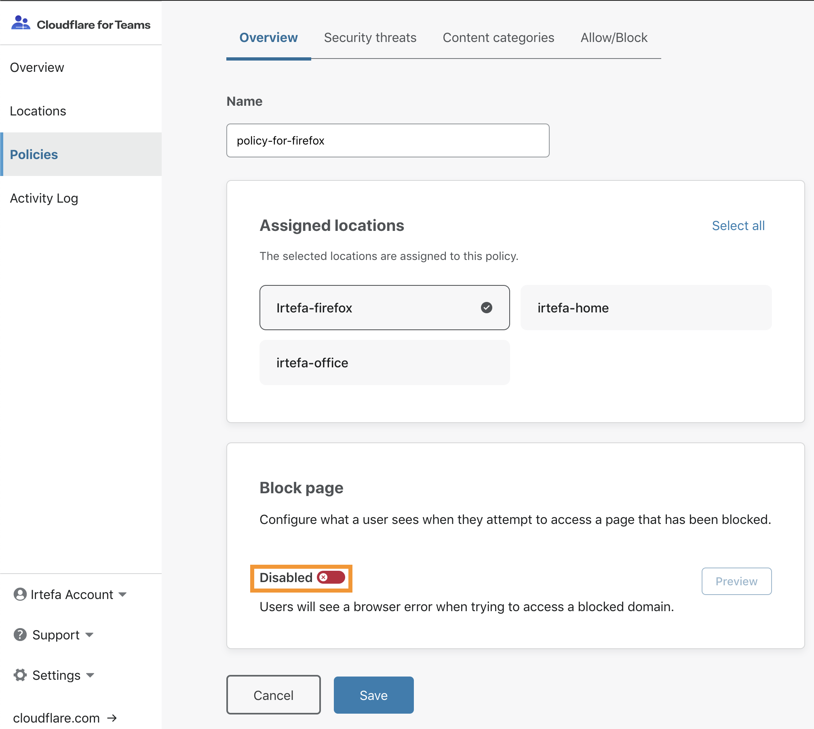
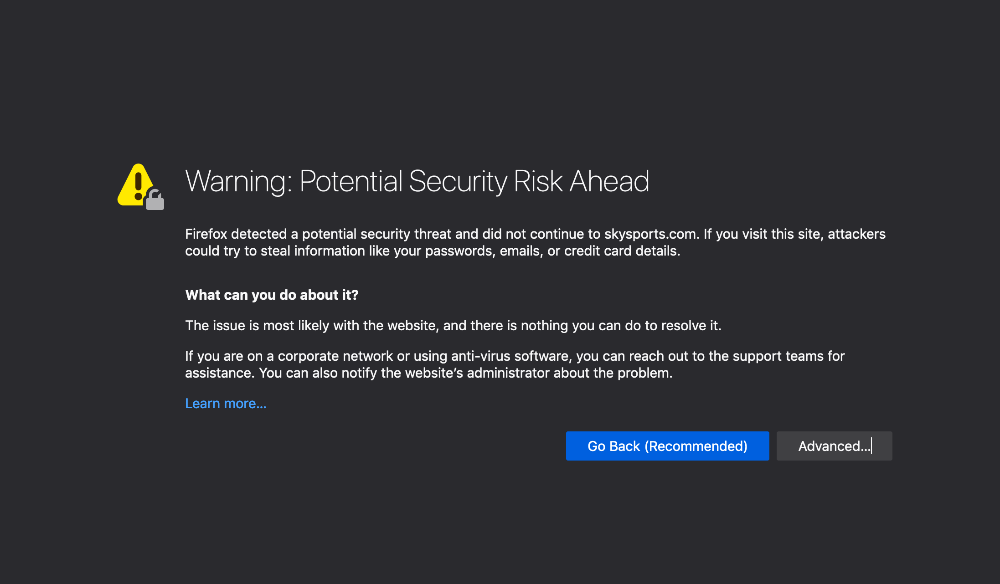
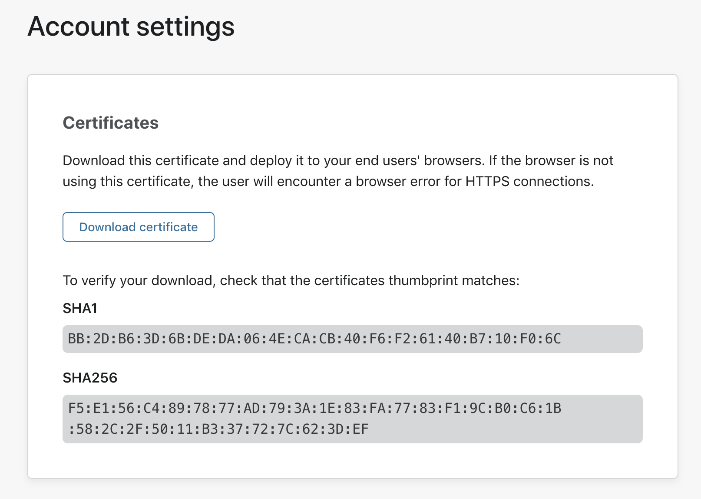
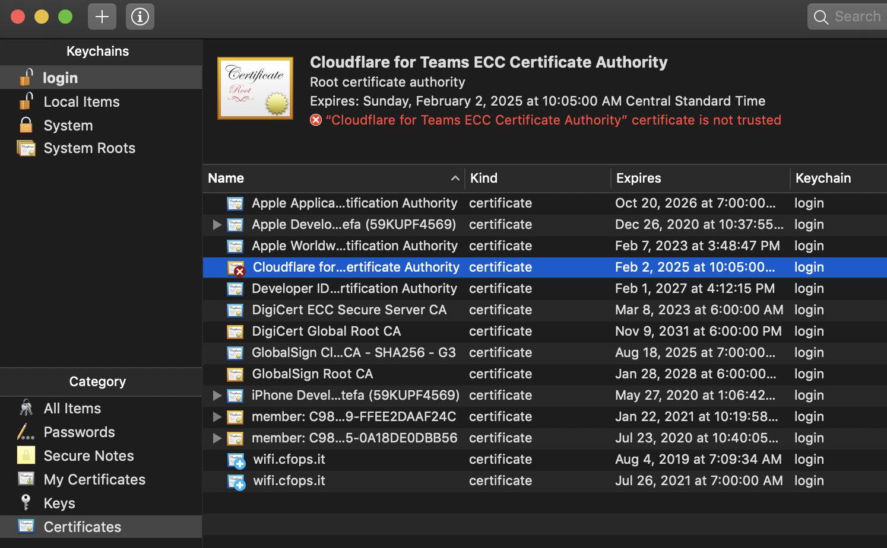
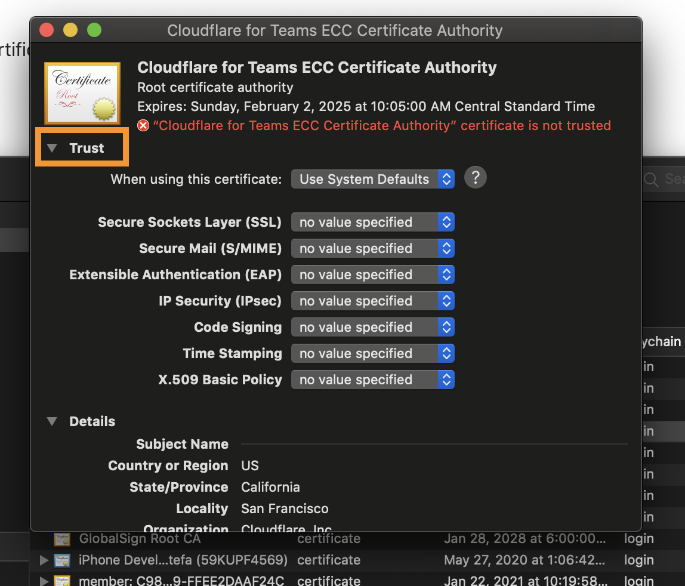
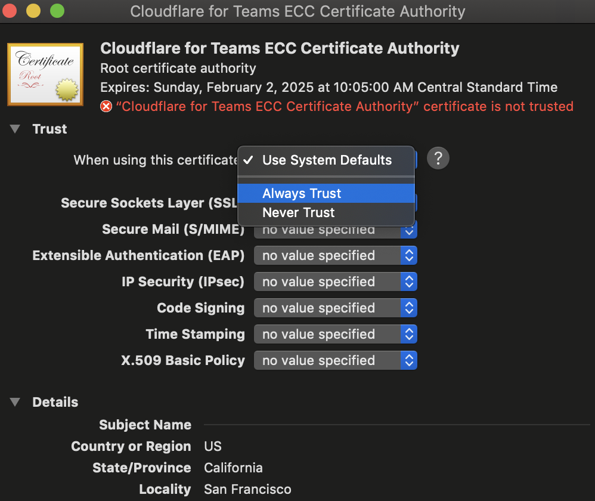
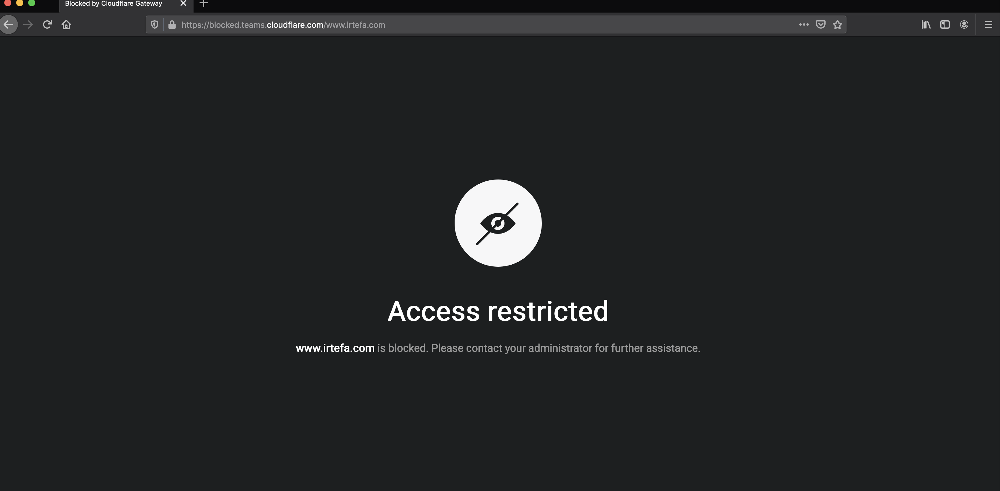

# Configure a block page

When trying to visit a blocked website, users will see a default browser error page like this one:  

This is because Gateway responds to any blocked domain with 0.0.0.0, and does not return the blocked domain's IP address. As a result, the browser cannot take the user to that website. However, this may be confusing for some people, as they may think that their Internet is not working.

To avoid this confusion, you can configure Cloudflare Gateway's block page to explain to the end user why a website is being blocked.  

Follow these three steps to configure a block page:

1. **[Enable](#enable-block-page)** the block page.
2. **[Download](#download-certificate)** the Cloudflare certificate.
3. **[Add](#add-certificate-to-your-system)** the certificate to your system.

## Enable block page

1. Navigate to the **Policies** tab in the [Teams dashboard](https://dash.teams.cloudflare.com).
2. Find the policy for which you would like to set up a block page.
3. Click **Edit**.
4. Scroll down to find the **Block page** card.
5. Toggle the **Enable** switch.

6. Click **Save**.

Enabling block page alone will not work for HTTPS connections. When your users try to visit a blocked website, they will now see the following error:

To fix the browser error, you need to download and add a certificate to your system.

## Download certificate
1. Navigate to the **Settings** tab on your [Teams dashboard](https://dash.teams.cloudflare.com).
1. Click on **Account**.
1. Scroll down to find the **Certificates** card.
1. Click on **Download**.

You will now need to add the certificate to your system to ensure your web browser will use this certificate to establish HTTPS connections.

## Add certificate to your system

1. If you are on a Mac, **double-click** on the .pem file.
2. The certificate is now listed in the **Keychain Access** application.

3. Double-click on the certificate and then click on **Trust**.

4. Select **Always Trust** from the drop-down menu for **When using this certificate**.

5. Close the menu.

If your system asks for admin permission, enter your password or use your fingerprint ID to confirm the changes.

### Firefox
If you are not using Firefox, you can skip this section.

Follow the instructions below to finish configuring the block page:

1. Enter **about:config** in the address bar.
1. Click on **Accept the risk!** if you see a prompt from Firefox.
1. Set `security.enterprise_roots.enabled` to `true`.

## See the block page
When you visit a blocked website you will now see the following block page:

