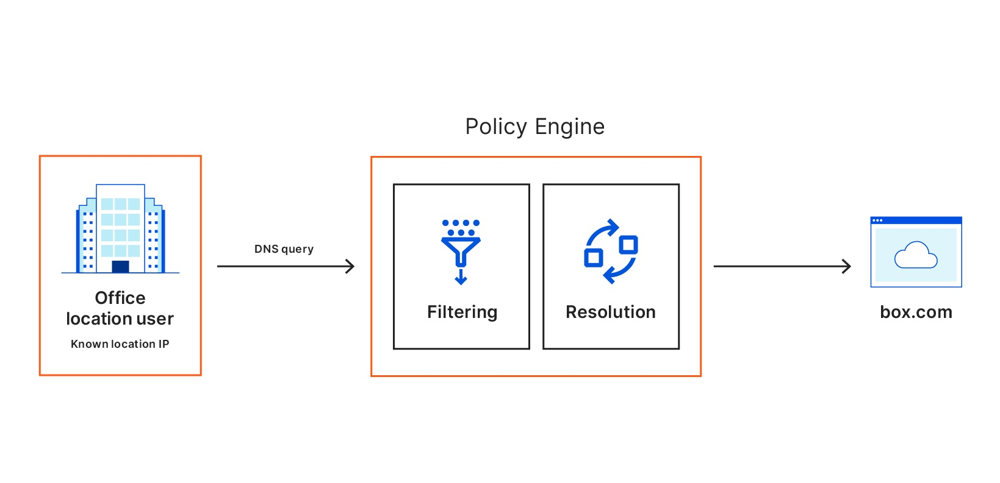

# DNS policies

When a user makes a DNS request to Gateway, Gateway matches the request against the content or security categories you have set up for your organization. If the domain does not belong to any blocked categories, or if it matches an override rule, the user's client receives the DNS resolution and initiates an HTTP connection. 

DNS policies can be built by doing one or more of the following:

1. Selecting security risk categories you want to block.
1. Enabling SafeSearch.
1. Enabling YouTube Restricted Mode.
1. Selecting content categories you want to block.
1. Adding custom domains you want to block, allow, or override.

## Security risk categories

When creating a DNS policy, you can select as many security risk categories as you want to block with the policy. This allows you to block known and potential security risks on the public Internet.

## Content categories

<Aside>

Sites that are classified as belonging to the **Child Abuse** category are blocked by default.
</Aside>

When creating a DNS policy, you can select as many content categories as you want to block with the policy.

## Destinations

Setting a **destination** for a policy allows you to have manual control on what action to take on requests for **specific domains**.
When setting a domain as a destination, you have the option to allow, block or override that domain.
* **Allow**. This action forces resolving this destination and all its sub-destinations, and takes precedence over any blocked destinations.
* **Block**. This action will block a destination and all its sub-destinations.
* **Override**. This action will forward all requests to a given destination to another destination you can set.

### Blocking a subdomain

When you manually block a domain, you automatically block all of its subdomains. For example, if you are blocking `example.com`, our policy engine will also block `a.example.com`, `a.b.example.com`.

If you only want to block a subdomain `a.example.com`, then instead of adding `example.com` to the list, you will add `a.example.com`. Note that once you add `a.example.com` to the block list, Cloudflare Gateway will also block all subdomains of `a.example.com`.

### Blocking a top-level domain

Just like you can choose to block a domain and all subdomains, you can block an entire top-level domain (TLD) by specifying it in a custom list. For example, if you wish to block all domains and subdomains registered as a `.net`, you would input `net` in a custom list with the *Block* action selected. 

<Aside>

Blocking a popular TLD like `.com` will prevent users from connecting to significant portions of the internet.
</Aside>

## Order of operations

When a DNS query matches with a DNS policy, Gateway follows this order of operations:

| Step |          Check If           |                           If Matches                      |     Else    |
|:----:|:---------------------------:|:---------------------------------------------------------:|:-----------:|
|  1   |  Domain is in Child Abuse category | Block domain, return REFUSED                              |Go to step 2 |
|  2   |    Domain in Allow list     | Allow domain, return NOERROR with IP address of the domain|Go to step 3 |
|  3   |    Domain in Block list     | Block domain, return REFUSED                              |Go to step 4 |
|  4   |    Domain in SafeSearch     | Override domain, return NOERROR with safe CNAME           |Go to step 5 |
|  5   | Domain blocked by category  | Block domain, return REFUSED                              |Go to step 6 |
|  6   |            N/A              | Allow domain, return NOERROR with IP address of the domain|     N/A     |