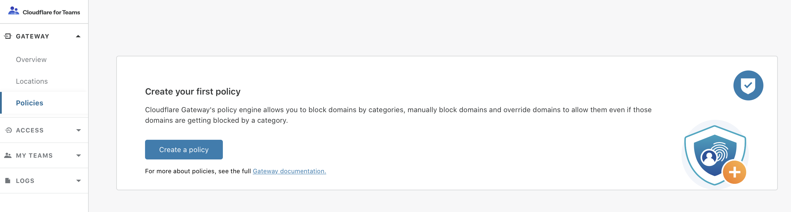
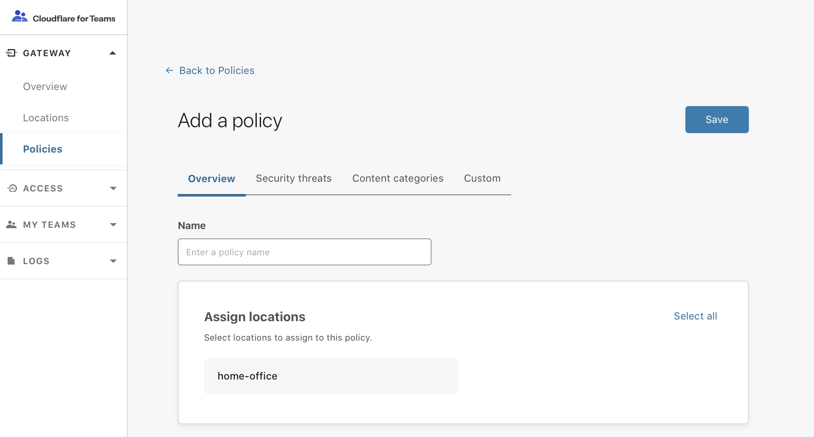
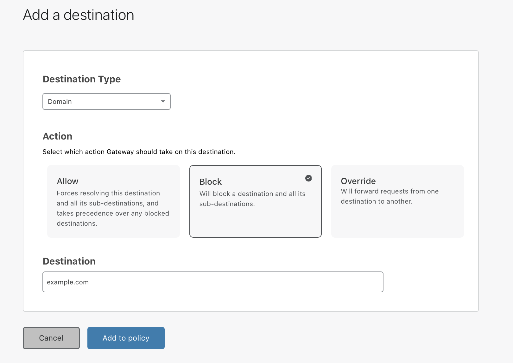
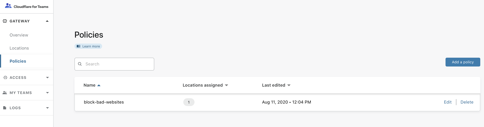

# Policy management

1. On the [Teams dashboard](https://dash.teams.cloudflare.com), navigate to the **Gateway** > **Policies** tab.

1. Click on **Create a policy**.

 

1. Add a policy name.

 

1. In the **Assign locations** card, specify the location(s) for which you want to enable the policy. To enable it for all your locations, click **Select all** on the top right corner of the card.  

1. You can choose to enable the **[Gateway Block Page](/policies/filtering/dns-policies/configuring-block-page)** to explain to the end user why a website is being blocked. 

1. In the cards below, you can choose to enable **[SafeSearch](/policies/filtering/dns-policies/safesearch)** or **YouTube Restricted Mode** for your policy. 

1. Next, navigate to **[Security threats](/policies/filtering/dns-policies/categories#security-threat-categories)** to choose which security categories you want to block. Click on **Block all** if you want to select all categories.

1. Navigate to **[Content categories](/policies/filtering/dns-policies/categories#content-categories)** to choose which content categories you want to block.

1. Navigate to **Custom** to allow, block, or override domains. The ability to override lists of URLs and IP addresses will be released in the future.

  * Click on **Add a destination**.

  * From the drop-down menu, choose a **Destination Type**.

    

  * Choose whether you want to allow, block, or override the destination.

  * Click on **Add to policy**.

1. Click on **Save** to add the policy to your dashboard.

 