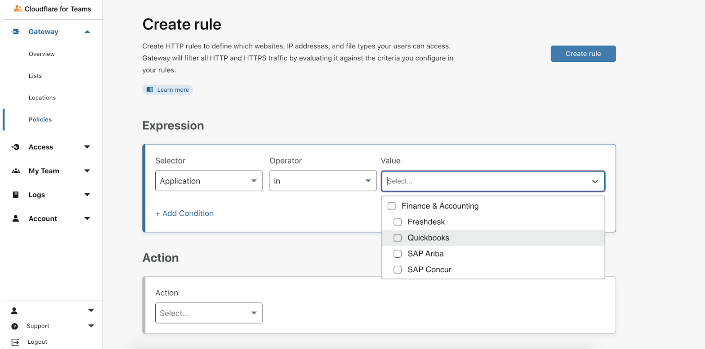
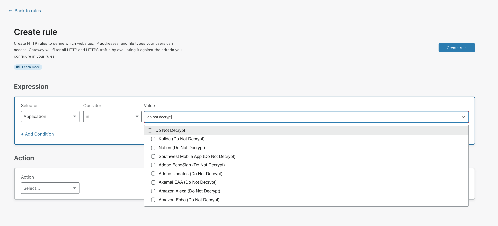

# Applications and app types

Cloudflare Gateway’s HTTP policies allow you to filter HTTP traffic on the L7 firewall. To make it easier to manage firewall policies for cloud applications, Gateway allows you to build policies based on applications and app types. 

Using these two selectors in the HTTP rule builder, you can have more granular control over how web applications are used on your network.

## Creating rules with applications and app types

1. On the [Teams dashboard](http://dash.teams.cloudflare.com), navigate to **Gateway > Policies**.
1. Navigate to the **HTTP tab**.
1. [Create a new rule](/policies/filtering/http-policies/policy-management#create-your-first-http-policy), or edit an existing one.
1. In the **Selector** drop-down menu, select the *Application* option. 
1. In the **Operator** drop-down menu, select *in* or *not in*, depending on whether you want to include or exclude applications or app types from your rule.
1. In the **Value** drop-down menu, check the applications or app types you would like to control with your rule.

  

1. Next, select an **[Action](#supported-actions-for-applications)** for your rule.
1. Click **Create rule** to finalize your changes.

## Supported applications and app types

### Applications
A full list of supported applications and their respective app types are available to download [here](../../../static/documentation/applications.csv).

### App types

<TableWrap>

| Application type | Definition |
| ---------------- | ---------- |
| Collaboration & Online Meetings | Applications used to communicate or collaborate in a business setting. |
| Development | Applications used for software development and development operations. |
| Email | Applications used for email. |
| Encrypted DNS | Applications used for encrypting DNS.| 
| File Sharing | Applications used to share files. |
| Finance & Accounting | Applications used as finance and accounting tools. |
| Human Resources |Applications used to manage employees and workforce tools.|
| Instant Messaging |Applications used for instant messaging. |
| IT Management |Applications used to manage IT deployments.|
| Legal | Applications used as legal tools.|
| Productivity | Applications used as business tools.|
| Public Cloud | Applications used to manage public cloud infrastructure.|
| Sales & Marketing| Applications used as sales and marketing tools. |
| Security | Applications used for information security. |
| Social Networking | Applications used for social networking. |
| Streaming |Applications used for streaming video or audio. |
| [Do Not Decrypt](#do-not-decrypt-applications) | Applications that are incompatible with the TLS man-in the middle certificate that is required for Cloudflare Gateway's proxy to function. These applications either use certificate pinning or send non-web traffic such as Session Initiation Protocol (SIP) or Extensible Messaging and Presence Protocol (XMPP) over TLS. |

</TableWrap>

#### Do Not Decrypt applications

Some applications are incompatible with TLS decryption for a variety of reasons, one of which is **certificate pinning**. This is a process used by applications to verify that the TLS certificate presented from the origin server matches a known, specified list of certificates hardcoded in the application.

This is a countermeasure to man-in-the-middle attacks where an attacker presents a trusted, but false, certificate on behalf of the origin in oder to decrypt the traffic. This is exactly what TLS interception in a Secure Web Gateway does, although for the purposes of securing a user's web traffic.

Gateway automatically groups applications incompatible with TLS decryption into the *Do Not Decrypt* app type. To ensure that traffic gets through to these applications, you can create an [HTTP rule](/policies/filtering/http-policies/application-app-types), select *Application* as a **Selector**, *in* as an **Operator**, and check the *Do Not Decrypt* app type in the **Value** field. Then, set the rule action to *Do Not Inspect*.

Gateway periodically updates the *Do Not Decrypt* app type to include new applications. By creating this *Do Not Inspect* rule and selecting all applications within the *Do Not Decrypt* app type, you'll ensure that your rule will apply to any new applications that will be added to the app type.

## Supported actions for applications

The Applications selector allows you to create rules with the following actions:

* **Allow** allows HTTP traffic to reach selected applications.
* **Block** blocks any HTTP traffic from reaching selected applications.
* **Do Not Inspect** bypasses SSL inspection for selected applications.