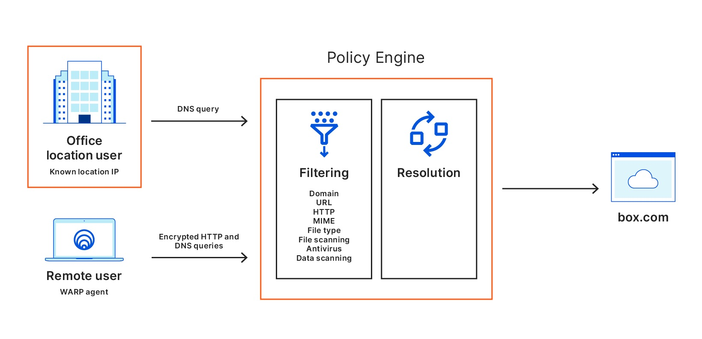

# HTTP policies

<Aside>

Install the <a href="/connections/connect-devices/warp/install-cloudflare-cert">Cloudflare Root Certificate</a> before creating HTTP policies.

</Aside>

HTTP policies allow you to filter HTTP traffic on the L7 firewall. Gateway will intercept all HTTP and HTTPS traffic and apply the rules you have configured in your policy to either block, allow, or override specific elements such as websites, IP addresses, and file types.

Build an HTTP policy by configuring the following elements:

* **Actions**
* **Expressions**
* **Selectors**
* **Operators**

## Actions

Just like actions on destinations in DNS policies, actions in HTTP policies allow you to choose what to do with a given set of elements (domains, IP addresses, file types, and so on). You can assign one action per policy.

These are the action types you can choose from:

* **[Allow](#allow)** 
* **[Block](#block)** 
* **[Isolate](#isolate)**
* **[Do Not Isolate](#do-not-isolate)**
* **[Do Not Inspect](#do-not-inspect)**

### Allow

Rules with Allow actions allow outbound traffic to reach destinations you specify within the [Selectors](#selectors) and Value fields. For example, the following configuration allows traffic to reach all websites we categorize as belonging to the Education content category:

| Selector | Operator | Value | Action |
| - | - | - | - |
| Content Categories | in | `Education` | Allow |

### Block

Rules with Block actions block outbound traffic from reaching destinations you specify within the [Selectors](#selectors) and Value fields. For example, the following configuration blocks users from being able to upload any file type to Google Drive:

| Selector | Operator | Value | Action |
| - | - | - | - |
| Application | in | `Google Drive` | Block |
| Upload Mime Type | matches regex | `.*` |  |

### Isolate

When a HTTP policy applies the Isolate action, the user's web browser is transparently served a HTML compatible remote browser client. Isolation policies can be applied to requests that include `Accept: text/html*`. This allows Browser Isolation policies to co-exist with API traffic.

If you'd like to isolate **all security threats**, you can set up a policy with the following configuration:

| Selector | Operator | Value | Action |
| - | - | - | - |
| Security Threats | In | `All security threats` | Isolate

If instead you need to isolate **specific hostnames**, you can list the domains you'd like to isolate traffic to:

| Selector | Operator | Value | Action |
| - | - | - | - |
| Host | In | `example.com`, `example.net` | Isolate

If you would like to isolate an **entire domain name**, you can use a regular expression match such as:

| Selector | Operator | Value | Action |
| - | - | - | - |
| Host | matches regex | `example\.com\|.*\.example\.com` | Isolate

<Aside type='note' header='Isolate identity providers for applications'>

Existing cookies and sessions from non-isolated browsing are not sent to the remote browser. Websites that implement single sign on using third-party cookies will also need to be isolated.

For example, example.com authenticates using Google Workspace you will also need to isolate the top level <a href="https://support.google.com/a/answer/9012184">Google Workspace URLs</a>.

</Aside>

### Do Not Isolate

You can choose to disable isolation for certain destinations or categories. The following configuration disables isolation for traffic directed to `example.com`:

| Selector | Operator | Value | Action |
| - | - | - | - |
| Host | In | `example.com` | Do Not Isolate |

### Do Not Inspect

<Aside type='Warning' header='Warning'>

When a *Do Not Inspect* rule is created for a given hostname, application, or app type, no traffic will be inspected.

</Aside>

*Do Not Inspect* lets administrators bypass certain elements from inspection. Administrators who wish to bypass a site must match against the host in order to prevent HTTP inspection from occuring on both encrypted and plaintext traffic.

The *Do Not Inspect* action is only available when matching against the host criteria.

The L7 firewall will evaluate *Do Not Inspect* rules before any subsequent Allow or Block rules. For encrypted traffic, Gateway uses the Server Name Indicator (SNI) in the TLS header to determine whether to decrypt the traffic for further HTTP inspection against Allow or Block rules. All *Do Not Inspect* rules are evaluated first to determine if decryption should occur. This means regardless of precedence in a customer's list of rules, all *Do Not Inspect* rules will take precedence over Allow or Block rules.

## Selectors

Gateway matches HTTP traffic against the following selectors, or criteria:
* **Host**
* **URL**
* **URL Query**
* **URL Path**
* **URL Path and Query**
* **HTTP Method**
* **HTTP Response**
* **Uploaded and Downloaded File Extension**
* **Uploaded and Downloaded Mime Type**
* **Content categories**
* **Applications**

List of file extensions Gateway can match against:

<TableWrap>

| Image | Executable | Audio | Documents | Data | Compressed | System | Video |
|------|------|-------|------|--------|--------|--------|-----|
| avif | apk | m4a | doc | avro | 7z | bak | avi |
| bmp | bat | mid | docx | csv | arj | cab | flv |
| gif | bin | mp3 | odp | dat | bz2 | cpl | h264 |
| ico | cgi | mpa | ods | dmg | deb | cur | m4v |
| jpeg | com | wav | odt | iso | gz | emu | mkv |
| png | dll | wma | pdf | json | lz | ini | mov |
| psd | exe | ppt | | log | lz4 | scr | mp4 |
| svg | hta | pptx | | mdb | lzh | sys | mpeg |
| tif | jar | rtf | | nzb | lzma | tmp | wmv |
| webp | moo | txt | | orc | pak
|  | pif | xls | | parquet | rar
|  | pl | xlsx | | rc | rpm
|  | prg | | | sav | sz
|  | | | | wasm | xz | | 
|  |      | | | sql lite | z
|  |      | | | tar | zip
|  |      | | | toml | zlib |
|  |      | | | torrent | zst |
|  |      | | | xml |  |
|  |      | | | yaml | | 

</TableWrap>

## Operators
Operators are the way Gateway matches traffic to a selector. Matching happens as follows:

| Operator              |          Meaning
|:---------------------:|:---------------------------:|
|  is                   |  exact match, equals        |
|  is not               |  all except exact match     |
|  in                   |  in any of defined entries  |
|  not in               |  not in defined entries     |
|  matches regex        | regex evaluates to true         |
|  does not match regex |  all except when regex evals to true   |

## Expressions
Expressions are sets of conditions with which you can combine [selectors](#selectors) and [operators](#operators). By configuring one or more expressions, you can define the scope of your HTTP policy. 

## Example scenarios

| Action | Selector | Operator | 
| ------ | ---- | -------- | 
| Block  | Content categories | in: `Gaming` | 

**Result**: this configuration blocks any traffic to domains categorized as `Gaming`. 

## FAQ

### **How can I bypass the L7 firewall for a website?**

Cloudflare Gateway uses the hostname in the HTTP CONNECT header to identify the destination of the request. Administrators who wish to bypass a site must match against the host in order to prevent HTTP inspection from occurring on both encrypted and plaintext traffic. The **bypass** action is only available when matching against the **host** criteria.
Bypassing the L7 firewall results in no HTTP traffic inspection and logging is disabled for that HTTP session.

### **In what order are rules evaluated?**

The L7 firewall evaluates rules starting with the rule containing the lowest precedence (e.g., rule number one). Rules with a higher value precedence are evaluated after those with a lower value.

### **I see an error when browsing Google-related pages. What's the problem?**

If you are using the Gateway proxy, you need to disable the QUIC protocol within the Google Chrome settings. This will prevent you from encountering issues such as users who are able to connect to Google-related sites and services (like YouTube) that are explicitly blocked by a Gateway policy. 

Google Chrome uses QUIC to connect to all google services by default. This means all requests to google services via the Google Chrome browser use UDP instead of TCP. **At this time, Gateway does not support inspection of QUIC traffic and requests using QUIC will bypass Gateway HTTP policies**. Gateway does prevent standard HTTP requests from negotiating to using QUIC with the `Alt-Svc` header by removing this header from HTTP requests.

Gateway will support inspection of QUIC traffic in the future. 

#### Disabling QUIC in Google Chrome

For more information on disabling QUIC on a managed device, see [these instructions](https://support.google.com/chrome/a/answer/7649838?hl=en). You can manually disable QUIC in Google Chrome using the Experimental QUIC protocol (`#enable-quic`) flag:

1. In the address bar, type:  `chrome://flags#enable-quic`.
1. Set the Experimental QUIC protocol flag to `Disabled`.
1. Relaunch Chrome for the setting to take effect.

The following Windows registry key (or Mac/Linux preference) can be used to disable QUIC in Chrome, and can be enforced via GPO or equivalent:

* **Data type:** `Boolean [Windows:REG_DWORD]`
* **Windows registry location for Windows clients:** `Software\Policies\Google\Chrome\QuicAllowed`
* **Windows registry location for Google Chrome OS clients:** `Software\Policies\Google\ChromeOS\QuicAllowed`
* **Mac/Linux preference name:** `QuicAllowed`
* **Description:** If this policy is set to true (or not set), usage of QUIC is allowed. If the policy is set to false, usage of QUIC is not allowed.
* **Recommended value:** `Windows: 0x00000000`, `Linux: false`, `Mac: <false />`
